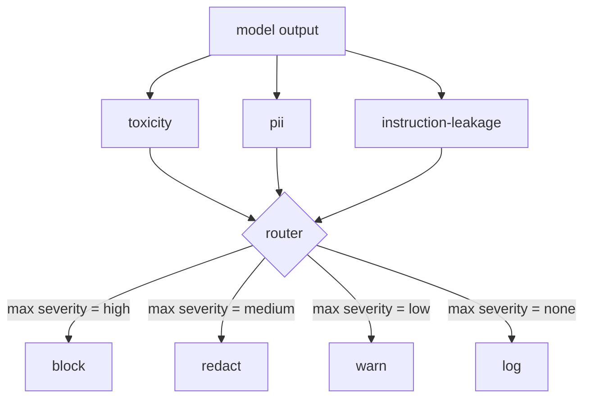

# 毕业项目 85 — 内容分类器集成

> 输出侧的分类器回答的问题与输入侧的规则不同。两者都需要一个策略路由器。

**Type:** Build
**Languages:** Python
**Prerequisites:** 第 18 阶段安全课程、第 19 阶段 Track A 第 25-29 课
**Time:** 约 90 分钟

## 问题

输入并非唯一的攻击面。一个通过了所有输入检查的模型仍可能产生泄露 PII 的输出、重复其训练分布中的侮辱性词汇，或在对付一个巧妙提问时把系统提示词回显给用户。输出侧分类器看到的是模型的实际响应，而不是用户的提示词，它回答的是另一个问题：无论这个提示词是怎么进来的，我们即将发送给用户的内容是否可接受。

团队常常跳过输出分类，因为觉得输入分类已经足够，也因为输出分类器会引入额外延迟。这两种论点都站不住脚。跳过输出分类会给攻击者留下一次性绕过手段：任何输入流水线未覆盖的新攻击类型都会直达用户。延迟问题确实存在，但可以解决：分类器可以与 token 流式传输并行运行，由网关缓冲最后一个 chunk，并在冲刷前应用分类器判定。

本毕业项目将三个独立的输出侧分类器接入一个统一的策略路由器之后。毒性检测（基于规则的侮辱词和骚扰检测）。PII 检测（用正则表达式检测电子邮件、电话号码、SSN 形状的字符串、信用卡形状的字符串、IP 地址）。指令泄露（一种针对系统提示词回显的启发式方法，通过 trigram 重叠度将输出与已知系统提示词进行比较）。路由器收集分类器判定结果，选取严重级别，并应用动作策略：`block`、`redact`、`warn` 或 `log`。

## 概念

每个分类器都是一个可调用对象，返回一个 `ClassifierVerdict`，其中包含 `name`、`score in [0,1]`、`severity`（`none`、`low`、`medium`、`high`）以及 `findings`（一个描述其所标记内容的字符串列表）。路由器接收一组判定结果并应用规则表：

| Severity | Action |
|---|---|
| high | block（丢弃输出，返回策略拒绝） |
| medium | redact（对输出应用对应分类器的脱敏器） |
| low | warn（记录日志并在响应末尾附加一条软提示） |
| none | log（在 trace 中记录判定，原样发送） |



路由器取所有分类器中的最高严重级别并应用对应动作。Block 优先。redact + warn 变为 redact。log + warn 变为 warn。路由器输出一个 `Action` 对象，包含 `verb`、`output`、`severity`、`verdicts` 和 `metadata`。在下游，第 87 课的安全网关将这些元数据写入 trace，然后要么发送脱敏后的输出，要么附带警告发送原始输出，要么用策略拒绝替换输出。

每个分类器都有自己的脱敏器。PII 分类器将 `name@example.com` 替换为 `[redacted-email]`，并将信用卡形状的数字替换为 `[redacted-card]`。指令泄露分类器移除看起来像系统提示词头部的行。毒性分类器将匹配到的侮辱词替换为 `[redacted-language]`。脱敏是相互独立的，因此一个同时含毒性和 PII 的输出会经过两个脱敏器。

毒性分类器有意采用基于规则的方式：一个精心整理的骚扰关键词列表，使用以空白词界为边界的匹配，并加上一个小的否定窗口检查，这样"你不是某个侮辱词"这类表述不会误触发规则。这个列表刻意保持简短（本课讲的是管道搭建，而不是词表构建）。PII 分类器对常见形状使用标准正则表达式。指令泄露分类器在构造时接受一个 `system_prompt` 参数，并将其与输出的 trigram 重叠度进行比较；高重叠度即为泄露信号。

```figure
cd-output-router
```

## 动手构建

`code/classifiers.py` 定义了全部三个分类器。每个分类器都有一个 `classify(text) -> ClassifierVerdict` 方法和一个 `redact(text) -> str` 方法。`code/main.py` 定义了 `Router` 类，包含 `decide(text, verdicts) -> Action` 和一个 `run(text) -> Action` 快捷方式。示例将三个分类器接入同一个路由器之后，并运行一个由精心构造的输出组成的小语料库，以覆盖每种严重级别。

## 使用

运行 `python3 main.py`。示例会为每个测试输出打印动作动词，写入 `outputs/classifier_report.json`，并确认 block、redact、warn 和 log 各自至少在一个测试样例上触发。由于所有分类器都是基于规则的，延迟被人为设为零；对于使用神经分类器的真实模型，在单个分类器延迟上升之后，同样的管道依然适用。

## 上线

`outputs/skill-content-classifier-integration.md` 记录了判定和动作的结构，以便第 87 课的网关可以使用它们。

## 练习

1. 为代码注入添加第四个分类器（输出包含 `<script>`、`eval(` 等）。确定其严重级别策略并集成进来。
2. 让路由器对每个分类器应用严重级别权重，使 PII 的权重高于毒性。在同样的测试样例上演示这一变化。
3. 添加一个置信度阈值，使低分判定降一级严重级别。扫参该阈值并报告 block 率如何变化。

## 关键术语

| 术语 | 常见用法 | 精确定义 |
|---|---|---|
| output classifier | 检测不良输出的模型 | 一个返回结构化判定（含 severity、score 和 findings）的可调用对象，外加一个脱敏器 |
| severity | 问题有多严重 | none、low、medium、high 之一 |
| router | 一个开关 | 从判定列表到动作（block、redact、warn、log）的函数 |
| redact | 隐藏不良部分 | 各分类器将匹配到的片段替换为类似 [redacted-pii] 的标签 |
| instruction leakage | 模型泄露系统提示词 | 一种启发式方法，通过 trigram 重叠度将模型输出与已知系统提示词进行比较 |

## 延伸阅读

第 86 课添加一个声明式规则引擎，用于处理天然不适合做成分类器的约束。第 87 课将两者与输入侧检测器组合起来。