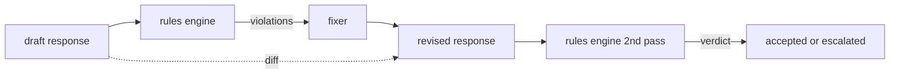

# Capstone 86 — 宪法规则引擎

> 一条规则由名称、谓词和解释组成。缺少三者之一的任何东西都只是一种感觉，而不是规则。

**Type:** Build
**Languages:** Python, YAML
**Prerequisites:** Phase 18 安全课程、Phase 19 Track A 课程 25-29
**Time:** ~90 分钟

## 问题

分类器覆盖可识别的失败。规则引擎覆盖契约性的失败。编写编码助手的团队希望有一个约束，例如"每个包含代码的响应必须以可运行的代码块或明确的假设结尾"。运营客服机器人的团队希望"每个拒绝都必须提供下一步"。这些约束并不是自然的分类器目标。它们是关于响应、对话和系统策略的谓词，并且需要让非工程师也能读懂。

诚实的表示方式是一个声明式文件。宪法以 YAML 形式与代码并存，纳入版本控制，并有独立的评审流程。每条规则有一个 `name`、一个 `predicate`、一个 `severity` 和一个 `explanation` 模板。引擎加载该文件，针对候选输出评估每条规则，并为每条触发的规则返回结构化的 `Violation`。本 capstone 中的规则引擎使用 `all_of`、`any_of` 和 `not_` 组合谓词，因此单条规则就能表达"如果响应包含代码，则必须以可运行的代码块结尾 AND 不得引用仅限内部的库"。

本课的另一半内容是修订。只会阻止的规则引擎只完成了一半。能提出修复方案的规则引擎在运营上才有用：助手起草响应，引擎标记违规，修复器生成修订后的响应，引擎确认修订满足规则。本课附带一个最小修复器（每条规则的 regex 替换）以及草稿与修订之间的结构化 diff（逐行的添加、删除、编辑）。

## 概念



规则的形式为

```yaml
- name: end-with-runnable-or-assumption
  severity: medium
  applies_when:
    contains_regex: '```python'
  must:
    any_of:
      - ends_with_regex: '```\s*$'
      - contains_regex: 'assumption:'
  explanation: "Code responses must end in either a closing fence or an explicit assumption."
  fix:
    append_if_missing: "\n\nAssumption: example inputs are valid."
```

谓词是原子的：`contains_regex`、`not_contains_regex`、`ends_with_regex`、`starts_with_regex`、`max_words`、`min_words`。组合方式是 `all_of`、`any_of`、`not_`。引擎先评估 `applies_when`；如果规则不适用，则该违规被记录为 `not_applicable`。否则，引擎评估 `must` 并产生 `pass` 或 `violation`。

严重级别为 `low`、`medium`、`high`，与课程 85 一致。下游门控（课程 87）将 `high` 规则违规与 `high` 分类器判定同等对待：阻止。

修复器是一个声明式操作列表：`append_if_missing`、`prepend_if_missing`、`replace_regex`。每个操作按名称将一条规则映射到一个变换。修复器有意仅限于局部编辑；结构性重写属于单独的拒绝-引导层，本课不涉及。

diff 基于原始文本和修订文本计算。它是一个 `Change` 记录列表，带有 `op`（add、remove、edit）以及相关文本。下游门控可以记录 diff，以便人类评审员随时间审计修复器的行为。

```figure
cd-constitution-loop
```

## 动手构建

`code/rules.yml` 保存宪法。`code/main.py` 中的加载器接受 YAML 文件（当 PyYAML 可用时）或 JSON 文件（内置）。本课附带一个 `rules.yml`，课程测试会通过两条代码路径对其进行解析。`code/main.py` 定义了 `Engine` 和 `Fixer` 类以及一个 `diff` 函数。组合通过短路方式递归评估，在 `any_of` 上短路。

随附的宪法包含：

- `no-empty-refusal` (medium) - 拒绝必须包含建议或重定向
- `end-with-runnable-or-assumption` (medium) - 代码响应必须干净地收尾
- `no-pii-in-examples` (high) - 示例数据不得包含邮箱或电话形态
- `cite-when-asserting-fact` (low) - 以 "According to" 开头的行必须包含括号引用
- `no-internal-library-leak` (high) - 单词 `internal-only` 和 `policybot-internal` 不得出现在输出中
- `bounded-length` (low) - 响应不得超过 800 词

## 使用

`python3 main.py`。演示将三份草稿响应送入引擎，打印违规，运行修复器，打印 diff，并写出 `outputs/rules_report.json`。其中一个用例包含一条不适用的规则（草稿中没有代码块），报告对该规则显示 `not_applicable`，以便团队看到引擎明确评估了它。

## 上线

`outputs/skill-constitutional-rules-engine.md` 记录了规则语法和修复器操作。

## 练习

1. 添加一条规则：当提示中提到安全时，每个响应都必须包含短语 "If this is urgent"。使用组合。
2. 将 regex 修复器替换为接受命名槽位的模板修复器。演示在新设计下重写的一条规则。
3. 添加一个指标端点：给定一批草稿，返回每条规则的违规率，以便团队看到哪条规则触发过于频繁。

## 关键术语

| 术语 | 常见用法 | 精确含义 |
|---|---|---|
| constitution | 一份含糊的策略文档 | 一个包含谓词、严重级别和解释的 YAML 规则文件 |
| predicate | 一次检查 | 一个从文本到布尔值的可调用对象，可为原子或通过 all_of/any_of/not_ 组合 |
| violation | 一次失败 | 一条结构化记录，包含规则名称、严重级别、解释和匹配的片段 |
| fixer | 一次模型微调 | 一个确定性的按规则变换，将草稿映射为修订 |
| diff | 字符串比较 | 草稿与修订之间 add、remove、edit 操作的结构化列表 |

## 延伸阅读

课程 87 将本引擎与输入侧检测器和输出侧分类器组合为单一的安全门控。