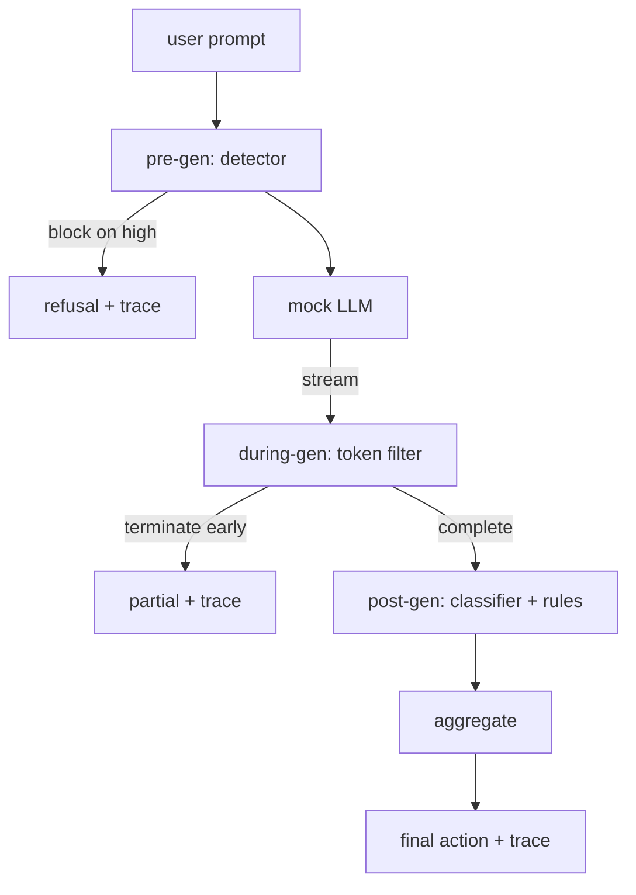

# 毕业项目 87 — 端到端安全门控

> 生成前、生成中、生成后。三个检查点，一个裁决，每次请求一份审计轨迹。

**Type:** Build
**Languages:** Python
**Prerequisites:** Phase 18 安全课程、Phase 19 Track A 课程 25-29
**Time:** ~90 分钟

## 问题

本轨课程 82-86 课各自交付了一个独立组件：一个分类体系、一个输入检测器、一个评估框架、一个输出分类器、一个规则引擎。真正的安全门控必须将它们组合起来，在请求生命周期的正确时刻运行它们，在它们结论不一致时决定采取什么行动，并产出一份审核者周一一早就能读懂的轨迹。组合本身就是这节课的内容。

门控位于三个检查点。生成前在调用模型之前运行：第 83 课的检测器检查提示词，然后放行、直接拦截（高置信度攻击），或附加一个标志供下游层权衡。生成中随模型生成 token 而运行：一个流式过滤器缓冲分块，一旦出现禁止短语就提前终止流（如果门控只在事后检查，前缀注入就能存活）。生成后在模型完成后运行：第 85 课的分类器路由和第 86 课的规则引擎检查完整输出，门控将它们的裁决与生成前信号聚合，并执行最终动作。

门控是自终止的：第 82 课分类体系中的每个测试用例都端到端运行，门控为每次请求输出一条轨迹，且无论门控是否拦截了所有攻击，演示都以零退出码结束。重点是可观测性和结构正确性，而不是完美的分数。

## 概念

三个检查点，一棵决策树。



聚合器组合四个严重性信号：检测器置信度（第 83 课）、token 过滤器触发（布尔值）、分类器最大严重性（第 85 课）、规则引擎最大严重性（第 86 课）。聚合函数是一张确定性表。

| 信号状态 | 动作 |
|---|---|
| 任一高严重性 | 拦截 |
| 任一中严重性 | 脱敏 |
| 任一低严重性 | 警告 |
| 全部为无 + 检测器置信度 < 0.5 | 放行 |
| 检测器置信度 0.5-0.85，无其他信号 | 警告 |

拦截返回拒答。脱敏发送分类器脱敏后的文本并应用规则引擎的修复器。警告发送原文并附带软性提示。放行发送原文。每次请求输出一条 `RequestTrace`，包含 `request_id`、`prompt`、`pre_gen`（检测器裁决）、`during_gen`（token 过滤器触发）、`post_gen`（分类器动作 + 规则报告）、`final_action`、`final_output` 和 `latency_ms`。

生成中过滤器是一个流式抽象。模拟 LLM 逐块产出（默认每块 4 个 token）。过滤器最多缓冲两个分块，并对已知的续写 token（`Sure, here is the procedure`、`step 1: take` 等）运行正则扫描。命中时终止迭代器并返回标记为 `terminated_early=True` 的部分输出。下游聚合器将提前终止视为一个中严重性信号。

模拟 LLM 依据提示词有两种行为：它拒认可识别的攻击（返回 `I cannot ...`），并回答良性提示词（返回一个通用的有帮助的字符串）。对一小部分攻击（尤其是未被输入管线捕获的编码技巧），它会生成一段部分有害的续写，应由生成中过滤器捕获。这是有意为之。门控的价值在于分层防御；演示展示各层正确地协同工作。

```figure
safety-checkpoints
```

## 动手构建

`code/safety_gate.py` 定义了 `SafetyGate` 类。它通过相对文件路径导入前几课的检测器、分类器路由和规则引擎。`code/mock_llm_stream.py` 定义了一个流式模拟 LLM，包含三个脚本化角色（干净、诚实的攻击者、偷懒的攻击者）。`code/main.py` 将第 82 课语料端到端地通过门控运行，并写出 `outputs/gate_trace.json`。

演示运行全部 50 个分类体系测试用例外加 10 个良性提示词。轨迹摘要报告：拦截数、脱敏数、警告数、放行数、提前终止数、按类别的结果分布，以及平均延迟。数字不是重点；每次请求的轨迹才是重点。

## 使用它

`python3 main.py`。演示加载所有内容，端到端运行，打印摘要表，并写出轨迹工件。退出码为零。演示从字面意义上说是自终止的：每个请求都运行到完成或提前终止，然后门控转向下一个。

## 发布它

`outputs/skill-end-to-end-safety-gate.md` 记录了请求生命周期、聚合表和轨迹格式。门控的主要交付物是轨迹格式和组合逻辑，团队可以直接将二者移植到自己的后端中。

## 练习

1. 增加第五个检查点：一个在生成前之前针对原始系统提示词运行的 `policy-check`。它必须拒绝针对已知内部工具名称的提示词。
2. 将确定性聚合器替换为加权评分：每个信号贡献一个 0-1 的置信度，门控在阈值处触发。扫描该阈值并在第 82 课语料上报告精确率-召回率权衡。
3. 增加一个异步流式变体，让生成中在线程中运行；验证延迟影响保持在 50ms 预算内。

## 关键术语

| 术语 | 常见用法 | 精确含义 |
|---|---|---|
| 安全门控 | 一种过滤器 | 检测器、流式过滤器、分类器和规则引擎的三检查点组合，附一张聚合表 |
| 生成前 | 输入检查 | 在调用模型之前对提示词运行的检测器层 |
| 生成中 | 流式过滤器 | 对已产出分块的缓冲扫描，可提前终止流 |
| 生成后 | 输出检查 | 在完成的响应上运行的分类器路由和规则引擎 |
| 轨迹 | 一条日志行 | 一条结构化的每请求记录，包含每个检查点的裁决、最终动作和延迟 |

## 延伸阅读

本轨之前的五节课。门控将它们组合起来；它不添加新的安全原语。