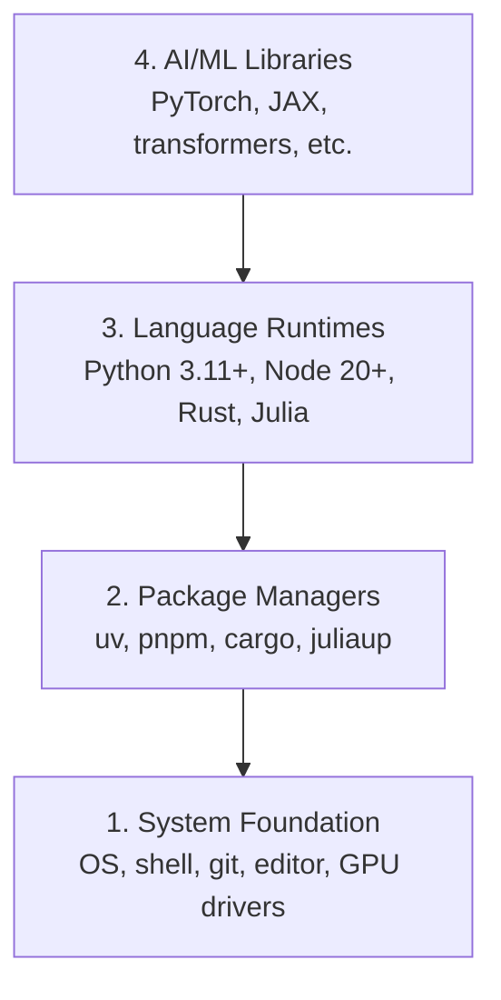

# 開発環境

> あなたのツールが思考を形作る。一度セットアップしたら、正しくセットアップする。

**タイプ:** 作ってみる
**言語:** Python, Node.js, Rust
**前提条件:** なし
**時間:** 約45分

## 学習目標

- Python 3.11以上、Node.js 20以上、Rustのツールチェーンをゼロからセットアップする
- 再現可能なビルドのために仮想環境とパッケージマネージャーを設定する
- CUDA/MPSによるGPUアクセスを確認し、テストテンソル演算を実行する
- 4層のスタック（システム、パッケージ、ランタイム、AIライブラリ）を理解する

## 課題

あなたは、Python、TypeScript、Rust、Juliaを使用して200以上のレッスンにわたるAIエンジニアリングを学習しようとしています。環境が壊れていれば、すべてのレッスンが学習ではなくツールへの戦いになります。

ほとんどの人は環境設定をスキップします。そして、インポートエラー、バージョン競合、欠落したCUDAドライバーのデバッグに何時間も費やします。私たちはこれを一度、適切に行います。

## 考え方

AIエンジニアリング環境には4つのレイヤーがあります。



下から積み上げてインストールしていきます。各レイヤーは、その下のレイヤーに依存しています。

## 作ってみる

### ステップ1：システム基盤

システムを確認し、基本的なものをインストールします。

```bash
# macOS
xcode-select --install
brew install git curl wget

# Ubuntu/Debian
sudo apt update && sudo apt install -y build-essential git curl wget

# Windows (use WSL2)
wsl --install -d Ubuntu-24.04
```

### ステップ2: uvを使ったPython

`uv`を使用します。これは`pip`よりも10〜100倍高速であり、仮想環境の管理を自動で行います。

```bash
curl -LsSf https://astral.sh/uv/install.sh | sh

uv python install 3.12

uv venv
source .venv/bin/activate  # or .venv\Scripts\activate on Windows

uv pip install numpy matplotlib jupyter
```

検証:

```python
import sys
print(f"Python {sys.version}")

import numpy as np
print(f"NumPy {np.__version__}")
a = np.array([1, 2, 3])
print(f"Vector: {a}, dot product with itself: {np.dot(a, a)}")
```

### ステップ3: pnpm を使用した Node.js

TypeScriptのレッスン（エージェント、MCPサーバー、Webアプリ）用。

```bash
curl -fsSL https://fnm.vercel.app/install | bash
fnm install 22
fnm use 22

npm install -g pnpm

node -e "console.log('Node', process.version)"
```

### ステップ4: Rust

パフォーマンスが重要なレッスン（推論、システム）向け。

```bash
curl --proto '=https' --tlsv1.2 -sSf https://sh.rustup.rs | sh

rustc --version
cargo --version
```

### ステップ 5: Julia (オプション)

Juliaが特に力を発揮する、数学的な内容のレッスン向け。

```bash
curl -fsSL https://install.julialang.org | sh

julia -e 'println("Julia ", VERSION)'
```

### ステップ6: GPUセットアップ（お持ちの場合）

```bash
# NVIDIA
nvidia-smi

# Install PyTorch with CUDA
uv pip install torch torchvision torchaudio --index-url https://download.pytorch.org/whl/cu124
```

```python
import torch
print(f"CUDA available: {torch.cuda.is_available()}")
if torch.cuda.is_available():
    print(f"GPU: {torch.cuda.get_device_name(0)}")
```

GPUがなくても大丈夫です。ほとんどのレッスンはCPUで動作します。トレーニング負荷の高いレッスンでは、Google ColabまたはクラウドGPUを使用してください。

### ステップ 7: すべての検証

検証スクリプトを実行します：

```bash
python phases/00-setup-and-tooling/01-dev-environment/code/verify.py
```

## 使ってみる

環境は、このコースのすべてのレッスンに対応できるようになりました。どこで何を使うかを見てみましょう。

| Language | Used In | Package Manager |
|----------|---------|-----------------|
| Python | フェーズ 1-12 (ML, DL, NLP, Vision, Audio, LLMs) | uv |
| TypeScript | フェーズ 13-17 (Tools, Agents, Swarms, Infra) | pnpm |
| Rust | フェーズ 12, 15-17 (Performance-critical systems) | cargo |
| Julia | フェーズ 1 (Math foundations) | Pkg |

## 形にして届ける

このレッスンでは、誰でも実行してセットアップを確認できる検証スクリプトを作成します。

AIアシスタントが環境の問題を診断するのに役立つプロンプトについては、`outputs/prompt-env-check.md` を参照してください。

## 演習

1. 検証スクリプトを実行し、失敗した箇所を修正する
2. このコース用のPython仮想環境を作成し、PyTorchをインストールする
3. 4つのすべての言語で「hello world」を書き、それぞれを実行する
