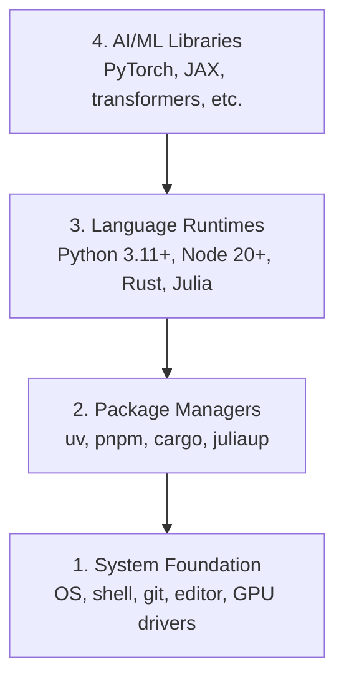

# Dev Environment

> ابزارهایتان شیوه‌ی فکرتان را شکل می‌دهند. یک‌بار آن‌ها را درست راه‌اندازی کنید.

**Type:** ساخت
**Languages:** Python, Node.js, Rust
**Prerequisites:** هیچ‌کدام
**Time:** حدود 45 دقیقه

## اهداف یادگیری

- toolchain (زنجیره‌ی ابزار) مربوط به Python 3.11+، Node.js 20+ و Rust را از صفر راه‌اندازی کنید
- virtual environment (محیط مجازی) و package manager (مدیر بسته) را برای ساخت‌های قابل‌بازتولید پیکربندی کنید
- دسترسی GPU را با CUDA/MPS بررسی کنید و یک عملیات آزمایشی روی tensor (تانسور) اجرا کنید
- پشته‌ی چهارلایه‌ی سیستم، بسته‌ها، runtime (محیط اجرا) و کتابخانه‌های AI را بشناسید

## مسئله

قرار است مهندسی AI را در بیش از 200 درس، با Python، TypeScript، Rust و Julia یاد بگیرید. اگر محیط شما درست کار نکند، هر درس، به‌جای یادگیری، به درگیری با ابزارها تبدیل می‌شود.

بیشتر افراد راه‌اندازی محیط را جدی نمی‌گیرند. بعد ساعت‌ها صرف رفع خطاهای import، ناسازگاری نسخه‌ها و نبود درایورهای CUDA می‌کنند. ما این کار را یک‌بار و درست انجام می‌دهیم.

## مفهوم

یک محیط مهندسی AI چهار لایه دارد:



```figure
s0-env-stack
```

نصب را از پایین به بالا انجام می‌دهیم. هر لایه به لایه‌ی زیرین خود وابسته است.

## آن را بسازید

### گام 1: زیربنای سیستم

سیستم خود را بررسی و ابزارهای پایه را نصب کنید.

```bash
# macOS
xcode-select --install
brew install git curl wget

# Ubuntu/Debian
sudo apt update && sudo apt install -y build-essential git curl wget

# Windows (use WSL2)
wsl --install -d Ubuntu-24.04
```

### گام 2: Python با uv

از `uv` استفاده می‌کنیم—این ابزار 10-100x سریع‌تر از pip است و محیط‌های مجازی را به‌صورت خودکار مدیریت می‌کند.

```bash
curl -LsSf https://astral.sh/uv/install.sh | sh

uv python install 3.12

uv venv
source .venv/bin/activate  # or .venv\Scripts\activate on Windows

uv pip install numpy matplotlib jupyter
```

از درست بودن نصب مطمئن شوید:

```python
import sys
print(f"Python {sys.version}")

import numpy as np
print(f"NumPy {np.__version__}")
a = np.array([1, 2, 3])
print(f"Vector: {a}, dot product with itself: {np.dot(a, a)}")
```

### گام 3: Node.js با pnpm

این بخش برای درس‌های TypeScript است؛ در این درس‌ها با agent، MCP server و web app کار می‌کنید.

```bash
curl -fsSL https://fnm.vercel.app/install | bash
fnm install 22
fnm use 22

npm install -g pnpm

node -e "console.log('Node', process.version)"
```

**macOS / Apple Silicon (M1/M2/M3/M4):** اگر نصب‌کننده با خطای `Error: Cannot install under Rosetta 2 in ARM default prefix (/opt/homebrew)` متوقف شد، یعنی terminal شما زیر Rosetta 2 اجرا می‌شود (`arch` مقدار `i386` چاپ می‌کند)، در حالی که Homebrew یک build بومی arm64 است. fnm را با اجبار به استفاده از arm64 نصب کنید، آن را به shell وصل کنید و بعد فرمان‌های بالا را از `fnm install 22` دوباره اجرا کنید:

```bash
arch -arm64 brew install fnm
echo 'eval "$(fnm env --use-on-cd)"' >> ~/.zshrc
source ~/.zshrc
```

### گام 4: Rust

برای درس‌های حساس به کارایی (performance-critical)، مثل inference (استنتاج) و systems.

```bash
curl --proto '=https' --tlsv1.2 -sSf https://sh.rustup.rs | sh

rustc --version
cargo --version
```

### گام 5: Julia (اختیاری)

برای درس‌های ریاضی‌محور که Julia در آن‌ها مزیت دارد.

```bash
curl -fsSL https://install.julialang.org | sh

julia -e 'println("Julia ", VERSION)'
```

### گام 6: آماده‌سازی GPU (اگر GPU دارید)

**NVIDIA (Linux / Windows):**

```bash
nvidia-smi

# Install PyTorch with CUDA
uv pip install torch torchvision torchaudio --index-url https://download.pytorch.org/whl/cu124
```

**macOS / Apple Silicon (M1/M2/M3/M4):** CUDA روی Mac وجود ندارد—این وضعیت طبیعی است، نه یک خطا. **هرگز** `--index-url .../cuXXX` را اضافه نکنید (این wheelها فقط برای Linux/Windows هستند و نصب را شکست می‌دهند). build معمولی را نصب کنید که backend مربوط به MPS (Metal) اپل را هم شامل می‌شود:

```bash
uv pip install torch torchvision torchaudio
```

بررسی کنید؛ این کد روی هر پلتفرمی کار می‌کند:

```python
import torch
print(f"CUDA available: {torch.cuda.is_available()}")           # False on macOS — expected
print(f"MPS available:  {torch.backends.mps.is_available()}")   # True on Apple Silicon
if torch.cuda.is_available():
    print(f"GPU: {torch.cuda.get_device_name(0)}")
```

GPU ندارید؟ مشکلی نیست. بیشتر درس‌ها روی CPU اجرا می‌شوند. برای درس‌هایی که آموزش مدل در آن‌ها سنگین است، از Google Colab یا GPUهای ابری استفاده کنید.

### گام 7: بررسی همه‌چیز

اسکریپت بررسی را اجرا کنید:

```bash
python phases/00-setup-and-tooling/01-dev-environment/code/verify.py
```

## از آن استفاده کنید

محیط شما حالا برای همه‌ی درس‌های این دوره آماده است. در ادامه می‌بینید از هر زبان کجا استفاده می‌کنید:

| زبان | کاربرد | package manager (مدیر بسته) |
| --- | --- | --- |
| Python | مرحله‌های 1 تا 12 (ML، DL، NLP، Vision، Audio، LLMها) | uv |
| TypeScript | مرحله‌های 13 تا 17 (Tools، Agents، Swarms، Infra) | pnpm |
| Rust | مرحله‌های 12 و 15 تا 17 (سیستم‌های حساس به کارایی) | cargo |
| Julia | مرحله‌ی 1 (مبانی ریاضی) | Pkg |

## آن را عرضه کنید

این درس یک اسکریپت بررسی در اختیارتان می‌گذارد که هر کسی می‌تواند برای بررسی تنظیماتش اجرا کند.

برای دریافت prompt (درخواست/دستور) که به دستیارهای AI کمک می‌کند مشکلات محیط را عیب‌یابی کنند، `outputs/prompt-env-check.md` را ببینید.

## تمرین‌ها

1. اسکریپت بررسی را اجرا کنید و هر خطا را برطرف کنید
2. برای این دوره یک محیط مجازی Python بسازید و PyTorch را نصب کنید
3. در هر چهار زبان یک «hello world» بنویسید و آن را اجرا کنید
