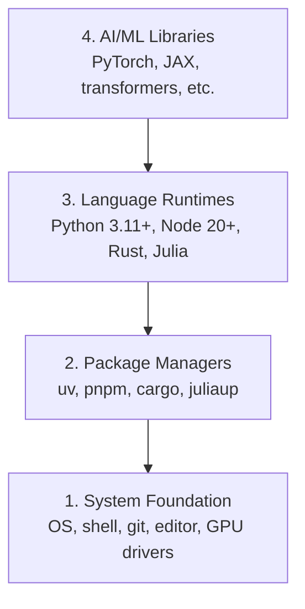

# محیط توسعه

> ابزارهایی که استفاده می‌کنید روی شیوهٔ فکر کردن و کار کردن شما تأثیر می‌گذارند. یک‌بار آن‌ها را درست راه‌اندازی کنید و خیال خودتان را راحت کنید.

**نوع:** Build

**زبان‌ها:** Python، Node.js، Rust

**پیش‌نیاز:** ندارد

**زمان:** حدود ۴۵ دقیقه

## اهداف یادگیری

* راه‌اندازی Python 3.11+، Node.js 20+ و Rust Toolchainها از ابتدا
* تنظیم Virtual Environmentها و Package Managerها برای داشتن Buildهای قابل‌اعتماد و قابل‌تکرار
* بررسی دسترسی به GPU با CUDA/MPS و اجرای یک عملیات آزمایشی روی Tensor
* آشنایی با ساختار چهارلایهٔ محیط توسعه: سیستم، Packageها، Runtimeها و کتابخانه‌های AI

## مسئله

قرار است مهندسی هوش مصنوعی را در بیش از ۲۰۰ درس و با استفاده از Python، TypeScript، Rust و Julia یاد بگیرید. اگر محیط توسعهٔ شما درست کار نکند، هر درس به‌جای تمرکز روی یادگیری، تبدیل به درگیری با ابزارها و مشکلات محیط می‌شود.

بیشتر افراد راه‌اندازی درست محیط را جدی نمی‌گیرند. بعد هم ساعت‌ها وقتشان را صرف پیدا کردن علت خطاهای import، ناسازگاری نسخه‌ها و نصب نبودن Driverهای CUDA می‌کنند. ما این کار را یک‌بار و درست انجام می‌دهیم.

## مفهوم

محیط توسعهٔ مهندسی هوش مصنوعی چهار لایه دارد:


```mermaid
graph TD
    A["4. AI/ML Libraries\nPyTorch, JAX, transformers, etc."] --> B["3. Language Runtimes\nPython 3.11+, Node 20+, Rust, Julia"]
    B --> C["2. Package Managers\nuv, pnpm, cargo, juliaup"]
    C --> D["1. System Foundation\nOS, shell, git, editor, GPU drivers"]
```

نصب را از پایین به بالا انجام می‌دهیم. هر لایه به لایهٔ زیرین خود وابسته است.

```figure
s0-env-stack
```

## ساخت محیط

### گام ۱: زیرساخت سیستم

سیستم خود را بررسی کنید و ابزارهای پایه را نصب کنید.

```bash
# macOS
xcode-select --install  
brew install git curl wget

# Ubuntu/Debian
sudo apt update && sudo apt install -y build-essential git curl wget

# Windows (use WSL2)
wsl --install -d Ubuntu-24.04
```

### گام ۲: Python با uv

در این دوره از `uv` استفاده می‌کنیم. `uv` بین ۱۰ تا ۱۰۰ برابر سریع‌تر از pip است و مدیریت Virtual Environmentها را هم به‌صورت خودکار انجام می‌دهد.

```bash
curl -LsSf https://astral.sh/uv/install.sh | sh

uv python install 3.12

uv venv
source .venv/bin/activate  # or .venv\Scripts\activate on Windows

uv pip install numpy matplotlib jupyter
```

برای اطمینان از درست بودن نصب، آن را بررسی کنید:

```python
import sys
print(f"Python {sys.version}")

import numpy as np
print(f"NumPy {np.__version__}")
a = np.array([1, 2, 3])
print(f"Vector: {a}, dot product with itself: {np.dot(a, a)}")
```

### گام ۳: Node.js با pnpm

برای درس‌های TypeScript، از جمله Agentها، MCP Serverها و Web Appها.

```bash
curl -fsSL https://fnm.vercel.app/install | bash
fnm install 22
fnm use 22

npm install -g pnpm

node -e "console.log('Node', process.version)"
```

**macOS / Apple Silicon (M1/M2/M3/M4):** اگر نصب‌کننده با خطای `Error: Cannot install under Rosetta 2 in ARM default prefix (/opt/homebrew)` متوقف شد، ترمینال شما تحت Rosetta 2 اجرا می‌شود (`arch` مقدار `i386` را نمایش می‌دهد)، در حالی که Homebrew به‌صورت native روی arm64 نصب شده است. `fnm` را با اجبار به استفاده از arm64 نصب کنید، آن را به shell خود اضافه کنید و سپس دستورهای بالا را از `fnm install 22` دوباره اجرا کنید:

```bash
arch -arm64 brew install fnm
echo 'eval "$(fnm env --use-on-cd)"' >> ~/.zshrc
source ~/.zshrc
```

### گام ۴: Rust

این زبان برای درس‌هایی استفاده می‌شود که به عملکرد بالا نیاز دارند، مانند Inference و مباحث سیستمی.

```bash
curl --proto '=https' --tlsv1.2 -sSf https://sh.rustup.rs | sh

rustc --version
cargo --version
```

### گام ۵: Julia (اختیاری)

این زبان برای درس‌های سنگین ریاضی که Julia در آن‌ها عملکرد بسیار خوبی دارد استفاده می‌شود.

```bash
curl -fsSL https://install.julialang.org | sh

julia -e 'println("Julia ", VERSION)'
```

### گام ۶: راه‌اندازی GPU (در صورت وجود)

**NVIDIA (Linux / Windows):**

```bash
nvidia-smi

# Install PyTorch with CUDA
uv pip install torch torchvision torchaudio --index-url https://download.pytorch.org/whl/cu124
```

**macOS / Apple Silicon (M1/M2/M3/M4):** در Mac، CUDA وجود ندارد. این کاملاً طبیعی است و به معنی وجود مشکل نیست. **هرگز** `--index-url .../cuXXX` را وارد نکنید؛ این Wheelها فقط برای Linux/Windows هستند و نصب با آن‌ها با خطا مواجه می‌شود. نسخهٔ معمولی را نصب کنید که شامل Backend گرافیکی MPS شرکت Apple (بر پایهٔ Metal) است:

```bash
uv pip install torch torchvision torchaudio
```

این بررسی روی هر پلتفرمی قابل اجراست:

```python
import torch
print(f"CUDA available: {torch.cuda.is_available()}")           # False on macOS — expected
print(f"MPS available:  {torch.backends.mps.is_available()}")   # True on Apple Silicon
if torch.cuda.is_available():
    print(f"GPU: {torch.cuda.get_device_name(0)}")
```

اگر GPU ندارید، مشکلی نیست. بیشتر درس‌ها روی CPU اجرا می‌شوند. برای درس‌هایی که به Training سنگین نیاز دارند، از Google Colab یا GPUهای Cloud استفاده کنید.

### گام ۷: بررسی نهایی

اسکریپت بررسی را اجرا کنید:

```bash
python phases/00-setup-and-tooling/01-dev-environment/code/verify.py
```

## استفاده از محیط

حالا محیط شما برای تمام درس‌های این دوره آماده است. در ادامه می‌بینید هر زبان در کدام بخش‌ها استفاده می‌شود:

| زبان       | کاربرد                                          | Package Manager |
| ---------- | ----------------------------------------------- | --------------- |
| Python     | Phases 1-12 (ML, DL, NLP, Vision, Audio, LLMs)  | uv              |
| TypeScript | Phases 13-17 (Tools, Agents, Swarms, Infra)     | pnpm            |
| Rust       | Phases 12, 15-17 (Performance-critical systems) | cargo           |
| Julia      | Phase 1 (Math foundations)                      | Pkg             |

## تحویل

در پایان این درس یک Verification Script خواهید داشت که هر کسی می‌تواند آن را اجرا کند تا از درست بودن تنظیمات محیط خود مطمئن شود.

برای مشاهدهٔ پرامپتی که به AI Assistantها کمک می‌کند مشکلات محیط توسعه را تشخیص دهند، به `outputs/prompt-env-check.md` مراجعه کنید.

## تمرین‌ها

1. Verification Script را اجرا کنید و هر خطایی را که پیدا می‌شود برطرف کنید.
2. برای این دوره یک Python Virtual Environment ایجاد کنید و PyTorch را نصب کنید.
3. در هر چهار زبان یک برنامهٔ `"hello world"` بنویسید و هرکدام را اجرا کنید.
