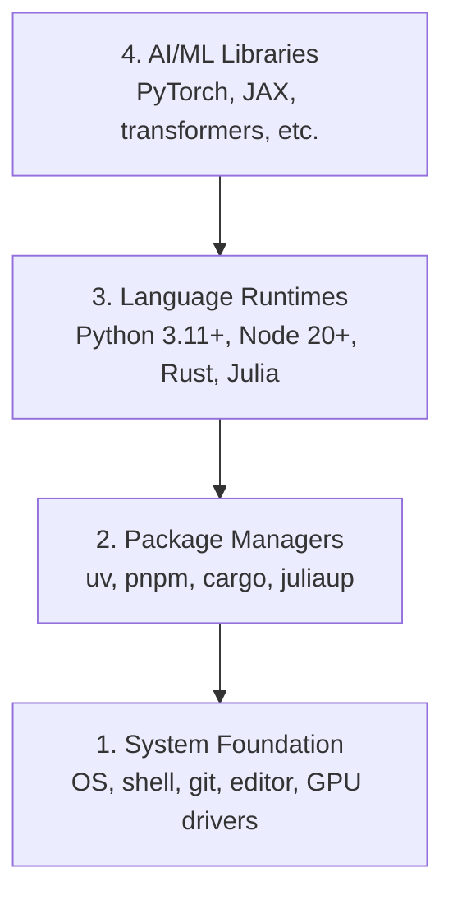

# Geliştirici Ortamı

> Araçlarınız düşüncenizi şekillendirir. Bir kez kurun, doğru şekilde kurun.

**Tür:** Yapım
**Diller:** Python, Node.js, Rust
**Önkoşullar:** Yok
**Süre:** ~45 dakika

## Öğrenme Hedefleri

- Python 3.11+, Node.js 20+ ve Rust araç zincirlerini sıfırdan kurun
- Tekrarlanabilir yapılar için sanal ortamları ve paket yöneticilerini yapılandırın
- CUDA/MPS ile GPU erişimini doğrulayın ve bir test tensör işlemi çalıştırın
- Dört katmanlı yığını anlayın: sistem, paketler, çalışma zamanları, yapay zeka kitaplıkları

## Sorun

Python, TypeScript, Rust ve Julia'yı kullanarak 200'den fazla derste AI engineering'yi öğrenmek üzeresiniz. Ortamınız bozulursa her ders, öğrenmek yerine alet olmaya karşı bir mücadeleye dönüşür.

Çoğu kişi ortam kurulumunu atlar. Daha sonra içe aktarma hatalarında, sürüm çakışmalarında ve eksik CUDA sürücülerinde hata ayıklamak için saatler harcıyorlar. Bunu bir kez, düzgün bir şekilde yapacağız.

## Konsept

Bir AI engineering ortamının dört katmanı vardır:



Aşağıdan yukarıya monte ediyoruz. Her katman, altındaki katmana bağlıdır.

## İnşa Et

### Adım 1: Sistem Temeli

Sisteminizi kontrol edin ve temelleri yükleyin.

```bash
# macOS
xcode-select --install
brew install git curl wget

# Ubuntu/Debian
sudo apt update && sudo apt install -y build-essential git curl wget

# Windows (use WSL2)
wsl --install -d Ubuntu-24.04
```

### Adım 2: uv ile Python

`uv` kullanıyoruz — pip'ten 10-100 kat daha hızlıdır ve sanal ortamları otomatik olarak yönetir.

```bash
curl -LsSf https://astral.sh/uv/install.sh | sh

uv python install 3.12

uv venv
source .venv/bin/activate  # or .venv\Scripts\activate on Windows

uv pip install numpy matplotlib jupyter
```

Doğrulayın:

```python
import sys
print(f"Python {sys.version}")

import numpy as np
print(f"NumPy {np.__version__}")
a = np.array([1, 2, 3])
print(f"Vector: {a}, dot product with itself: {np.dot(a, a)}")
```

### Adım 3: npm ile Node.js

TypeScript dersleri için (agent'ler, MCP sunucuları, web uygulamaları).

```bash
curl -fsSL https://fnm.vercel.app/install | bash
fnm install 22
fnm use 22

npm install -g pnpm

node -e "console.log('Node', process.version)"
```

**macOS / Apple Silicon (M1/M2/M3/M4):** Yükleyici `Error: Cannot install under Rosetta 2 in ARM default prefix (/opt/homebrew)` ile durursa, terminaliniz Rosetta 2 altında çalışıyor demektir (`arch`, `i386`'yi yazdırır), Homebrew ise yerel bir arm64 yapısıdır. Fnm forcing arm64'ü yükleyin, kabuğunuza bağlayın ve ardından yukarıdaki komutları `fnm install 22`'den yeniden çalıştırın:

```bash
arch -arm64 brew install fnm
echo 'eval "$(fnm env --use-on-cd)"' >> ~/.zshrc
source ~/.zshrc
```

### Adım 4: Pas

Performans açısından kritik dersler için (inference, sistemler).

```bash
curl --proto '=https' --tlsv1.2 -sSf https://sh.rustup.rs | sh

rustc --version
cargo --version
```

### Adım 5: Julia (İsteğe bağlı)

Julia'nın parladığı matematik ağırlıklı dersler için.

```bash
curl -fsSL https://install.julialang.org | sh

julia -e 'println("Julia ", VERSION)'
```

### Adım 6: GPU Kurulumu (Varsa)

**NVIDIA (Linux / Windows):**

```bash
nvidia-smi

# Install PyTorch with CUDA
uv pip install torch torchvision torchaudio --index-url https://download.pytorch.org/whl/cu124
```

**macOS / Apple Silicon (M1/M2/M3/M4):** Mac'te CUDA yoktur; bu beklenen bir durumdur, bir arıza değildir. `--index-url .../cuXXX`'yi **geçmeyin** (bu tekerlekler yalnızca Linux/Windows'tur, dolayısıyla yükleme başarısız olur). Apple'ın MPS (Metal) GPU arka ucunu içeren düz yapıyı yükleyin:

```bash
uv pip install torch torchvision torchaudio
```

Doğrulayın (herhangi bir platformda çalışır):

```python
import torch
print(f"CUDA available: {torch.cuda.is_available()}")           # False on macOS — expected
print(f"MPS available:  {torch.backends.mps.is_available()}")   # True on Apple Silicon
if torch.cuda.is_available():
    print(f"GPU: {torch.cuda.get_device_name(0)}")
```

GPU'nuz yok mu? Sorun değil. Derslerin çoğu CPU üzerinde çalışır. Eğitim ağırlıklı dersler için Google Colab'ı veya bulut GPU'larını kullanın.

### Adım 7: Her Şeyi Doğrulayın

Doğrulama komut dosyasını çalıştırın:

```bash
python phases/00-setup-and-tooling/01-dev-environment/code/verify.py
```

## Kullan onu

Ortamınız artık bu kurstaki her ders için hazır. Neyi nerede kullanacağınız aşağıda açıklanmıştır:

| Dil | Kullanılan | Paket Yöneticisi |
|----------|---------|-----------------|
| Python | Aşama 1-12 (ML, DL, NLP, Görme, Ses, Yüksek Lisans) | UV |
| TypeScript | Aşama 13-17 (Araçlar, Agent'ler, Sürüler, Altyapı) | pppm |
| Pas | Aşama 12, 15-17 (Performans açısından kritik sistemler) | kargo |
| Julia | Aşama 1 (Matematik temelleri) | Paket |

## Gönderin

Bu ders, herkesin kurulumunu kontrol etmek için çalıştırabileceği bir doğrulama komut dosyası oluşturur.

Yapay zeka asistanlarının ortam sorunlarını teşhis etmesine yardımcı olan prompt için `outputs/prompt-env-check.md`'ye bakın.

## Egzersizler

1. Doğrulama komut dosyasını çalıştırın ve hataları düzeltin
2. Bu kurs için bir Python sanal ortamı oluşturun ve PyTorch'u yükleyin
3. Dört dilde de bir "merhaba dünya" yazın ve her birini çalıştırın
