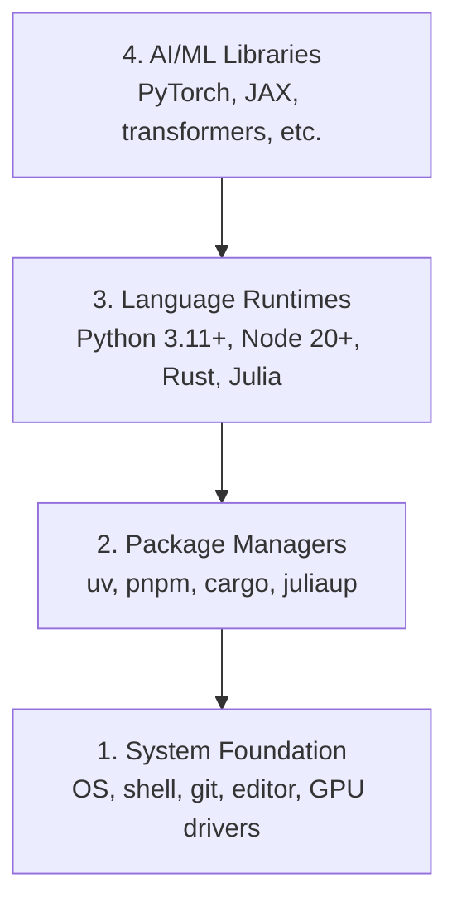

# Geliştirme Ortamı

> Araçlarınız düşünme biçiminizi şekillendirir. Onları bir kez, doğru biçimde kurun.

**Tür:** Build — Sıfırdan oluşturma
**Diller:** Python, Node.js, Rust
**Ön koşullar:** Yok
**Süre:** ~45 dakika

## Öğrenme Hedefleri

- Python 3.11+, Node.js 20+ ve Rust toolchain'lerini sıfırdan kurmak
- Tekrarlanabilir build'ler için virtual environment'ları ve package manager'ları yapılandırmak
- CUDA/MPS ile GPU erişimini doğrulamak ve bir test tensor işlemi çalıştırmak
- Dört katmanlı yapıyı anlamak: sistem, paketler, runtime'lar ve AI kütüphaneleri

## Problem

Python, TypeScript, Rust ve Julia kullanarak 200'den fazla derste AI Engineering (yapay zekâ sistemlerini tasarlama, geliştirme ve işletme disiplini) öğreneceksiniz. Ortamınız bozuksa her ders, öğrenmek yerine araçlarla mücadeleye dönüşür.

Çoğu kişi ortam kurulumunu atlar. Ardından import hatalarını, sürüm çakışmalarını ve eksik CUDA driver'larını ayıklamak için saatler harcar. Bu işi bir kez ve doğru biçimde yapacağız.

## Kavram

Bir AI Engineering ortamı dört katmandan oluşur:



Kurulumu aşağıdan yukarıya yaparız. Her katman, altındaki katmana bağlıdır.

## Build It — Sıfırdan Oluşturun

### 1. Adım: Sistem Temeli

Sisteminizi kontrol edin ve temel araçları kurun.

```bash
# macOS
xcode-select --install
brew install git curl wget

# Ubuntu/Debian
sudo apt update && sudo apt install -y build-essential git curl wget

# Windows (use WSL2)
wsl --install -d Ubuntu-24.04
```

### 2. Adım: uv ile Python

`uv` kullanıyoruz; pip'ten 10-100 kat hızlıdır ve virtual environment'ları otomatik olarak yönetir.

```bash
curl -LsSf https://astral.sh/uv/install.sh | sh

uv python install 3.12

uv venv
source .venv/bin/activate  # or .venv\Scripts\activate on Windows

uv pip install numpy matplotlib jupyter
```

Doğrulayın:

```python
import sys
print(f"Python {sys.version}")

import numpy as np
print(f"NumPy {np.__version__}")
a = np.array([1, 2, 3])
print(f"Vector: {a}, dot product with itself: {np.dot(a, a)}")
```

### 3. Adım: pnpm ile Node.js

TypeScript dersleri (agent'lar, MCP server'ları ve web uygulamaları) için.

```bash
curl -fsSL https://fnm.vercel.app/install | bash
fnm install 22
fnm use 22

npm install -g pnpm

node -e "console.log('Node', process.version)"
```

**macOS / Apple Silicon (M1/M2/M3/M4):** Kurulum `Error: Cannot install under Rosetta 2 in ARM default prefix (/opt/homebrew)` hatasıyla durursa terminaliniz Rosetta 2 altında çalışıyor (`arch` komutu `i386` yazdırıyor), Homebrew ise yerel arm64 build'i kullanıyordur. fnm'i arm64 kullanmaya zorlayarak kurun, shell'inize bağlayın ve yukarıdaki komutları `fnm install 22` üzerinden yeniden çalıştırın:

```bash
arch -arm64 brew install fnm
echo 'eval "$(fnm env --use-on-cd)"' >> ~/.zshrc
source ~/.zshrc
```

### 4. Adım: Rust

Performansın kritik olduğu dersler (inference ve sistemler) için.

```bash
curl --proto '=https' --tlsv1.2 -sSf https://sh.rustup.rs | sh

rustc --version
cargo --version
```

### 5. Adım: Julia (İsteğe Bağlı)

Julia'nın güçlü olduğu, matematik ağırlıklı dersler için.

```bash
curl -fsSL https://install.julialang.org | sh

julia -e 'println("Julia ", VERSION)'
```

### 6. Adım: GPU Kurulumu (GPU'nuz Varsa)

**NVIDIA (Linux / Windows):**

```bash
nvidia-smi

# Install PyTorch with CUDA
uv pip install torch torchvision torchaudio --index-url https://download.pytorch.org/whl/cu124
```

**macOS / Apple Silicon (M1/M2/M3/M4):** Mac'te CUDA yoktur; bu beklenen bir durumdur, hata değildir. `--index-url .../cuXXX` parametresini **kullanmayın** (bu wheel'ler yalnızca Linux/Windows içindir, dolayısıyla kurulum başarısız olur). Apple'ın MPS (Metal) GPU backend'ini içeren standart build'i kurun:

```bash
uv pip install torch torchvision torchaudio
```

Doğrulayın (tüm platformlarda çalışır):

```python
import torch
print(f"CUDA available: {torch.cuda.is_available()}")           # False on macOS — expected
print(f"MPS available:  {torch.backends.mps.is_available()}")   # True on Apple Silicon
if torch.cuda.is_available():
    print(f"GPU: {torch.cuda.get_device_name(0)}")
```

GPU'nuz yok mu? Sorun değil. Derslerin çoğu CPU'da çalışır. Eğitim yükü ağır derslerde Google Colab veya cloud GPU'ları kullanın.

### 7. Adım: Her Şeyi Doğrulayın

Doğrulama script'ini çalıştırın:

```bash
python phases/00-setup-and-tooling/01-dev-environment/code/verify.py
```

## Use It — Kullanın

Ortamınız artık bu kurstaki tüm derslere hazır. Hangi aracı nerede kullanacağınız aşağıda gösterilmiştir:

| Dil | Kullanıldığı Yer | Package Manager |
|----------|---------|-----------------|
| Python | Aşama 1-12 (ML, DL, NLP, Vision, Audio, LLM'ler) | uv |
| TypeScript | Aşama 13-17 (Araçlar, Agent'lar, Swarm'lar, Altyapı) | pnpm |
| Rust | Aşama 12, 15-17 (Performansın kritik olduğu sistemler) | cargo |
| Julia | Aşama 1 (Matematik temelleri) | Pkg |

## Ship It — Teslim Edin

Bu ders, herkesin kendi kurulumunu kontrol etmek için çalıştırabileceği bir doğrulama script'i üretir.

AI assistant'larının ortam sorunlarını teşhis etmesine yardımcı olan bir prompt için `outputs/prompt-env-check.md` dosyasına bakın.

## Alıştırmalar

1. Doğrulama script'ini çalıştırın ve tüm hataları giderin
2. Bu kurs için bir Python virtual environment'ı oluşturun ve PyTorch'u kurun
3. Dört dilin her birinde bir "hello world" programı yazıp çalıştırın
