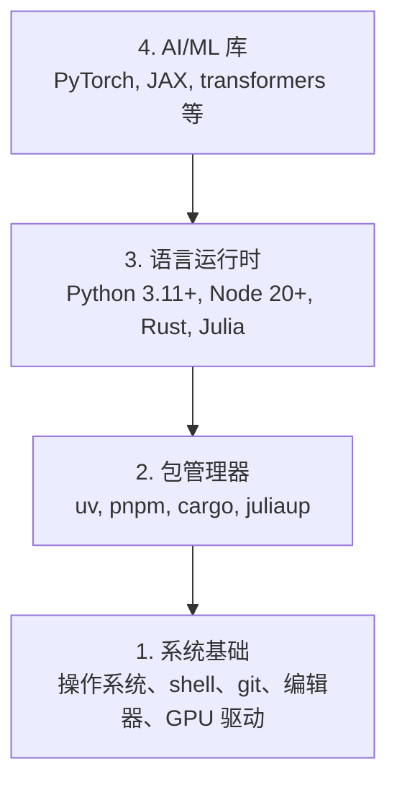

# 开发环境（Dev Environment）

> 译注：本文译自同目录 [`en.md`](./en.md)。术语遵循仓根 [TRANSLATION_GUIDE.md](../../../../TRANSLATION_GUIDE.md)。

> 工具会塑造你的思维方式。装一次，就装对。

**Type:** Build
**Languages:** Python, Node.js, Rust
**Prerequisites:** None
**Time:** ~45 分钟

## 学习目标（Learning Objectives）

- 从零搭好 Python 3.11+、Node.js 20+ 和 Rust 工具链
- 配置好虚拟环境和包管理器，让构建可复现
- 用 CUDA / MPS 验证 GPU 可用，跑一个 tensor（张量）测试运算
- 理解四层结构：系统、包管理器、语言运行时、AI 库

## 问题（The Problem）

接下来的 200+ 节课里，你会用 Python、TypeScript、Rust 和 Julia 学 AI 工程。如果环境是坏的，每一节课都会变成跟工具搏斗，而不是在学习。

大多数人跳过环境配置这一步，然后花几小时去 debug 导入错误、版本冲突、缺失的 CUDA 驱动。我们这一次，把它一次做对。

## 概念（The Concept）

一个 AI 工程环境分四层：



我们自下而上安装。每一层都依赖下面那一层。

## 动手实现（Build It）

### Step 1: 系统基础（System Foundation）

先检查系统、装上基本工具。

```bash
# macOS
xcode-select --install
brew install git curl wget

# Ubuntu/Debian
sudo apt update && sudo apt install -y build-essential git curl wget

# Windows (use WSL2)
wsl --install -d Ubuntu-24.04
```

### Step 2: Python 配 uv

我们用 `uv` —— 它比 pip 快 10–100 倍，而且自动管理虚拟环境。

```bash
curl -LsSf https://astral.sh/uv/install.sh | sh

uv python install 3.12

uv venv
source .venv/bin/activate  # or .venv\Scripts\activate on Windows

uv pip install numpy matplotlib jupyter
```

验证：

```python
import sys
print(f"Python {sys.version}")

import numpy as np
print(f"NumPy {np.__version__}")
a = np.array([1, 2, 3])
print(f"Vector: {a}, dot product with itself: {np.dot(a, a)}")
```

### Step 3: Node.js 配 pnpm

用于 TypeScript 课程（agent、MCP 服务、Web 应用）。

```bash
curl -fsSL https://fnm.vercel.app/install | bash
fnm install 22
fnm use 22

npm install -g pnpm

node -e "console.log('Node', process.version)"
```

### Step 4: Rust

用于对性能敏感的课程（inference（推理）、系统）。

```bash
curl --proto '=https' --tlsv1.2 -sSf https://sh.rustup.rs | sh

rustc --version
cargo --version
```

### Step 5: Julia（可选）

用于数学密集、Julia 更顺手的课程。

```bash
curl -fsSL https://install.julialang.org | sh

julia -e 'println("Julia ", VERSION)'
```

### Step 6: GPU 配置（如果你有 GPU）

```bash
# NVIDIA
nvidia-smi

# Install PyTorch with CUDA
uv pip install torch torchvision torchaudio --index-url https://download.pytorch.org/whl/cu124
```

```python
import torch
print(f"CUDA available: {torch.cuda.is_available()}")
if torch.cuda.is_available():
    print(f"GPU: {torch.cuda.get_device_name(0)}")
```

没有 GPU？没关系。大部分课程在 CPU 上就能跑。对训练量大的课程，可以用 Google Colab 或云 GPU。

### Step 7: 全面验证

跑一遍验证脚本：

```bash
python phases/00-setup-and-tooling/01-dev-environment/code/verify.py
```

## 用起来（Use It）

你的环境现在已经能撑起本课程的每一节课了。下表是各语言用在哪里：

| 语言 | 用在哪 | 包管理器 |
|----------|---------|-----------------|
| Python | Phase 1–12（ML、DL、NLP、Vision、Audio、LLM） | uv |
| TypeScript | Phase 13–17（工具、agent、swarm、基础设施） | pnpm |
| Rust | Phase 12、15–17（性能敏感的系统） | cargo |
| Julia | Phase 1（数学基础） | Pkg |

## 上线部署（Ship It）

这节课会产出一个验证脚本，任何人都能跑它来检查自己的环境。

参见 `outputs/prompt-env-check.md`，里面是一段帮 AI 助手诊断环境问题的 prompt。

## 练习（Exercises）

1. 跑一遍验证脚本，修掉所有失败项
2. 为本课程建一个 Python 虚拟环境，并装上 PyTorch
3. 用四种语言各写一个 "hello world"，并各自跑通
