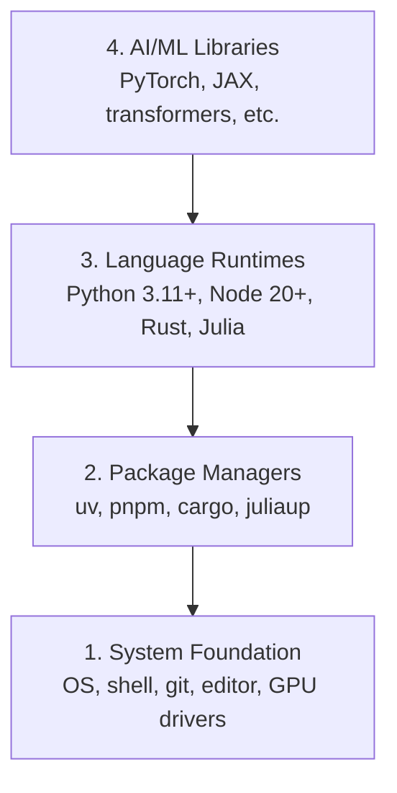

# 开发环境

> 您的工具塑造您的思维。设置一次，正确设置。

** 类型：** 构建
** 语言：** Python、Node.js、Rust
** 先决条件：** 无
** 时间：** ~45分钟

## 学习目标

- 从头开始设置Python 3.11+、Node.js 20+和Rust工具链
- 配置虚拟环境和包管理器以实现可复制的构建
- Verify GPU access with CUDA/MPS and run a test tensor operation
- Understand the four-layer stack: system, packages, runtimes, AI libraries

## The Problem

您将使用Python、TypScript、Rust和Julia在200多门课程中学习人工智能工程。如果您的环境被破坏了，那么每一堂课都会变成与工具的斗争，而不是学习。

大多数人跳过环境设置。然后他们花几个小时调试导入错误、版本冲突和丢失的CUDA驱动程序。我们要正确地做一次。

## 概念

An AI engineering environment has four layers:



We install bottom-up. Each layer depends on the one below it.

## 建设党

### 第1步：系统基础

检查您的系统并安装基础设施。

```bash
# macOS
xcode-select --install
brew install git curl wget

# Ubuntu/Debian
sudo apt update && sudo apt install -y build-essential git curl wget

# Windows (use WSL2)
wsl --install -d Ubuntu-24.04
```

### 第2步：带uv的Python

我们使用“uv”--它比pip快10- 100倍，并自动处理虚拟环境。

```bash
curl -LsSf https://astral.sh/uv/install.sh | sh

uv python install 3.12

uv venv
source .venv/bin/activate  # or .venv\Scripts\activate on Windows

uv pip install numpy matplotlib jupyter
```

验证：

```python
import sys
print(f"Python {sys.version}")

import numpy as np
print(f"NumPy {np.__version__}")
a = np.array([1, 2, 3])
print(f"Vector: {a}, dot product with itself: {np.dot(a, a)}")
```

### Step 3: Node.js with pnpm

适用于TypScript课程（代理、HCP服务器、Web应用程序）。

```bash
curl -fsSL https://fnm.vercel.app/install | bash
fnm install 22
fnm use 22

npm install -g pnpm

node -e "console.log('Node', process.version)"
```

### 第4步：生锈

对于性能关键的课程（推理，系统）。

```bash
curl --proto '=https' --tlsv1.2 -sSf https://sh.rustup.rs | sh

rustc --version
cargo --version
```

### Step 5: Julia (Optional)

朱莉娅大放异彩的数学课程。

```bash
curl -fsSL https://install.julialang.org | sh

julia -e 'println("Julia ", VERSION)'
```

### 第6步：图形处理器设置（如果您有）

```bash
# NVIDIA
nvidia-smi

# Install PyTorch with CUDA
uv pip install torch torchvision torchaudio --index-url https://download.pytorch.org/whl/cu124
```

```python
import torch
print(f"CUDA available: {torch.cuda.is_available()}")
if torch.cuda.is_available():
    print(f"GPU: {torch.cuda.get_device_name(0)}")
```

没有图形处理器？没问题.大多数课程在中央处理器上工作。对于培训密集型课程，请使用Google Colab或云图形处理器。

### 第7步：验证一切

运行验证脚本：

```bash
python phases/00-setup-and-tooling/01-dev-environment/code/verify.py
```

## 使用它

Your environment is now ready for every lesson in this course. Here's what you'll use where:

| Language | 用于 | 包管理器 |
|----------|---------|-----------------|
| Python | Phases 1-12 (ML, DL, NLP, Vision, Audio, LLMs) | uv |
| TypeScript | 第13-17阶段（工具、代理、群、Infra） | PNPM |
| Rust | 第12、15-17阶段（性能关键系统） | 货物 |
| 朱莉娅 | Phase 1 (Math foundations) | Pkg |

## 把它运

本课生成了一个验证脚本，任何人都可以运行该脚本来检查其设置。

请参阅`outputs/prompt-env-check.md`，以获得帮助AI助手诊断环境问题的提示。

## Exercises

1. Run the verification script and fix any failures
2. Create a Python virtual environment for this course and install PyTorch
3. 用所有四种语言编写“hello world”并运行每种语言
