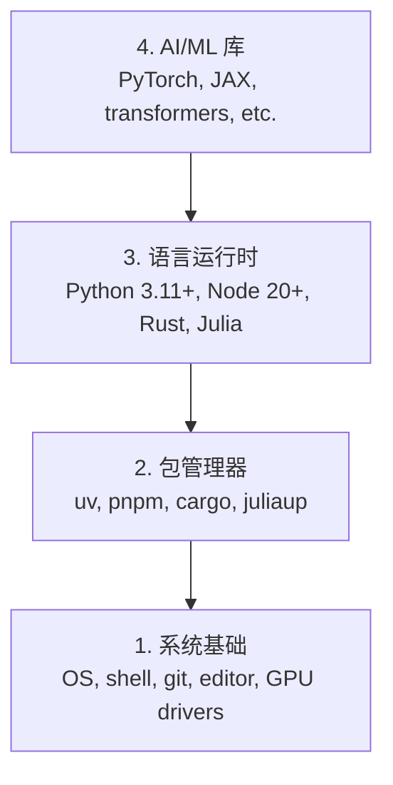

# 开发环境 (Dev Environment)

> 你的工具塑造你的思维方式。一次性搭建好，并且搭建正确。

**类型：** 构建 (Build)
**语言：** Python, Node.js, Rust
**前置要求：** 无
**时间：** ~45 分钟

## 学习目标 (Learning Objectives)

- 从零搭建 Python 3.11+、Node.js 20+ 和 Rust 工具链
- 配置虚拟环境和包管理器以实现可复现的构建
- 使用 CUDA/MPS 验证 GPU 访问，并运行测试 tensor 操作
- 理解四层堆栈：系统、包管理、运行时、AI 库

## 问题 (The Problem)

你即将在 200 多个课程中使用 Python、TypeScript、Rust 和 Julia 学习 AI 工程。如果你的环境出了问题，每一节课都会变成与工具的斗争，而不是学习本身。

大多数人会跳过环境搭建。然后他们会花数小时调试导入错误、版本冲突和缺失的 CUDA 驱动。我们准备一次性、正确地完成这件事。

## 概念 (The Concept)

一个 AI 工程环境包含四个层级：


```mermaid
graph TD
    A["4. AI/ML 库\nPyTorch, JAX, transformers, etc."] --> B["3. 语言运行时\nPython 3.11+, Node 20+, Rust, Julia"]
    B --> C["2. 包管理器\nuv, pnpm, cargo, juliaup"]
    C --> D["1. 系统基础\nOS, shell, git, editor, GPU drivers"]
```

我们自底向上安装。每一层依赖于它下面的一层。

## 动手构建 (Build It)

### 第 1 步：系统基础 (System Foundation)

检查你的系统并安装基础工具。

```bash
# macOS
xcode-select --install
brew install git curl wget

# Ubuntu/Debian
sudo apt update && sudo apt install -y build-essential git curl wget

# Windows (使用 WSL2)
wsl --install -d Ubuntu-24.04
```

### 第 2 步：使用 uv 安装 Python

我们使用 `uv`——它比 pip 快 10-100 倍，并且自动管理虚拟环境。

```bash
curl -LsSf https://astral.sh/uv/install.sh | sh

uv python install 3.12

uv venv
source .venv/bin/activate  # Windows 下使用 .venv\Scripts\activate

uv pip install numpy matplotlib jupyter
```

验证：

```python
import sys
print(f"Python {sys.version}")

import numpy as np
print(f"NumPy {np.__version__}")
a = np.array([1, 2, 3])
print(f"向量: {a}, 与自身的点积: {np.dot(a, a)}")
```

### 第 3 步：使用 pnpm 安装 Node.js

用于 TypeScript 课程（agents、MCP servers、web apps）。

```bash
curl -fsSL https://fnm.vercel.app/install | bash
fnm install 22
fnm use 22

npm install -g pnpm

node -e "console.log('Node', process.version)"
```

### 第 4 步：安装 Rust

用于性能关键的课程（推理、系统编程）。

```bash
curl --proto '=https' --tlsv1.2 -sSf https://sh.rustup.rs | sh

rustc --version
cargo --version
```

### 第 5 步：安装 Julia（可选）

用于数学密集型课程，Julia 在这些领域表现出色。

```bash
curl -fsSL https://install.julialang.org | sh

julia -e 'println("Julia ", VERSION)'
```

### 第 6 步：GPU 设置（如果你有 GPU）

```bash
# NVIDIA
nvidia-smi

# 安装带 CUDA 的 PyTorch
uv pip install torch torchvision torchaudio --index-url https://download.pytorch.org/whl/cu124
```

```python
import torch
print(f"CUDA 可用: {torch.cuda.is_available()}")
if torch.cuda.is_available():
    print(f"GPU: {torch.cuda.get_device_name(0)}")
```

没有 GPU？没问题。大多数课程可以在 CPU 上运行。对于训练密集的课程，使用 Google Colab 或云 GPU。

### 第 7 步：全部验证

运行验证脚本：

```bash
python phases/00-setup-and-tooling/01-dev-environment/code/verify.py
```

## 使用方式 (Use It)

你的环境现在已经为本课程的所有课程准备好了。以下是不同语言的使用场景：

| 语言 | 使用阶段 | 包管理器 |
|----------|---------|-----------------|
| Python | 阶段 1-12 (ML, DL, NLP, Vision, Audio, LLMs) | uv |
| TypeScript | 阶段 13-17 (Tools, Agents, Swarms, Infra) | pnpm |
| Rust | 阶段 12, 15-17 (性能关键系统) | cargo |
| Julia | 阶段 1 (数学基础) | Pkg |

## 交付 (Ship It)

本课程产出一个验证脚本，任何人都可以运行它来检查自己的环境设置。

参见 `outputs/prompt-env-check.md`，其中包含帮助 AI 助手诊断环境问题的提示。

## 练习 (Exercises)

1. 运行验证脚本并修复所有失败项
2. 为本课程创建一个 Python 虚拟环境并安装 PyTorch
3. 用四种语言各写一个 "hello world" 程序并分别运行
