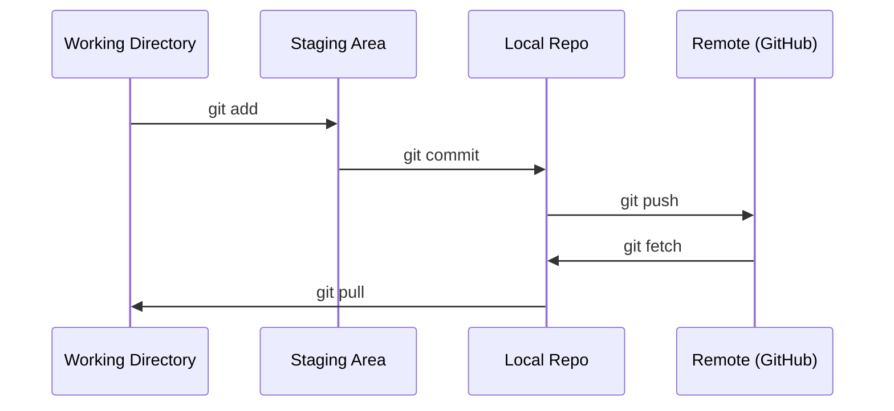

# Gitとコラボレーション

> バージョン管理は任意ではありません。ここで作るすべての実験、すべてのモデル、すべてのレッスンを記録します。

**タイプ:** 学習
**言語:** --
**前提条件:** フェーズ0、レッスン01
**時間:** 約30分

## 学習目標

- gitのユーザー情報を設定し、add、commit、pushの日常的な流れを使う
- mainを壊さずに、独立した実験用のブランチを作成してマージする
- モデルチェックポイントや大きなバイナリファイルを除外する `.gitignore` を書く
- `git log` でコミット履歴をたどり、プロジェクトの進化を理解する

## 課題

あなたはこれから、20フェーズにわたって何百ものコードファイルを書きます。バージョン管理がなければ、作業を失い、元に戻せない壊し方をし、他の人と協力する手段もなくなります。

Gitが道具です。GitHubはコードを置く場所です。このレッスンでは、このコースに必要なことだけを扱います。

## 考え方



覚えることは3つです。
1. こまめに保存する（`git commit`）
2. リモートへ送る（`git push`）
3. 実験にはブランチを使う（`git checkout -b experiment`）

## 作ってみる

### ステップ1: gitを設定する

```bash
git config --global user.name "Your Name"
git config --global user.email "you@example.com"
```

### ステップ2: 日常のワークフロー

```bash
git status
git add file.py
git commit -m "Add perceptron implementation"
git push origin main
```

### ステップ3: 実験用にブランチを切る

```bash
git checkout -b experiment/new-optimizer

# ... make changes, commit ...

git checkout main
git merge experiment/new-optimizer
```

### ステップ4: このコースのリポジトリで作業する

```bash
git clone https://github.com/rohitg00/ai-engineering-from-scratch.git
cd ai-engineering-from-scratch

git checkout -b my-progress
# work through lessons, commit your code
git push origin my-progress
```

## 使ってみる

このコースで必要なコマンドは、正確には次のものだけです。

| コマンド | 使う場面 |
|---------|------|
| `git clone` | コースのリポジトリを取得する |
| `git add` + `git commit` | 作業を保存する |
| `git push` | GitHubへバックアップする |
| `git checkout -b` | mainを壊さずに試す |
| `git log --oneline` | 自分がやったことを見る |

これだけです。このコースでは、rebase、cherry-pick、submoduleは必要ありません。

## 演習

1. このリポジトリをcloneし、`my-progress` というブランチを作成し、ファイルを作ってcommitし、pushする
2. モデルチェックポイントファイル（`.pt`, `.pth`, `.safetensors`）を除外する `.gitignore` を作成する
3. `git log --oneline` でこのリポジトリのコミット履歴を見て、レッスンがどのように追加されたかを読む

## 重要用語

| 用語 | よくある言い方 | 実際の意味 |
|------|----------------|----------------------|
| Commit | 「保存」 | ある時点のプロジェクト全体のスナップショット |
| Branch | 「コピー」 | 作業に合わせて前へ進む、コミットへのポインタ |
| Merge | 「コードをまとめる」 | あるブランチの変更を別のブランチへ適用すること |
| Remote | 「クラウド」 | GitHubやGitLabなど、別の場所にホストされたリポジトリのコピー |
