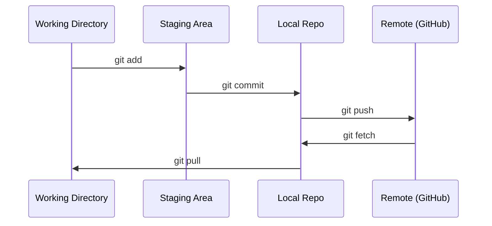

# Git & Collaboration

> Version control is not optional. Every experiment, every model, every lesson you build here gets tracked.

**Type:** Learn
**Languages:** --
**Prerequisites:** Phase 0, Lesson 01
**Time:** ~30 minutes

## Learning Objectives

- Configure git identity and use the daily workflow of add, commit, and push
- Create and merge branches for isolated experiments without breaking main
- Write a `.gitignore` that excludes model checkpoints and large binary files
- Navigate the commit history with `git log` to understand project evolution

## The Problem

You're about to write hundreds of code files across 20 phases. Without version control you will lose work, break things you can't undo, and have no way to collaborate with others.

Git is the tool. GitHub is where the code lives. This lesson covers what you need for this course and nothing more.

## The Concept


```mermaid
sequenceDiagram
    participant WD as Working Directory
    participant SA as Staging Area
    participant LR as Local Repo
    participant R as Remote (GitHub)
    WD->>SA: git add
    SA->>LR: git commit
    LR->>R: git push
    R->>LR: git fetch
    LR->>WD: git pull
```

Three things to remember:
1. Save often (`git commit`)
2. Push to remote (`git push`)
3. Branch for experiments (`git checkout -b experiment`)

## Build It

### Step 1: Configure git

```bash
git config --global user.name "Your Name"
git config --global user.email "you@example.com"
```
### Step 2: Configure ssh keys

https://docs.github.com/en/authentication/connecting-to-github-with-ssh/adding-a-new-ssh-key-to-your-github-account

### Step 3: Fork this course

Learn about forking:
https://docs.github.com/en/pull-requests/collaborating-with-pull-requests/working-with-forks/fork-a-repo

Fork this repo:
https://github.com/rohitg00/ai-engineering-from-scratch


### Step 4: Clone

Replace {YOUR_USERNAME} with your GitHub username.
```bash
git clone git@github.com:{YOUR_USERNAME}/ai-engineering-from-scratch.git
cd ai-engineering-from-scratch/
```

### Step 5: Set origin and upstream repo

```bash
git remote set-url origin git@github.com:{YOUR_USERNAME}/ai-engineering-from-scratch.git
git remote add upstream git@github.com:rohitg00/ai-engineering-from-scratch.git
```

### Step 6: Create a new branch

This will be used to save your progress.
```bash
git checkout -b my-progress
```

### Step 7: Test and push

```bash
cd phases/00-setup-and-tooling/02-git-and-collaboration/
```
Create any file.
```bash
git add file.py
git commit -m "first test commit"
git push origin my-progress
```

### Step 8: Keep your fork updated

```bash
git fetch upstream main
git merge upstream/main # update local main branch with upstream
git checkout my-progress
git merge main # merge updated main branch on top of my-progress branch
```

### Other useful commands

| Command | When |
|---------|------|
| `git restore --staged <file_path>` | Undo `git add` and unstage files |
| `git reset --soft HEAD~1` | Undo `git commit` and keep files staged |
| `git reset HEAD~1` | Undo `git commit` and unstage files |
| `git log --oneline` | See what you've done |


That's it. You don't need rebase, cherry-pick, or submodules for this course.

## Exercises

1. Look at the commit history of this repo with `git log --oneline` and read how lessons were added

## Key Terms

| Term | What people say | What it actually means |
|------|----------------|----------------------|
| Commit | "Saving" | A snapshot of your entire project at a point in time |
| Branch | "A copy" | A pointer to a commit that moves forward as you work |
| Merge | "Combining code" | Taking changes from one branch and applying them to another |
| Remote | "The cloud" | A copy of your repo hosted somewhere else (GitHub, GitLab) |
