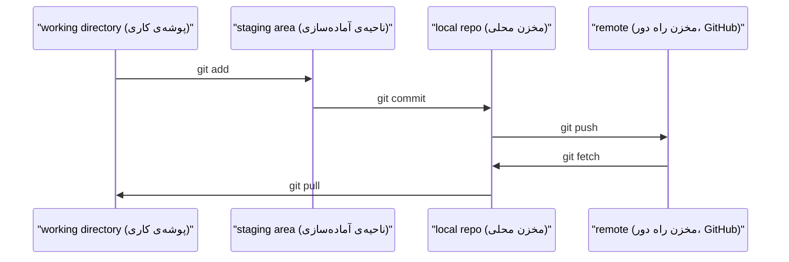

# Git & Collaboration

> version control (کنترل نسخه) اختیاری نیست. هر آزمایش، هر مدل و هر درسی که اینجا می‌سازید، ثبت و پیگیری می‌شود.

**Type:** یادگیری
**Languages:** --
**Prerequisites:** مرحله‌ی 0، درس 01
**Time:** حدود 30 دقیقه

## اهداف یادگیری

- هویت git را پیکربندی کنید و از workflow (گردش‌کار) روزانه‌ی add، commit و push استفاده کنید
- برای آزمایش‌های جداگانه branch (شاخه) بسازید و پس از پایان کار آن‌ها را merge (ادغام) کنید، بدون اینکه main را خراب کنید
- یک `.gitignore` بنویسید که فایل‌های checkpoint (نقطه‌ی ذخیره) مدل و فایل‌های باینری بزرگ را کنار بگذارد
- تاریخچه‌ی commit (ثبت تغییرات) را با `git log` مرور کنید تا تکامل پروژه را بهتر بفهمید

## مسئله

قرار است در 20 مرحله، صدها فایل code بنویسید. بدون version control (کنترل نسخه)، کارتان را از دست می‌دهید، چیزهایی را خراب می‌کنید که نمی‌توانید برگردانید و راهی برای همکاری با دیگران نخواهید داشت.

Git ابزار کار است. GitHub جایی است که code در آن نگهداری می‌شود. این درس فقط چیزهای لازم برای این دوره را پوشش می‌دهد؛ نه بیشتر.

## مفهوم



سه نکته را به خاطر بسپارید:
1. تغییرات را مرتب ثبت کنید (`git commit`)
2. تغییرات را به remote (مخزن راه دور) بفرستید (`git push`)
3. برای آزمایش‌ها یک branch (شاخه) بسازید (`git checkout -b experiment`)

```figure
s0-commit-dag
```

## آن را بسازید

### گام 1: پیکربندی git

هویت git خود را تنظیم کنید:

```bash
git config --global user.name "Your Name"
git config --global user.email "you@example.com"
```

### گام 2: workflow روزانه

این توالی پایه را برای ذخیره و پشتیبان‌گیری از تغییرات اجرا کنید:

```bash
git status
git add file.py
git commit -m "Add perceptron implementation"
git push origin main
```

### گام 3: branch برای آزمایش‌ها

برای اینکه تغییرات آزمایشی از main جدا بمانند، یک branch جدید بسازید و بعد آن را با main ادغام کنید:

```bash
git checkout -b experiment/new-optimizer

# ... make changes, commit ...

git checkout main
git merge experiment/new-optimizer
```

### گام 4: کار با repo (مخزن) این دوره

نمی‌توانید مستقیماً به repo دوره push کنید—فقط نگه‌دارندگان پروژه دسترسی نوشتن دارند. ابتدا آن را در GitHub fork کنید (با دکمه‌ی Fork در بالا-سمت‌راست) تا `origin` به کپی خودتان اشاره کند:

```bash
git clone https://github.com/YOUR-USERNAME/ai-engineering-from-scratch.git
cd ai-engineering-from-scratch

git checkout -b my-progress
# work through lessons, commit your code
git push origin my-progress
```

## از آن استفاده کنید

برای این دوره، دقیقاً به این فرمان‌ها نیاز دارید:

| فرمان | زمان استفاده |
|---------|------|
| `git clone` | دریافت repo (مخزن) دوره |
| `git add` + `git commit` | ذخیره‌ی تغییرات |
| `git push` | پشتیبان‌گیری از آن در GitHub |
| `git checkout -b` | امتحان کردن چیزی بدون خراب کردن main |
| `git log --oneline` | دیدن کارهایی که انجام داده‌اید |

همین‌ها کافی است. برای این دوره به rebase، cherry-pick یا submodules نیازی ندارید.

## تمرین‌ها

1. این repo را fork کنید، fork خودتان را clone کنید، یک branch با نام `my-progress` بسازید، یک فایل ایجاد کنید، آن را commit کنید و push کنید
2. یک `.gitignore` بنویسید که فایل‌های checkpoint (نقطه‌ی ذخیره) مدل (`.pt`، `.pth`، `.safetensors`) را کنار بگذارد
3. تاریخچه‌ی commit در این repo را با `git log --oneline` ببینید و بررسی کنید درس‌ها چطور اضافه شده‌اند

## اصطلاحات کلیدی

| اصطلاح | چیزی که مردم می‌گویند | معنای واقعی |
|------|----------------------|------|
| Commit | «ذخیره کردن» | یک snapshot (تصویر لحظه‌ای) از کل پروژه در یک نقطه از زمان |
| Branch | «یک کپی» | اشاره‌گری به یک commit که هنگام کار شما به جلو حرکت می‌کند |
| Merge | «ترکیب کردن code» | گرفتن تغییرات یک branch و اعمال آن‌ها روی branch دیگر |
| Remote | «ابر» | یک کپی از repo (مخزن) شما که جای دیگری، مثل GitHub یا GitLab، میزبانی می‌شود |
