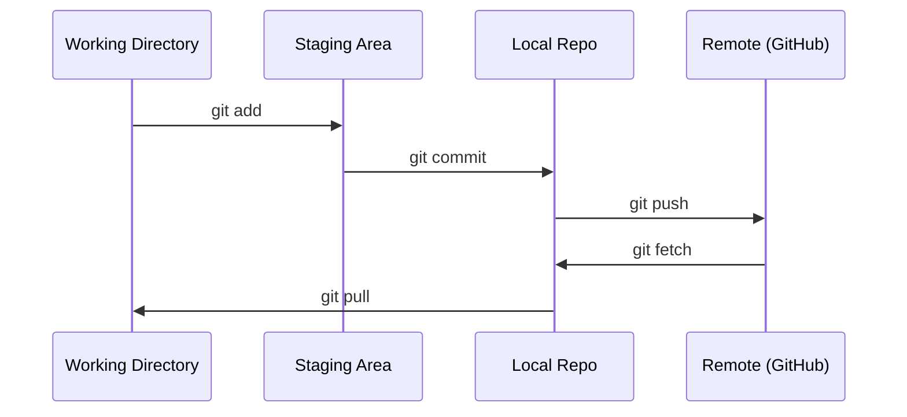

# Git ve İş Birliği

> Sürüm kontrolü isteğe bağlı değildir. Burada oluşturduğunuz her deney, model ve ders izlenir.

**Tür:** Learn — Öğrenme
**Diller:** --
**Ön koşullar:** Aşama 0, Ders 01
**Süre:** ~30 dakika

## Öğrenme Hedefleri

- Git kimliğini yapılandırmak ve günlük add, commit, push iş akışını kullanmak
- main branch'ini bozmadan yalıtılmış deneyler için branch oluşturmak ve merge etmek
- Model checkpoint'lerini ve büyük binary dosyaları dışlayan bir `.gitignore` yazmak
- Projenin gelişimini anlamak için `git log` ile commit geçmişinde gezinmek

## Problem

20 aşama boyunca yüzlerce kod dosyası yazacaksınız. Sürüm kontrolü olmadan çalışmalarınızı kaybeder, geri alamayacağınız hatalar yapar ve başkalarıyla iş birliği kuramazsınız.

Araç Git'tir. Kodun bulunduğu yer GitHub'dır. Bu ders yalnızca bu kurs için gerekenleri ele alır.

## Kavram



Hatırlamanız gereken üç nokta:
1. Sık sık kaydedin (`git commit`)
2. Remote'a gönderin (`git push`)
3. Deneyler için branch açın (`git checkout -b experiment`)

## Build It — Sıfırdan Oluşturun

### 1. Adım: Git'i yapılandırın

```bash
git config --global user.name "Your Name"
git config --global user.email "you@example.com"
```

### 2. Adım: Günlük iş akışı

```bash
git status
git add file.py
git commit -m "Add perceptron implementation"
git push origin main
```

### 3. Adım: Deneyler için branch oluşturma

```bash
git checkout -b experiment/new-optimizer

# ... make changes, commit ...

git checkout main
git merge experiment/new-optimizer
```

### 4. Adım: Bu kursun repo'suyla çalışma

Kursun repo'suna doğrudan push edemezsiniz; yalnızca maintainer'ların yazma erişimi vardır. Önce GitHub'da fork'layın (sağ üstteki Fork düğmesi); böylece `origin` kendi kopyanızı gösterir:

```bash
git clone https://github.com/YOUR-USERNAME/ai-engineering-from-scratch.git
cd ai-engineering-from-scratch

git checkout -b my-progress
# work through lessons, commit your code
git push origin my-progress
```

## Use It — Kullanın

Bu kurs için tam olarak şu komutlara ihtiyacınız var:

| Komut | Ne zaman kullanılır? |
|---------|------|
| `git clone` | Kursun repo'sunu almak için |
| `git add` + `git commit` | Çalışmanızı kaydetmek için |
| `git push` | GitHub'a yedeklemek için |
| `git checkout -b` | main'i bozmadan bir şey denemek için |
| `git log --oneline` | Yaptıklarınızı görmek için |

Hepsi bu kadar. Bu kurs için rebase, cherry-pick veya submodule kullanmanız gerekmez.

## Alıştırmalar

1. Bu repo'yu fork'layın, fork'unuzu clone'layın, `my-progress` adlı bir branch oluşturun; bir dosya oluşturup commit ve push edin
2. Bir `.gitignore` oluşturup model checkpoint dosyalarını (`.pt`, `.pth`, `.safetensors`) dışlayın
3. `git log --oneline` ile bu repo'nun commit geçmişine bakın ve derslerin nasıl eklendiğini inceleyin

## Temel Terimler

| Terim | Yaygın ifade | Gerçek anlamı |
|------|----------------|----------------------|
| Commit | "Kaydetme" | Projenizin belirli bir andaki eksiksiz snapshot'ı |
| Branch | "Bir kopya" | Çalıştıkça ilerleyen bir commit pointer'ı |
| Merge | "Kodu birleştirme" | Bir branch'teki değişiklikleri başka bir branch'e uygulama |
| Remote | "Cloud" | Repo'nuzun başka bir yerde barındırılan kopyası (GitHub, GitLab) |
