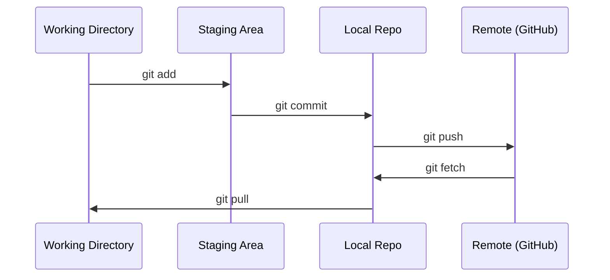

# Git ve İşbirliği

> Sürüm kontrolü isteğe bağlı değildir. Burada oluşturduğunuz her deney, her model, her ders takip ediliyor.

**Tür:** Öğren
**Diller:** --
**Önkoşullar:** Aşama 0, Ders 01
**Süre:** ~30 dakika

## Öğrenme Hedefleri

- Git kimliğini yapılandırın ve günlük ekleme, taahhüt etme ve aktarma iş akışını kullanın
- Ana konuyu bozmadan izole edilmiş deneyler için dallar oluşturun ve birleştirin
- Model kontrol noktalarını ve büyük ikili dosyaları hariç tutan bir `.gitignore` yazın
- Proje gelişimini anlamak için `git log` ile taahhüt geçmişinde gezinin

## Sorun

20 aşamada yüzlerce kod dosyası yazmak üzeresiniz. Sürüm kontrolü olmadan işinizi kaybedersiniz, geri alamayacağınız şeyleri bozarsınız ve başkalarıyla işbirliği yapmanın hiçbir yolu kalmaz.

Git bir araçtır. GitHub kodun yaşadığı yerdir. Bu ders, bu kurs için ihtiyacınız olan şeyleri kapsar, daha fazlasını değil.

## Konsept



Hatırlanması gereken üç şey:
1. Sık sık kaydedin (`git commit`)
2. Uzaktan kumandaya basın (`git push`)
3. Deneyler için şube (`git checkout -b experiment`)

## İnşa Et

### Adım 1: Git'i yapılandırın

```bash
git config --global user.name "Your Name"
git config --global user.email "you@example.com"
```

### Adım 2: Günlük iş akışı

```bash
git status
git add file.py
git commit -m "Add perceptron implementation"
git push origin main
```

### 3. Adım: Deneyler için dallara ayrılma

```bash
git checkout -b experiment/new-optimizer

# ... make changes, commit ...

git checkout main
git merge experiment/new-optimizer
```

### 4. Adım: Bu kurs deposuyla çalışma

Kurs deposunun kendisini gönderemezsiniz; yalnızca bakımcıların yazma erişimi vardır. Önce GitHub'da çatallayın (Çatal düğmesi, sağ üstte), böylece `origin` kendi kopyanızı işaret eder:

```bash
git clone https://github.com/YOUR-USERNAME/ai-engineering-from-scratch.git
cd ai-engineering-from-scratch

git checkout -b my-progress
# work through lessons, commit your code
git push origin my-progress
```

## Kullan onu

Bu kurs için tam olarak şu komutlara ihtiyacınız var:

| Komut | Ne zaman |
|---------|------|
| `git clone` | Kurs deposunu edinin |
| `git add` + `git commit` | Çalışmanızı kaydedin |
| `git push` | GitHub'a yedekleyin |
| `git checkout -b` | main |'ı bozmadan bir şeyler deneyin.
| `git log --oneline` | Ne yaptığınızı görün |

İşte bu. Bu kurs için rebase'e, kiraz toplamaya veya alt modüllere ihtiyacınız yok.

## Egzersizler

1. Bu repoyu çatallayın, çatalınızı klonlayın, `my-progress` adında bir dal oluşturun, bir dosya oluşturun, onu kaydedin, itin
2. Model kontrol noktası dosyalarını (`.pt`, `.pth`, `.safetensors`) hariç tutan bir `.gitignore` oluşturun
3. `git log --oneline` ile bu reponun taahhüt geçmişine bakın ve derslerin nasıl eklendiğini okuyun

## Anahtar Terimler

| Dönem | İnsanlar ne diyor | Aslında ne anlama geliyor |
|------|----------------|----------------------|
| Taahhüt | "Kaydediliyor" | Tüm projenizin belirli bir andaki anlık görüntüsü |
| Şube | "Bir kopya" | Çalıştıkça ilerleyen bir taahhüdün işaretçisi |
| Birleştir | "Kodu birleştirme" | Değişiklikleri bir şubeden alıp diğerine uygulamak |
| Uzaktan | "Bulut" | Deponuzun bir kopyası başka bir yerde barındırılıyor (GitHub, GitLab) |
