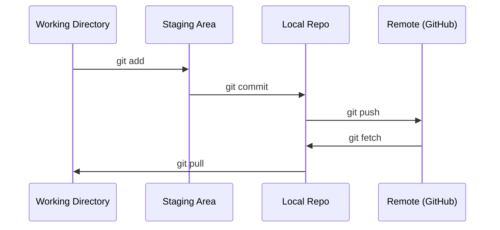

# Git 与协作（Git & Collaboration）

> 译注：本文译自同目录 [`en.md`](./en.md)。术语遵循仓根 [TRANSLATION_GUIDE.md](../../../../TRANSLATION_GUIDE.md)。

> 版本控制不是可选项。你在这里做的每一次实验、每一个模型、每一节课，都要被追踪记录。

**Type:** Learn
**Languages:** --
**Prerequisites:** Phase 0, Lesson 01
**Time:** ~30 minutes

## 学习目标（Learning Objectives）

- 配置 git 身份信息，掌握 add、commit、push 这套日常工作流
- 创建并合并分支，把实验隔离开来，不弄坏 main
- 写一个 `.gitignore`，把模型 checkpoint 和大二进制文件排除在外
- 用 `git log` 浏览提交历史，理解项目是怎么一步步演进的

## 问题（The Problem）

你接下来要在 20 个 phase 里写下数百个代码文件。没有版本控制，你会丢代码、会改坏东西却没法回退，更别提跟别人协作了。

Git 是工具。GitHub 是代码托管的地方。本节只讲这门课需要用到的那些，不多讲。

## 概念（The Concept）



三件事要记住：
1. 经常保存（`git commit`）
2. 推到远端（`git push`）
3. 用分支跑实验（`git checkout -b experiment`）

## 动手实现（Build It）

### Step 1: Configure git

```bash
git config --global user.name "Your Name"
git config --global user.email "you@example.com"
```

### Step 2: The daily workflow

```bash
git status
git add file.py
git commit -m "Add perceptron implementation"
git push origin main
```

### Step 3: Branching for experiments

```bash
git checkout -b experiment/new-optimizer

# ... make changes, commit ...

git checkout main
git merge experiment/new-optimizer
```

### Step 4: Working with this course repo

```bash
git clone https://github.com/rohitg00/ai-engineering-from-scratch.git
cd ai-engineering-from-scratch

git checkout -b my-progress
# work through lessons, commit your code
git push origin my-progress
```

## 用起来（Use It）

这门课里，你只需要这几条命令：

| Command | When |
|---------|------|
| `git clone` | 拉取课程仓 |
| `git add` + `git commit` | 保存你的工作 |
| `git push` | 备份到 GitHub |
| `git checkout -b` | 试新东西又不弄坏 main |
| `git log --oneline` | 看看你做过什么 |

就这些。本课用不到 rebase、cherry-pick，也用不到 submodule。

## 练习（Exercises）

1. 克隆这个仓，创建一个叫 `my-progress` 的分支，新建一个文件，commit、push
2. 写一个 `.gitignore`，排除模型 checkpoint 文件（`.pt`、`.pth`、`.safetensors`）
3. 用 `git log --oneline` 看看本仓的提交历史，读一读这些课程是怎么一节节加进来的

## 关键术语（Key Terms）

| Term | What people say | What it actually means |
|------|----------------|----------------------|
| Commit | “存档” | 项目在某个时间点的整体快照 |
| Branch | “一份副本” | 一个指向某次 commit 的指针，会随你工作往前推进 |
| Merge | “把代码合到一起” | 把一个分支上的改动取出来，应用到另一个分支上 |
| Remote | “云端” | 你的仓库在别处的一份副本（GitHub、GitLab） |
