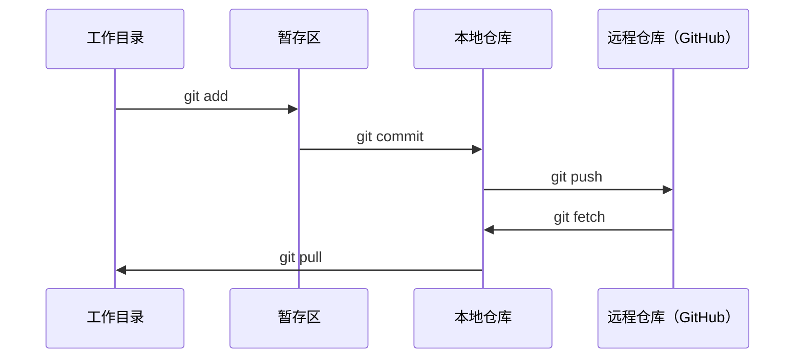

# Git & 协作

> 版本控制（Version Control）不是可选项。你在此构建的每个实验、每个模型、每节课都会被跟踪记录。

**类型：** 学习
**语言：** --
**前置条件：** 阶段0，第01课
**时长：** ~30分钟

## 学习目标

- 配置 Git 身份信息，并使用每日工作流程（添加、提交和推送）
- 创建和合并分支，以便在不破坏主分支（Main）的情况下进行隔离实验
- 编写 `.gitignore` 文件，排除模型检查点和大型二进制文件
- 使用 `git log` 浏览提交历史，理解项目的演变过程

## 问题

你即将在20个阶段中编写数百个代码文件。如果没有版本控制，你将丢失工作、破坏无法撤销的内容，并且无法与他人协作。

Git 是工具。GitHub 是代码存放的地方。本节课只涵盖本课程所需的内容，不多不少。

## 概念



需要记住三件事：
1. 经常保存（`git commit`）
2. 推送到远程仓库（`git push`）
3. 为实验创建分支（`git checkout -b experiment`）

## 动手实践

### 步骤1：配置 Git

```bash
git config --global user.name "你的名字"
git config --global user.email "you@example.com"
```

### 步骤2：每日工作流程

```bash
git status
git add file.py
git commit -m "添加感知机实现"
git push origin main
```

### 步骤3：为实验创建分支

```bash
git checkout -b experiment/new-optimizer

# ... 进行更改，提交 ...

git checkout main
git merge experiment/new-optimizer
```

### 步骤4：使用本课程仓库

```bash
git clone https://github.com/rohitg00/ai-engineering-from-scratch.git
cd ai-engineering-from-scratch

git checkout -b my-progress
# 完成课程，提交你的代码
git push origin my-progress
```

## 使用它

对于本课程，你只需用到以下命令：

| 命令 | 使用时机 |
|------|---------|
| `git clone` | 获取课程仓库 |
| `git add` + `git commit` | 保存你的工作 |
| `git push` | 备份到 GitHub |
| `git checkout -b` | 尝试新功能而不影响主分支 |
| `git log --oneline` | 查看已完成的工作 |

仅此而已。本课程不需要 `rebase`、`cherry-pick` 或子模块。

## 练习

1. 克隆此仓库，创建一个名为 `my-progress` 的分支，创建一个文件，提交它，然后推送。
2. 创建一个 `.gitignore` 文件，排除模型检查点文件（`.pt`、`.pth`、`.safetensors`）。
3. 使用 `git log --oneline` 查看此仓库的提交历史，并了解课程是如何逐步添加的。

## 关键术语

| 术语 | 人们通常说的 | 实际含义 |
|------|-------------|---------|
| 提交（Commit） | "保存" | 项目在某个时间点的快照 |
| 分支（Branch） | "一份副本" | 指向某个提交的指针，会随着你的工作向前移动 |
| 合并（Merge） | "组合代码" | 将一个分支的更改应用到另一个分支 |
| 远程仓库（Remote） | "云" | 托管在其他地方（GitHub、GitLab）的仓库副本 |