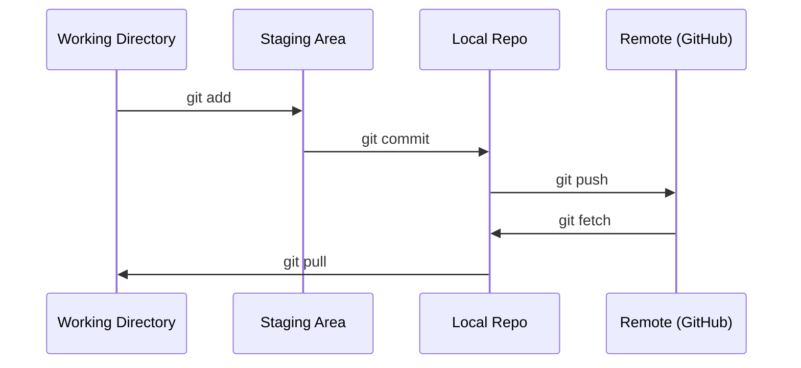

# 02 · Git 与协作

> 版本控制不是可选项。你在这里构建的每一次实验、每一个模型、每一节课，都会被追踪记录。

**类型：** 学习
**语言：** --
**前置：** 阶段 0，第 01 课
**时长：** 约 30 分钟

## 学习目标

- 配置 git 身份信息，掌握 add、commit、push 的日常工作流
- 创建并合并分支，在不破坏 main 的前提下隔离实验
- 编写 `.gitignore`，排除模型检查点和大型二进制文件
- 用 `git log` 浏览提交历史，理解项目的演进过程

## 问题所在

接下来你将在 20 个阶段中编写数百个代码文件。如果没有版本控制，你会丢失工作成果、做出无法撤销的破坏性改动，而且也没有办法与他人协作。

Git 是工具。GitHub 是代码存放的地方。本课只覆盖你在本课程中所需的内容，不多讲。

## 核心概念



需要记住三件事：
1. 经常保存（`git commit`）
2. 推送到远程（`git push`）
3. 为实验创建分支（`git checkout -b experiment`）

## 动手构建

### 第 1 步：配置 git

```bash
git config --global user.name "Your Name"
git config --global user.email "you@example.com"
```

### 第 2 步：日常工作流

```bash
git status
git add file.py
git commit -m "Add perceptron implementation"
git push origin main
```

### 第 3 步：为实验创建分支

```bash
git checkout -b experiment/new-optimizer

# ... 做改动，提交 ...

git checkout main
git merge experiment/new-optimizer
```

### 第 4 步：使用本课程的仓库

```bash
git clone https://github.com/rohitg00/ai-engineering-from-scratch.git
cd ai-engineering-from-scratch

git checkout -b my-progress
# 跟着课程做，提交你的代码
git push origin my-progress
```

## 实际运用

对于本课程，你只需要以下这些命令：

| 命令 | 何时使用 |
|---------|------|
| `git clone` | 获取课程仓库 |
| `git add` + `git commit` | 保存你的工作 |
| `git push` | 备份到 GitHub |
| `git checkout -b` | 在不破坏 main 的前提下尝试新东西 |
| `git log --oneline` | 查看你做过什么 |

就这些。本课程不需要 rebase、cherry-pick 或 submodule。

## 练习

1. 克隆本仓库，创建一个名为 `my-progress` 的分支，新建一个文件，提交它，再推送它
2. 创建一个 `.gitignore`，排除模型检查点文件（`.pt`、`.pth`、`.safetensors`）
3. 用 `git log --oneline` 查看本仓库的提交历史，了解各节课是如何被添加进来的

## 关键术语

| 术语 | 大家通常的说法 | 它实际的含义 |
|------|----------------|----------------------|
| 提交（Commit） | "保存" | 在某个时间点对你整个项目所拍下的快照 |
| 分支（Branch） | "一份副本" | 指向某个提交的指针，会随着你的工作向前移动 |
| 合并（Merge） | "把代码合到一起" | 把一个分支上的改动取出并应用到另一个分支 |
| 远程（Remote） | "云端" | 托管在别处（GitHub、GitLab）的仓库副本 |
