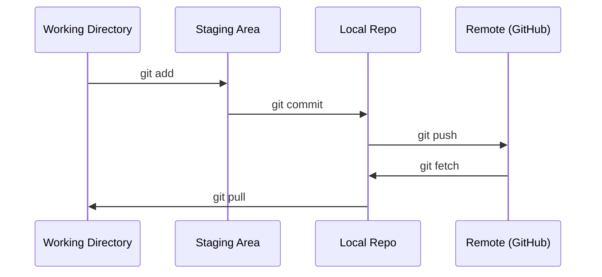

# Git与协作

> 版本控制不是可选的。您在这里建立的每个实验、每个模型、每个课程都会被跟踪。

** 类型：** 学习
** 语言：**--
** 先决条件：** 第0阶段，第01课
** 时间：** ~30分钟

## 学习目标

- 配置git身份并使用添加、提交和推送的日常工作流程
- 在不中断主的情况下创建和合并孤立实验的分支
- Write a `.gitignore` that excludes model checkpoints and large binary files
- 使用“git log”浏览提交历史记录以了解项目演变

## 问题

您即将跨越20个阶段编写数百个代码文件。如果没有版本控制，您将失去工作，破坏无法撤销的事情，并且无法与他人协作。

Git就是工具。GitHub是代码所在的地方。本课仅介绍本课程所需的内容。

## 概念



需要记住的三件事：
1. 经常保存（“git commit”）
2. 推到远程（' git push '）
3. 实验分支（“git checkout -b experiment”）

## 建设党

### 第1步：配置git

```bash
git config --global user.name "Your Name"
git config --global user.email "you@example.com"
```

### 第2步：日常工作流程

```bash
git status
git add file.py
git commit -m "Add perceptron implementation"
git push origin main
```

### Step 3: Branching for experiments

```bash
git checkout -b experiment/new-optimizer

# ... make changes, commit ...

git checkout main
git merge experiment/new-optimizer
```

### 第4步：使用此课程回购

```bash
git clone https://github.com/rohitg00/ai-engineering-from-scratch.git
cd ai-engineering-from-scratch

git checkout -b my-progress
# work through lessons, commit your code
git push origin my-progress
```

## 使用它

对于本课程，您确实需要这些命令：

| Command | 当 |
|---------|------|
| `git clone` | 获取课程回购 |
| `git add` + `git commit` | Save your work |
| “git push” | 备份到GitHub |
| ' git checkout -b ' | Try something without breaking main |
| ' git log --online ' | 看看你都做了什么 |

就是这样。本课程不需要重基、樱桃挑选或子模块。

## Exercises

1. 克隆这个仓库，创建一个名为“my-programme”的分支，创建一个文件，提交它，推送它
2. 创建排除模型检查点文件（`.pt`、`.pth`、`.safetensors`）的`.gitignore`
3. 使用“git log --oneline”查看此仓库的提交历史记录，并了解如何添加课程

## 关键术语

| Term | 别人怎么说 | What it actually means |
|------|----------------|----------------------|
| Commit | “节省” | 整个项目在某个时间点的快照 |
| 分支 | "A copy" | 一个指针，指向在您工作时向前推进的提交 |
| 合并 | “组合代码” | Taking changes from one branch and applying them to another |
| 远程 | “云” | 托管在其他地方（GitHub、GitLab）的仓库副本 |
