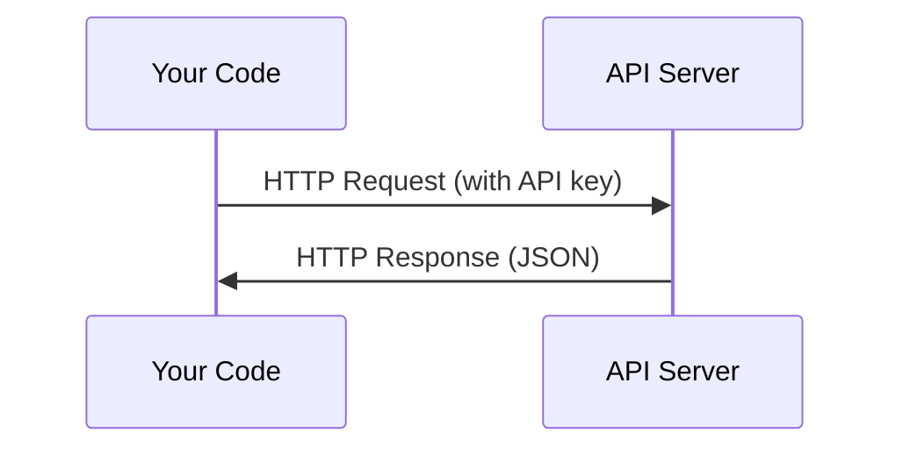

# APIとキー

> すべてのAI APIは同じ仕組みです。リクエストを送り、レスポンスを受け取る。細部は変わっても、パターンは変わりません。

**タイプ:** 作ってみる
**言語:** Python, TypeScript
**前提条件:** フェーズ0、レッスン01
**時間:** 約30分

## 学習目標

- 環境変数と `.env` ファイルを使ってAPIキーを安全に保存する
- Anthropic Python SDKと生のHTTPの両方でLLM APIを呼び出す
- デバッグのために、SDKベースと生HTTPのリクエスト/レスポンス形式を比較する
- 認証やレート制限を含む、よくあるAPIエラーを特定して処理する

## 課題

フェーズ11から、LLM API（Anthropic、OpenAI、Google）を呼び出します。フェーズ13〜16では、これらのAPIをループ内で使うエージェントを構築します。APIキーがどのように機能するか、安全に保存する方法、最初のAPI呼び出しの方法を知っておく必要があります。

## 考え方



すべてのAPI呼び出しには次があります。
1. エンドポイント（URL）
2. APIキー（認証）
3. リクエスト本文（欲しいもの）
4. レスポンス本文（返ってくるもの）

## 作ってみる

### ステップ1: APIキーを安全に保存する

APIキーをコードに書いてはいけません。環境変数を使います。

```bash
export ANTHROPIC_API_KEY="sk-ant-..."
export OPENAI_API_KEY="sk-..."
```

または `.env` ファイルを使います（`.gitignore` に追加してください）。

```
ANTHROPIC_API_KEY=sk-ant-...
OPENAI_API_KEY=sk-...
```

### ステップ2: 最初のAPI呼び出し（Python）

```python
import anthropic

client = anthropic.Anthropic()

response = client.messages.create(
    model="claude-sonnet-4-20250514",
    max_tokens=256,
    messages=[{"role": "user", "content": "What is a neural network in one sentence?"}]
)

print(response.content[0].text)
```

### ステップ3: 最初のAPI呼び出し（TypeScript）

```typescript
import Anthropic from "@anthropic-ai/sdk";

const client = new Anthropic();

const response = await client.messages.create({
  model: "claude-sonnet-4-20250514",
  max_tokens: 256,
  messages: [{ role: "user", content: "What is a neural network in one sentence?" }],
});

console.log(response.content[0].text);
```

### ステップ4: 生HTTP（SDKなし）

```python
import os
import urllib.request
import json

url = "https://api.anthropic.com/v1/messages"
headers = {
    "Content-Type": "application/json",
    "x-api-key": os.environ["ANTHROPIC_API_KEY"],
    "anthropic-version": "2023-06-01",
}
body = json.dumps({
    "model": "claude-sonnet-4-20250514",
    "max_tokens": 256,
    "messages": [{"role": "user", "content": "What is a neural network in one sentence?"}],
}).encode()

req = urllib.request.Request(url, data=body, headers=headers, method="POST")
with urllib.request.urlopen(req) as resp:
    result = json.loads(resp.read())
    print(result["content"][0]["text"])
```

これはSDKが内部で行っていることです。生HTTP呼び出しを理解しておくと、デバッグ時に役立ちます。

## 使ってみる

このコースでは、次のように使います。

| API | 必要になる場面 | 無料枠 |
|-----|-----------------|-----------|
| Anthropic (Claude) | フェーズ11〜16（エージェント、ツール） | サインアップ時に$5クレジット |
| OpenAI | フェーズ11（比較） | サインアップ時に$5クレジット |
| Hugging Face | フェーズ4〜10（モデル、データセット） | 無料 |

今すぐすべてを用意する必要はありません。レッスンで必要になったときに設定してください。

## 形にして届ける

このレッスンで作るもの:
- `outputs/prompt-api-troubleshooter.md` - よくあるAPIエラーを診断する

## 演習

1. Anthropic APIキーを取得し、最初のAPI呼び出しを行う
2. 生HTTP版を試し、レスポンス形式をSDK版と比較する
3. 意図的に間違ったAPIキーを使い、エラーメッセージを読む

## 重要用語

| 用語 | よくある言い方 | 実際の意味 |
|------|----------------|----------------------|
| API key | 「APIのパスワード」 | アカウントを識別し、リクエストを認可する一意の文字列 |
| Rate limit | 「制限されている」 | 不正利用を防ぎ公平性を保つための、1分/1時間あたりの最大リクエスト数 |
| Token | 「単語」（APIの文脈） | 課金単位。入力トークンと出力トークンは別々に数えられ、課金される |
| Streaming | 「リアルタイム応答」 | 完全なレスポンスを待たず、単語ごとに応答を受け取ること |
