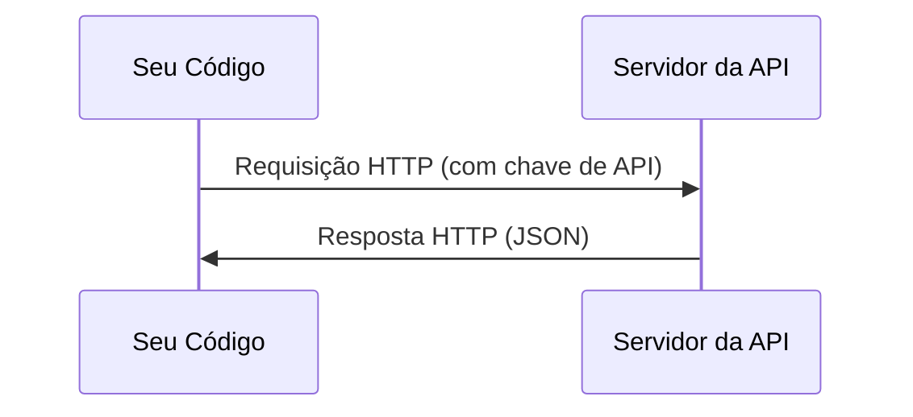

# APIs e Chaves

> Toda API de IA funciona da mesma forma: envia uma requisição, recebe uma resposta. Os detalhes mudam, o padrão não.

**Tipo:** Build
**Linguagens:** Python, TypeScript
**Pré-requisitos:** Fase 0, Aula 01
**Tempo:** ~30 minutos

## Objetivos de Aprendizado

- Armazenar chaves de API de forma segura usando variáveis de ambiente e arquivos `.env`
- Fazer uma chamada de API de LLM usando tanto o SDK Python da Anthropic quanto HTTP puro
- Comparar formatos de requisição/resposta via SDK e HTTP puro para debug
- Identificar e tratar erros comuns de API, incluindo autenticação e limites de taxa

## O Problema

A partir da Fase 11, você vai chamar APIs de LLM (Anthropic, OpenAI, Google). Nas Fases 13-16 você vai construir agentes que usam essas APIs em loops. Você precisa saber como chaves de API funcionam, como armazená-las com segurança e como fazer sua primeira chamada de API.

## O Conceito



Toda chamada de API tem:
1. Um endpoint (URL)
2. Uma chave de API (autenticação)
3. Um corpo de requisição (o que você quer)
4. Um corpo de resposta (o que você recebe)

## Construa

### Passo 1: Armazene chaves de API com segurança

Nunca coloque chaves de API no código. Use variáveis de ambiente.

```bash
export ANTHROPIC_API_KEY="sk-ant-..."
export OPENAI_API_KEY="sk-..."
```

Ou use um arquivo `.env` (adicione ao `.gitignore`):

```
ANTHROPIC_API_KEY=sk-ant-...
OPENAI_API_KEY=sk-...
```

### Passo 2: Primeira chamada de API (Python)

```python
import anthropic

client = anthropic.Anthropic()

response = client.messages.create(
    model="claude-sonnet-4-20250514",
    max_tokens=256,
    messages=[{"role": "user", "content": "What is a neural network in one sentence?"}]
)

print(response.content[0].text)
```

### Passo 3: Primeira chamada de API (TypeScript)

```typescript
import Anthropic from "@anthropic-ai/sdk";

const client = new Anthropic();

const response = await client.messages.create({
  model: "claude-sonnet-4-20250514",
  max_tokens: 256,
  messages: [{ role: "user", content: "What is a neural network in one sentence?" }],
});

console.log(response.content[0].text);
```

### Passo 4: HTTP Puro (sem SDK)

```python
import os
import urllib.request
import json

url = "https://api.anthropic.com/v1/messages"
headers = {
    "Content-Type": "application/json",
    "x-api-key": os.environ["ANTHROPIC_API_KEY"],
    "anthropic-version": "2023-06-01",
}
body = json.dumps({
    "model": "claude-sonnet-4-20250514",
    "max_tokens": 256,
    "messages": [{"role": "user", "content": "What is a neural network in one sentence?"}],
}).encode()

req = urllib.request.Request(url, data=body, headers=headers, method="POST")
with urllib.request.urlopen(req) as resp:
    result = json.loads(resp.read())
    print(result["content"][0]["text"])
```

Isso é o que os SDKs fazem por baixo dos panos. Entender a chamada HTTP pura ajuda na hora de debugar.

## Use

Para este curso:

| API | Quando você precisa | Plano gratuito |
|-----|-------------------|----------------|
| Anthropic (Claude) | Fases 11-16 (agents, ferramentas) | $5 de crédito ao se registrar |
| OpenAI | Fase 11 (comparação) | $5 de crédito ao se registrar |
| Hugging Face | Fases 4-10 (modelos, datasets) | Gratuito |

Você não precisa de todas agora. Configure quando a aula exigir.

## Entregue

Esta aula produz:
- `outputs/prompt-api-troubleshooter.md` - diagnose erros comuns de API

## Exercícios

1. Pegue uma chave de API da Anthropic e faça sua primeira chamada de API
2. Tente a versão HTTP pura e compare o formato da resposta com a versão do SDK
3. Use propositalmente uma chave de API errada e leia a mensagem de erro

## Termos-Chave

| Termo | O que as pessoas dizem | O que realmente significa |
|-------|----------------------|--------------------------|
| Chave de API | "Senha da API" | Uma string única que identifica sua conta e autoriza requisições |
| Limite de taxa | "Estão me limitando" | Máximo de requisições por minuto/hora para prevenir abuso e garantir uso justo |
| Token | "Uma palavra" (em contexto de API) | Uma unidade de cobrança: tokens de entrada e saída são contados e cobrados separadamente |
| Streaming | "Respostas em tempo real" | Receber a resposta palavra por palavra em vez de esperar a resposta completa |
