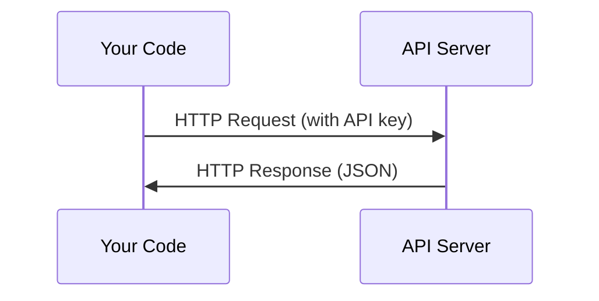

# API'ler ve Anahtarlar

> Her AI API aynı şekilde çalışır: istek gönderin, yanıt alın. Detaylar değişir ama desen değişmez.

**Tür:** Yapım
**Diller:** Python, TypeScript
**Önkoşullar:** Aşama 0, Ders 01
**Süre:** ~30 dakika

## Öğrenme Hedefleri

- Ortam değişkenlerini ve `.env` dosyalarını kullanarak API anahtarlarını güvenli bir şekilde saklayın
- Hem Anthropic Python SDK'yı hem de ham HTTP'yi kullanarak bir LLM API çağrısı yapın
- Hata ayıklama için SDK tabanlı ve ham HTTP istek/yanıt formatlarını karşılaştırın
- Kimlik doğrulama ve hız sınırları da dahil olmak üzere yaygın API hatalarını tanımlayın ve yönetin

## Sorun

11. Aşamadan itibaren LLM API'lerini (Antropik, OpenAI, Google) arayacaksınız. Aşama 13-16'da bu API'leri döngüler halinde kullanan agent'lar oluşturacaksınız. API anahtarlarının nasıl çalıştığını, bunları nasıl güvenli bir şekilde saklayacağınızı ve ilk API çağrınızı nasıl yapacağınızı bilmeniz gerekir.

## Konsept



Her API çağrısında şunlar bulunur:
1. Bir uç nokta (URL)
2. Bir API anahtarı (kimlik doğrulama)
3. Bir istek gövdesi (ne istiyorsunuz)
4. Bir yanıt gövdesi (geri aldığınız şey)

## İnşa Et

### 1. Adım: API anahtarlarını güvenle saklayın

API anahtarlarını asla koda koymayın. Ortam değişkenlerini kullanın.

```bash
export ANTHROPIC_API_KEY="sk-ant-..."
export OPENAI_API_KEY="sk-..."
```

Veya bir `.env` dosyası kullanın (bunu `.gitignore` dosyasına ekleyin):

```
ANTHROPIC_API_KEY=sk-ant-...
OPENAI_API_KEY=sk-...
```

### Adım 2: İlk API çağrısı (Python)

```python
import os

import anthropic

client = anthropic.Anthropic()

MODEL = os.environ.get("LLM_MODEL", "claude-sonnet-5")

response = client.messages.create(
    model=MODEL,
    max_tokens=256,
    messages=[{"role": "user", "content": "What is a neural network in one sentence?"}]
)

print(response.content[0].text)
```

`LLM_MODEL` Antropik model kimliğini seçer ve varsayılan, tarihsiz Sonnet takma adıdır. Diğer sağlayıcılar (OpenAI, Google ve diğerleri) anahtar artı model kimliğinden oluşan aynı modeli izler ancak her birinin kendi SDK'sı, uç noktası ve istek/yanıt şeması vardır.

### Adım 3: İlk API çağrısı (TypeScript)

```typescript
import Anthropic from "@anthropic-ai/sdk";

const client = new Anthropic();

const MODEL = process.env.LLM_MODEL ?? "claude-sonnet-5";

const response = await client.messages.create({
  model: MODEL,
  max_tokens: 256,
  messages: [{ role: "user", content: "What is a neural network in one sentence?" }],
});

console.log(response.content[0].text);
```

### Adım 4: Ham HTTP (SDK yok)

```python
import os
import urllib.request
import json

url = "https://api.anthropic.com/v1/messages"
headers = {
    "Content-Type": "application/json",
    "x-api-key": os.environ["ANTHROPIC_API_KEY"],
    "anthropic-version": "2023-06-01",
}
body = json.dumps({
    "model": os.environ.get("LLM_MODEL", "claude-sonnet-5"),
    "max_tokens": 256,
    "messages": [{"role": "user", "content": "What is a neural network in one sentence?"}],
}).encode()

req = urllib.request.Request(url, data=body, headers=headers, method="POST")
with urllib.request.urlopen(req) as resp:
    result = json.loads(resp.read())
    print(result["content"][0]["text"])
```

SDK'ların kaputun altında yaptığı şey budur. Ham HTTP çağrısını anlamak, hata ayıklama sırasında yardımcı olur.

## Kullan onu

Bu kurs için:

| API'si | İhtiyacınız olduğunda | Ücretsiz katman |
|-----|-----------------|-----------|
| Antropik (Claude) | Aşama 11-16 (agentler, araçlar) | Kayıt sırasında 5$ kredi |
| OpenAI | Aşama 11 (karşılaştırma) | Kayıt sırasında 5$ kredi |
| Sarılma Yüzü | Aşama 4-10 (modeller, dataset'lar) | Ücretsiz |

Şu anda hepsine ihtiyacınız yok. Ders gerektirdiğinde bunları kurun.

## Gönderin

Bu ders şunları üretir:
- `outputs/prompt-api-troubleshooter.md` - yaygın API hatalarını teşhis edin

## Egzersizler

1. Antropik API anahtarı alın ve ilk API çağrınızı yapın
2. Ham HTTP sürümünü deneyin ve yanıt formatını SDK sürümüyle karşılaştırın
3. Kasıtlı olarak yanlış bir API anahtarı kullanın ve hata mesajını okuyun

## Anahtar Terimler

| Dönem | İnsanlar ne diyor | Aslında ne anlama geliyor |
|------|----------------|----------------------|
| API anahtarı | "API Şifresi" | Hesabınızı tanımlayan ve istekleri yetkilendiren benzersiz bir dize |
| Oran sınırı | "Beni kısıtlıyorlar" | Kötüye kullanımı önlemek ve adil kullanımı sağlamak için dakika/saat başına maksimum talep |
| Token | "Bir kelime" (API bağlamında) | Bir faturalandırma birimi: giriş ve çıkış token'lar ayrı ayrı sayılır ve ücretlendirilir |
| Akış | "Gerçek zamanlı yanıtlar" | Yanıtın tamamını beklemek yerine yanıtı kelime kelime alma |
