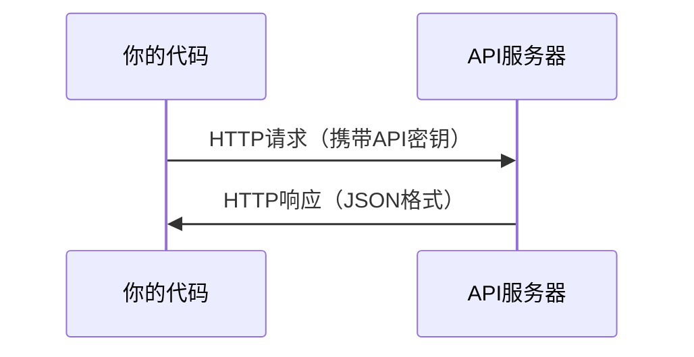

# API 与密钥（APIs & Keys）

> 所有AI API的工作方式都一样：发送请求，接收响应。细节可能不同，但模式不变。

**类型：** 实践构建
**语言：** Python、TypeScript
**前置条件：** 阶段0，课程01
**时间：** 约30分钟

## 学习目标

- 使用环境变量和`.env`文件安全存储API密钥
- 通过Anthropic的Python SDK和原始HTTP两种方式调用LLM API
- 对比基于SDK和原始HTTP的请求/响应格式以便调试
- 识别并处理常见API错误，包括身份验证和速率限制

## 问题所在

从阶段11开始，你将调用LLM API（Anthropic、OpenAI、Google）。在阶段13-16中，你将构建在循环中使用这些API的智能体。你需要了解API密钥如何工作、如何安全存储它们，以及如何进行第一次API调用。

## 基本概念



每个API调用都包含：
1. 端点（URL）
2. API密钥（身份验证）
3. 请求体（你想要的内容）
4. 响应体（你得到的结果）

## 动手构建

### 步骤1：安全存储API密钥

切勿将API密钥直接写在代码中。请使用环境变量。

```bash
export ANTHROPIC_API_KEY="sk-ant-..."
export OPENAI_API_KEY="sk-..."
```

或者使用`.env`文件（记得将其添加到`.gitignore`中）：

```
ANTHROPIC_API_KEY=sk-ant-...
OPENAI_API_KEY=sk-...
```

### 步骤2：第一次API调用（Python）

```python
import anthropic

client = anthropic.Anthropic()

response = client.messages.create(
    model="claude-sonnet-4-20250514",
    max_tokens=256,
    messages=[{"role": "user", "content": "What is a neural network in one sentence?"}]
)

print(response.content[0].text)
```

### 步骤3：第一次API调用（TypeScript）

```typescript
import Anthropic from "@anthropic-ai/sdk";

const client = new Anthropic();

const response = await client.messages.create({
  model: "claude-sonnet-4-20250514",
  max_tokens: 256,
  messages: [{ role: "user", content: "What is a neural network in one sentence?" }],
});

console.log(response.content[0].text);
```

### 步骤4：原始HTTP（不使用SDK）

```python
import os
import urllib.request
import json

url = "https://api.anthropic.com/v1/messages"
headers = {
    "Content-Type": "application/json",
    "x-api-key": os.environ["ANTHROPIC_API_KEY"],
    "anthropic-version": "2023-06-01",
}
body = json.dumps({
    "model": "claude-sonnet-4-20250514",
    "max_tokens": 256,
    "messages": [{"role": "user", "content": "What is a neural network in one sentence?"}],
}).encode()

req = urllib.request.Request(url, data=body, headers=headers, method="POST")
with urllib.request.urlopen(req) as resp:
    result = json.loads(resp.read())
    print(result["content"][0]["text"])
```

这就是SDK底层所做的工作。理解原始HTTP调用的方式有助于调试。

## 使用说明

本课程中：

| API | 何时使用 | 免费额度 |
|-----|----------|----------|
| Anthropic (Claude) | 阶段11-16（智能体、工具） | 注册时获赠$5额度 |
| OpenAI | 阶段11（对比） | 注册时获赠$5额度 |
| Hugging Face | 阶段4-10（模型、数据集） | 免费 |

现在不需要全部配置。当课程需要时再进行设置。

## 交付成果

本课程产出：
- `outputs/prompt-api-troubleshooter.md` - 诊断常见API错误

## 练习

1. 获取Anthropic API密钥并完成第一次API调用
2. 尝试原始HTTP版本，并比较其响应格式与SDK版本的差异
3. 故意使用错误的API密钥并阅读错误信息

## 关键术语

| 术语 | 通常说法 | 实际含义 |
|------|----------|----------|
| API密钥 (API key) | “API的密码” | 唯一标识你的账户并授权请求的字符串 |
| 速率限制 (Rate limit) | “他们在限流我” | 每分钟/小时的最大请求数，用于防止滥用和确保公平使用 |
| 令牌 (Token) | “一个单词”（API上下文中） | 计费单位：输入和输出令牌分别计数并收费 |
| 流式传输 (Streaming) | “实时响应” | 逐词获取响应，而非等待完整响应