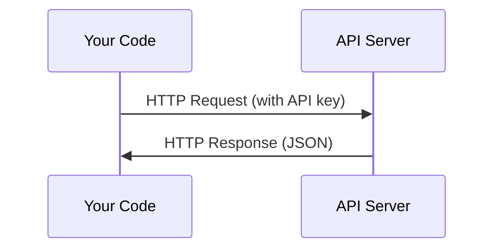

# API 与密钥（APIs & Keys）

> 译注：本文译自同目录 [`en.md`](./en.md)。术语遵循仓根 [TRANSLATION_GUIDE.md](../../../../TRANSLATION_GUIDE.md)。

> 所有 AI API 的工作方式都一样：发请求，拿响应。细节会变，套路不变。

**Type:** Build
**Languages:** Python, TypeScript
**Prerequisites:** Phase 0, Lesson 01
**Time:** ~30 minutes

## 学习目标（Learning Objectives）

- 用环境变量和 `.env` 文件安全地存放 API key
- 用 Anthropic Python SDK 和原生 HTTP 两种方式各发起一次 LLM API 调用
- 对比 SDK 与原生 HTTP 在请求 / 响应格式上的差异，便于调试
- 识别并处理常见 API 错误，包括身份验证失败和 rate limit

## 问题（The Problem）

从 Phase 11 起，你会开始调用 LLM API（Anthropic、OpenAI、Google）。Phase 13–16 里你会写 agent，让它在循环里反复调这些 API。你得先搞清楚 API key 是怎么回事、怎么安全地存放，以及怎么发出第一次 API 调用。

## 概念（The Concept）



每次 API 调用都包含：
1. 一个 endpoint（URL）
2. 一个 API key（用于身份验证）
3. 一个请求体（你想要什么）
4. 一个响应体（服务器返回什么）

## 动手实现（Build It）

### Step 1: 安全存放 API key

绝对不要把 API key 写进代码里。用环境变量。

```bash
export ANTHROPIC_API_KEY="sk-ant-..."
export OPENAI_API_KEY="sk-..."
```

或者用 `.env` 文件（记得加进 `.gitignore`）：

```
ANTHROPIC_API_KEY=sk-ant-...
OPENAI_API_KEY=sk-...
```

### Step 2: 第一次 API 调用（Python）

```python
import anthropic

client = anthropic.Anthropic()

response = client.messages.create(
    model="claude-sonnet-4-20250514",
    max_tokens=256,
    messages=[{"role": "user", "content": "What is a neural network in one sentence?"}]
)

print(response.content[0].text)
```

### Step 3: 第一次 API 调用（TypeScript）

```typescript
import Anthropic from "@anthropic-ai/sdk";

const client = new Anthropic();

const response = await client.messages.create({
  model: "claude-sonnet-4-20250514",
  max_tokens: 256,
  messages: [{ role: "user", content: "What is a neural network in one sentence?" }],
});

console.log(response.content[0].text);
```

### Step 4: 原生 HTTP（不用 SDK）

```python
import os
import urllib.request
import json

url = "https://api.anthropic.com/v1/messages"
headers = {
    "Content-Type": "application/json",
    "x-api-key": os.environ["ANTHROPIC_API_KEY"],
    "anthropic-version": "2023-06-01",
}
body = json.dumps({
    "model": "claude-sonnet-4-20250514",
    "max_tokens": 256,
    "messages": [{"role": "user", "content": "What is a neural network in one sentence?"}],
}).encode()

req = urllib.request.Request(url, data=body, headers=headers, method="POST")
with urllib.request.urlopen(req) as resp:
    result = json.loads(resp.read())
    print(result["content"][0]["text"])
```

SDK 在底下做的就是这件事。理解原生 HTTP 调用，调试时会顺手很多。

## 用起来（Use It）

本课程会用到的 API：

| API | 何时需要 | 免费额度 |
|-----|---------|---------|
| Anthropic (Claude) | Phase 11–16（agent、tool use） | 注册送 $5 额度 |
| OpenAI | Phase 11（用于对比） | 注册送 $5 额度 |
| Hugging Face | Phase 4–10（模型、数据集） | 免费 |

不必现在全部注册。课到了哪一节再去配哪一个就行。

## 上线部署（Ship It）

本课的产出：
- `outputs/prompt-api-troubleshooter.md` —— 诊断常见 API 错误

## 练习（Exercises）

1. 申请一个 Anthropic API key，发起你的第一次 API 调用
2. 试试原生 HTTP 版本，对比一下响应格式与 SDK 版本的差别
3. 故意用一个错的 API key，读读返回的错误信息

## 关键术语（Key Terms）

| 术语 | 大家怎么说 | 实际含义 |
|------|-----------|---------|
| API key | "调用 API 的密码" | 一串唯一字符串，标识你的账号并对请求授权 |
| Rate limit | "他们在限我速" | 每分钟 / 每小时的最大请求数，用来防滥用、保公平 |
| Token | "一个词"（在 API 语境下） | 计费单位：输入 token 和输出 token 分别计数、分别收费 |
| Streaming | "实时响应" | 一个词一个词地往回吐，而不是等整段响应一次性返回 |
