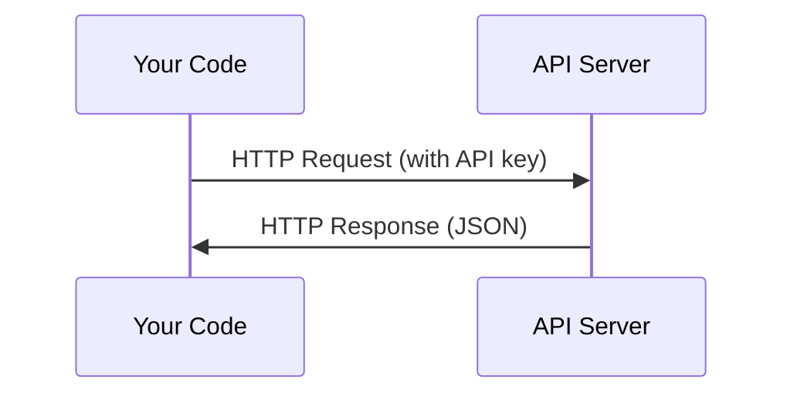

# API和密钥

> 每个AI API的工作方式相同：发送请求，获得响应。细节发生了变化，但模式却没有变化。

** 类型：** 构建
** 语言：** Python、TypScript
** 先决条件：** 第0阶段，第01课
** 时间：** ~30分钟

## 学习目标

- 使用环境变量和'. dev '文件安全地存储API密钥
- 使用Anthropic Python SDK和原始HTTP进行LLM API调用
- 比较基于SDK和原始的HTTP请求/响应格式以进行调试
- Identify and handle common API errors including authentication and rate limits

## 问题

从第11阶段开始，您将调用LLM API（Anthropic、OpenAI、Google）。在第13-16阶段，您将构建在循环中使用这些API的代理。您需要了解API密钥的工作原理、如何安全地存储它们以及如何进行第一次API调用。

## 概念



Every API call has:
1. 端点（URL）
2. API密钥（身份验证）
3. A request body (what you want)
4. A response body (what you get back)

## 建设党

### 第1步：安全存储API密钥

切勿将API密钥放入代码中。使用环境变量。

```bash
export ANTHROPIC_API_KEY="sk-ant-..."
export OPENAI_API_KEY="sk-..."
```

Or use a `.env` file (add it to `.gitignore`):

```
ANTHROPIC_API_KEY=sk-ant-...
OPENAI_API_KEY=sk-...
```

### 第2步：第一次API调用（Python）

```python
import anthropic

client = anthropic.Anthropic()

response = client.messages.create(
    model="claude-sonnet-4-20250514",
    max_tokens=256,
    messages=[{"role": "user", "content": "What is a neural network in one sentence?"}]
)

print(response.content[0].text)
```

### 第3步：第一次API调用（TypScript）

```typescript
import Anthropic from "@anthropic-ai/sdk";

const client = new Anthropic();

const response = await client.messages.create({
  model: "claude-sonnet-4-20250514",
  max_tokens: 256,
  messages: [{ role: "user", content: "What is a neural network in one sentence?" }],
});

console.log(response.content[0].text);
```

### 第4步：原始HTTP（无SDK）

```python
import os
import urllib.request
import json

url = "https://api.anthropic.com/v1/messages"
headers = {
    "Content-Type": "application/json",
    "x-api-key": os.environ["ANTHROPIC_API_KEY"],
    "anthropic-version": "2023-06-01",
}
body = json.dumps({
    "model": "claude-sonnet-4-20250514",
    "max_tokens": 256,
    "messages": [{"role": "user", "content": "What is a neural network in one sentence?"}],
}).encode()

req = urllib.request.Request(url, data=body, headers=headers, method="POST")
with urllib.request.urlopen(req) as resp:
    result = json.loads(resp.read())
    print(result["content"][0]["text"])
```

这就是SDK背后所做的事情。了解原始的HTTP调用在调试时很有帮助。

## 使用它

对于本课程：

| API | 当你需要它 | Free tier |
|-----|-----------------|-----------|
| Anthropic (Claude) | 第11-16阶段（代理、工具） | 注册5美元积分 |
| OpenAI | Phase 11 (comparison) | 注册5美元积分 |
| Hugging Face | 第4-10阶段（模型、数据集） | 免费 |

您现在不需要所有这些。当课程需要时设置它们。

## 把它运

This lesson produces:
- '输出/prompt-api-troubleshooter.md '-诊断常见API错误

## 演习

1. 获取Anthropic API密钥并进行首次API调用
2. Try the raw HTTP version and compare the response format to the SDK version
3. Intentionally use a wrong API key and read the error message

## 关键术语

| Term | 别人怎么说 | What it actually means |
|------|----------------|----------------------|
| API密钥 | “API的密码” | 识别您的帐户并授权请求的唯一字符串 |
| Rate limit | “他们在勒死我” | 每分钟/小时的最大请求量，以防止滥用并确保公平使用 |
| 令牌 | "A word" (in API context) | 计费单位：输入和输出代币分别计数和计费 |
| 流 | “实时响应” | Getting the response word by word instead of waiting for the full response |
