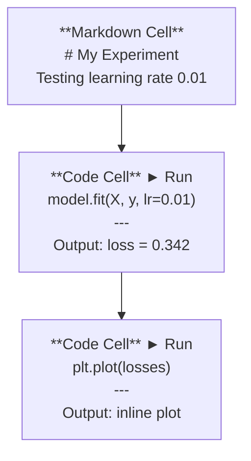
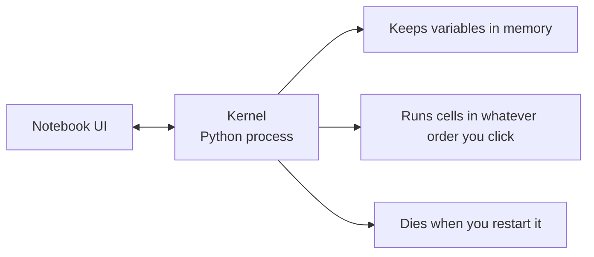

# Jupyter Notebooks

> notebookはAIエンジニアリングの実験台です。ここで試作し、うまくいったものを本番用コードへ移します。

**タイプ:** 作ってみる
**言語:** Python
**前提条件:** フェーズ0、レッスン01
**時間:** 約30分

## 学習目標

- JupyterLab、Jupyter Notebook、またはJupyter拡張付きVS Codeをインストールして起動する
- マジックコマンド（`%timeit`, `%%time`, `%matplotlib inline`）を使って、インラインでベンチマークと可視化を行う
- notebookとscriptを使い分け、「notebookで探索し、scriptで届ける」ワークフローを適用する
- 順不同実行、隠れた状態、メモリリークといったnotebookの落とし穴を特定して避ける

## 課題

あらゆるAI論文、チュートリアル、KaggleコンペでJupyter notebookが使われます。コードを小分けに実行し、出力をインラインで確認し、コードと説明を混ぜ、素早く反復できます。notebookなしでAIを学ぼうとするのは、メモ用紙なしで数学の宿題をするようなものです。

ただしnotebookには本物の落とし穴があります。不得意な用途まで含めて、何にでもnotebookを使ってしまう人がいます。notebookを使うべき時とscriptを使うべき時を知っておくと、後でデバッグ地獄を避けられます。

## 考え方

notebookはcellのリストです。各cellはコードまたはテキストです。



kernelはバックグラウンドで動くPythonプロセスです。cellを実行すると、notebookはコードをkernelに送り、kernelが実行して結果を返します。すべてのcellは同じkernelを共有するため、変数はcell間で残ります。



この「クリックした順に何でも実行できる」性質が、notebookの強みでもあり、事故の原因でもあります。

## 作ってみる

### ステップ1: インターフェースを選ぶ

3つの選択肢がありますが、ファイル形式は1つです。

| インターフェース | インストール | 向いている用途 |
|-----------|---------|----------|
| JupyterLab | `pip install jupyterlab` の後に `jupyter lab` | フルIDE体験、複数タブ、ファイルブラウザ、ターミナル |
| Jupyter Notebook | `pip install notebook` の後に `jupyter notebook` | シンプル、軽量、1度に1 notebook |
| VS Code | "Jupyter" 拡張をインストール | 既存のエディタ内、git連携、デバッグ |

3つとも同じ `.ipynb` ファイルを読み書きします。好きなものを選んでください。AIの作業ではJupyterLabが最も一般的です。

```bash
pip install jupyterlab
jupyter lab
```

### ステップ2: 重要なキーボードショートカット

操作には2つのモードがあります。コマンドモード（左の青いバー）には `Escape`、編集モード（緑のバー）には `Enter` を押します。

**コマンドモード（最もよく使う）:**

| キー | 操作 |
|-----|--------|
| `Shift+Enter` | cellを実行し、次へ移動 |
| `A` | 上にcellを挿入 |
| `B` | 下にcellを挿入 |
| `DD` | cellを削除 |
| `M` | markdownへ変換 |
| `Y` | codeへ変換 |
| `Z` | cell操作を取り消す |
| `Ctrl+Shift+H` | すべてのショートカットを表示 |

**編集モード:**

| キー | 操作 |
|-----|--------|
| `Tab` | 補完 |
| `Shift+Tab` | 関数シグネチャを表示 |
| `Ctrl+/` | コメントを切り替え |

`Shift+Enter` は1日に何度も使います。最初に覚えてください。

### ステップ3: cellの種類

**Code cell** はPythonを実行し、出力を表示します。

```python
import numpy as np
data = np.random.randn(1000)
data.mean(), data.std()
```

出力: `(0.0032, 0.9987)`

**Markdown cell** は整形済みテキストを表示します。何をしているのか、なぜそうするのかを記録するために使います。見出し、太字、斜体、LaTeX数式（`$E = mc^2$`）、表、画像に対応しています。

### ステップ4: マジックコマンド

これはPythonではありません。`%`（line magic）または `%%`（cell magic）で始まる、Jupyter固有のコマンドです。

**コードの時間を測る:**

```python
%timeit np.random.randn(10000)
```

出力: `45.2 us +/- 1.3 us per loop`

```python
%%time
model.fit(X_train, y_train, epochs=10)
```

出力: `Wall time: 2.34 s`

`%timeit` はコードを何度も実行して平均を取ります。`%%time` は1回だけ実行します。マイクロベンチマークには `%timeit`、学習実行には `%%time` を使います。

**インラインプロットを有効にする:**

```python
%matplotlib inline
```

これで、すべての `plt.plot()` や `plt.show()` がnotebook内に直接描画されます。

**notebookを離れずにパッケージをインストールする:**

```python
!pip install scikit-learn
```

`!` プレフィックスは任意のshellコマンドを実行します。

**環境変数を確認する:**

```python
%env CUDA_VISIBLE_DEVICES
```

### ステップ5: リッチな出力をインライン表示する

notebookはcell内の最後の式を自動表示します。ただし、制御することもできます。

```python
import pandas as pd

df = pd.DataFrame({
    "model": ["Linear", "Random Forest", "Neural Net"],
    "accuracy": [0.72, 0.89, 0.94],
    "training_time": [0.1, 2.3, 45.6]
})
df
```

これはテキストのダンプではなく、整形されたHTML表として表示されます。プロットも同じです。

```python
import matplotlib.pyplot as plt

plt.figure(figsize=(8, 4))
plt.plot([1, 2, 3, 4], [1, 4, 2, 3])
plt.title("Inline Plot")
plt.show()
```

プロットはcellのすぐ下に表示されます。これが、AI作業でnotebookが主流である理由です。データ、プロット、コードをまとめて見られます。

画像の場合:

```python
from IPython.display import Image, display
display(Image(filename="architecture.png"))
```

### ステップ6: Google Colab

Colabはクラウド上の無料Jupyter notebookです。GPU、プリインストール済みライブラリ、Google Drive連携を提供します。セットアップは不要です。

1. [colab.research.google.com](https://colab.research.google.com) を開く
2. このコースの任意の `.ipynb` ファイルをアップロードする
3. Runtime > Change runtime type > T4 GPU（無料）を選ぶ

ローカルJupyterとの違い:
- ファイルはセッション間で保持されません（Driveに保存するかダウンロードする）
- プリインストール済み: numpy, pandas, matplotlib, torch, tensorflow, sklearn
- ファイルのアップロード/ダウンロードには `from google.colab import files`
- 永続ストレージには `from google.colab import drive; drive.mount('/content/drive')`
- 無料枠では90分間操作がないとセッションがタイムアウトする

## 使ってみる

### Notebooks vs Scripts: どちらをいつ使うか

| notebookを使う用途 | scriptを使う用途 |
|-------------------|-----------------|
| データセットの探索 | 学習パイプライン |
| モデルの試作 | 再利用可能なユーティリティ |
| 結果の可視化 | `if __name__` を含むもの |
| 作業の説明 | スケジュール実行されるコード |
| 素早い実験 | 本番コード |
| コース演習 | パッケージとライブラリ |

ルール: **notebookで探索し、scriptで届ける**。

AIでよくあるワークフロー:
1. notebookでデータを探索する
2. notebookでモデルを試作する
3. 動いたらコードを `.py` ファイルへ移す
4. 追加実験のために、その `.py` ファイルをnotebookへimportする

### よくある落とし穴

**順不同実行。** cell 5を実行し、次にcell 2、その次にcell 7を実行する。自分のマシンでは動きますが、他の人が上から下へ実行すると壊れます。修正: 共有前に Kernel > Restart & Run All。

**隠れた状態。** cellを削除しても、そのcellが作った変数はメモリに残っています。notebookはきれいに見えても、存在しないcellに依存しています。修正: 定期的にkernelを再起動する。

**メモリリーク。** 4GBのデータセットを読み込み、モデルを学習し、別のデータセットを読み込む。何も解放されません。修正: `del variable_name` と `gc.collect()`、またはkernelを再起動します。

## 形にして届ける

このレッスンで作るもの:
- notebook問題のデバッグ用 `outputs/prompt-notebook-helper.md`

## 演習

1. JupyterLabを開き、notebookを作成し、`%timeit` を使って10万個の乱数配列を作るlist comprehensionとnumpyを比較する
2. CSVを読み込み、dataframeを表示し、グラフを描くmarkdown cellとcode cell入りのnotebookを作成する。その後 Kernel > Restart & Run All を実行し、上から下まで動くことを確認する
3. `code/notebook_tips.py` のコードをColab notebookへ貼り付け、無料GPUで実行する

## 重要用語

| 用語 | よくある言い方 | 実際の意味 |
|------|----------------|----------------------|
| Kernel | 「コードを動かしているもの」 | cellを実行し、変数をメモリに保持する別プロセスのPython |
| Cell | 「コードブロック」 | notebook内の独立して実行できる単位。codeまたはmarkdown |
| Magic command | 「Jupyterの便利技」 | `%` や `%%` で始まり、notebook環境を制御する特別なコマンド |
| `.ipynb` | 「notebookファイル」 | cell、出力、metadataを含むJSONファイル。IPython Notebookの略 |

## さらに読む

- [JupyterLab Docs](https://jupyterlab.readthedocs.io/) - 全機能の説明
- [Google Colab FAQ](https://research.google.com/colaboratory/faq.html) - Colab固有の制限と機能
- [28 Jupyter Notebook Tips](https://www.dataquest.io/blog/jupyter-notebook-tips-tricks-shortcuts/) - 上級者向けショートカット
