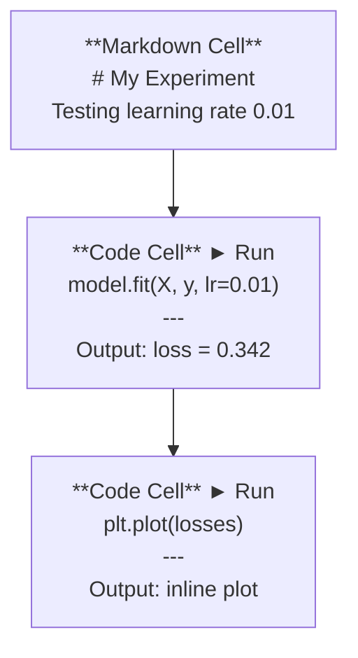
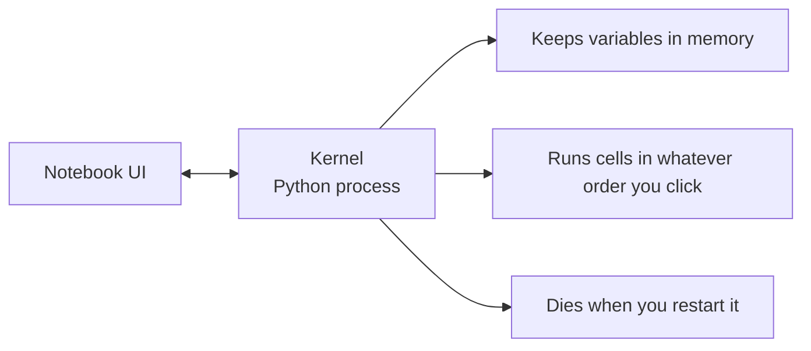

# Jüpyter Defterleri

> Defterler AI engineering'nin laboratuvar tezgahıdır. Burada prototip yaparsınız, sonra işe yarayanı üretime aktarırsınız.

**Tür:** Yapım
**Diller:** Python
**Önkoşullar:** Aşama 0, Ders 01
**Süre:** ~30 dakika

## Öğrenme Hedefleri

- Jupyter uzantısıyla JupyterLab, Jupyter Notebook veya VS Code'u yükleyin ve başlatın
- benchmark'ye sihirli komutları (`%timeit`, `%%time`, `%matplotlib inline`) kullanın ve satır içi görselleştirin
- Not defterlerinin ve komut dosyalarının ne zaman kullanılacağını ayırt edin ve "not defterlerinde keşfedin, komut dosyalarını gönderin" iş akışını uygulayın
- Yaygın dizüstü bilgisayar tuzaklarını tanımlayın ve bunlardan kaçının: sıra dışı yürütme, gizli durum ve bellek sızıntıları

## Sorun

Her AI makalesi, öğreticisi ve Kaggle yarışması Jupyter not defterlerini kullanır. Kodu parçalar halinde çalıştırmanıza, çıktıları satır içi görmenize, kodu açıklamalarla karıştırmanıza ve hızlı bir şekilde yinelemenize olanak tanır. Yapay zekayı not defterleri olmadan öğrenmeye çalışırsanız, matematik ödevlerini karalama kağıdı olmadan yapmış olursunuz.

Ancak defterlerin gerçek tuzakları vardır. İnsanlar onları her şey için kullanıyor, berbat oldukları şeyler de dahil. Ne zaman not defteri kullanacağınızı ve ne zaman komut dosyası kullanacağınızı bilmek sizi daha sonra kabus görmekten kurtaracaktır.

## Konsept

Not defteri hücrelerin bir listesidir. Her hücre kod veya metindir.



Çekirdek arka planda çalışan bir Python işlemidir. Bir hücreyi çalıştırdığınızda, kodu çekirdeğe gönderir, çekirdek de onu çalıştırır ve sonucu geri gönderir. Tüm hücreler aynı çekirdeği paylaştığından hücreler arasında değişkenler varlığını sürdürür.



Bu "tıkladığınız sıra ne olursa olsun" kısmı hem süper güç hem de ayak silahıdır.

## İnşa Et

### 1. Adım: Arayüzünüzü seçin

Üç seçenek, tek format:

| Arayüz | Yükle | Şunun için en iyisi |
|-----------|---------|----------|
| JupyterLab | `pip install jupyterlab` ardından `jupyter lab` | Tam IDE deneyimi, çoklu sekmeler, dosya tarayıcısı, terminal |
| Jüpiter Not Defteri | `pip install notebook` ardından `jupyter notebook` | Basit, hafif, aynı anda bir dizüstü bilgisayar |
| VS Kodu | "Jupyter" uzantısını yükleyin | Zaten editörünüzde, git entegrasyonu, hata ayıklama |

Üçü de aynı `.ipynb` dosyasını okuyup yazıyor. Ne istersen onu seç. JupyterLab yapay zeka çalışmalarında en yaygın olanıdır.

```bash
pip install jupyterlab
jupyter lab
```

### Adım 2: Önemli klavye kısayolları

İki modda çalışıyorsunuz. Komut modu için `Escape`'ye (soldaki mavi çubuk), düzenleme modu için `Enter`'ye (yeşil çubuk) basın.

**Komut modu (en çok kullanılan):**

| Anahtar | Eylem |
|-----|--------|
| `Shift+Enter` | Hücreyi çalıştır, sonrakine geç |
| `A` | Yukarıya hücre ekle |
| `B` | Aşağıya hücre ekle |
| `DD` | Hücreyi sil |
| `M` | Markdown'a dönüştür |
| `Y` | Koda dönüştür |
| `Z` | Hücre işlemini geri al |
| `Ctrl+Shift+H` | Tüm kısayolları göster |

**Düzenleme modu:**

| Anahtar | Eylem |
|-----|--------|
| `Tab` | Otomatik Tamamlama |
| `Shift+Tab` | İşlev imzasını göster |
| `Ctrl+/` | Yorumu değiştir |

`Shift+Enter` günde bin kez kullanacağınız çözümdür. Önce bunu öğren.

### Adım 3: Hücre türleri

**Kod hücreleri** Python'u çalıştırır ve çıktıyı gösterir:

```python
import numpy as np
data = np.random.randn(1000)
data.mean(), data.std()
```

Çıktı: `(0.0032, 0.9987)`

**İşaretleme hücreleri** biçimlendirilmiş metni oluşturur. Ne yaptığınızı ve nedenini belgelemek için bunları kullanın. Başlıkları, kalın, italik, LaTeX matematiğini (`$E = mc^2$`), tabloları ve resimleri destekler.

### Adım 4: Sihirli komutlar

Bunlar Python değil. Bunlar `%` (çizgi büyüsü) veya `%%` (hücre büyüsü) ile başlayan Jupyter'a özgü komutlardır.

**Kodunuzu zamanlayın:**

```python
%timeit np.random.randn(10000)
```

Çıktı: `45.2 us +/- 1.3 us per loop`

```python
%%time
model.fit(X_train, y_train, epochs=10)
```

Çıktı: `Wall time: 2.34 s`

`%timeit`, kodu birçok kez çalıştırır ve ortalamasını alır. `%%time` bunu bir kez çalıştırır. microbenchmark'ler için `%timeit`'yi, eğitim çalışmaları için `%%time`'yi kullanın.

**Satır içi grafikleri etkinleştirin:**

```python
%matplotlib inline
```

Her `plt.plot()` veya `plt.show()` artık doğrudan dizüstü bilgisayarda işleniyor.

**Paketleri dizüstü bilgisayardan ayrılmadan yükleyin:**

```python
!pip install scikit-learn
```

`!` öneki herhangi bir kabuk komutunu çalıştırır.

**Ortam değişkenlerini kontrol edin:**

```python
%env CUDA_VISIBLE_DEVICES
```

### Adım 5: Zengin çıktıyı satır içi olarak görüntüleyin

Not defterleri bir hücredeki son ifadeyi otomatik olarak görüntüler. Ancak bunu kontrol edebilirsiniz:

```python
import pandas as pd

df = pd.DataFrame({
    "model": ["Linear", "Random Forest", "Neural Net"],
    "accuracy": [0.72, 0.89, 0.94],
    "training_time": [0.1, 2.3, 45.6]
})
df
```

Bu, bir metin dökümü değil, biçimlendirilmiş bir HTML tablosu oluşturur. Arsalarla aynı:

```python
import matplotlib.pyplot as plt

plt.figure(figsize=(8, 4))
plt.plot([1, 2, 3, 4], [1, 4, 2, 3])
plt.title("Inline Plot")
plt.show()
```

Grafik hücrenin hemen altında görünür. Dizüstü bilgisayarların yapay zeka çalışmalarına hakim olmasının nedeni budur. Veriyi, grafiği ve kodu bir arada görüyorsunuz.

Görseller için:

```python
from IPython.display import Image, display
display(Image(filename="architecture.png"))
```

### Adım 6: Google Colab

Colab, buluttaki ücretsiz bir Jupyter not defteridir. Size bir GPU, önceden yüklenmiş kitaplıklar ve Google Drive entegrasyonu sağlar. Kurulum gerekmez.

1. [colab.research.google.com](https://colab.research.google.com)'ye gidin
2. Bu kurstan herhangi bir `.ipynb` dosyasını yükleyin
3. Çalışma zamanı > Çalışma zamanı türünü değiştir > T4 GPU (ücretsiz)

Colab'ın yerel Jüpyter'den farklılıkları:
- Dosyalar oturumlar arasında saklanmaz (Drive'a kaydedin veya indirin)
- Önceden yüklenmiş: numpy, pandas, matplotlib, torch, tensorflow, sklearn
- Dosyaları yüklemek/indirmek için `from google.colab import files`
- Kalıcı depolama için `from google.colab import drive; drive.mount('/content/drive')`
- 90 dakika işlem yapılmadığında oturumlar zaman aşımına uğrar (ücretsiz katman)

## Kullan onu

### Not Defterleri ve Komut Dosyaları: Hangisi ne zaman kullanılmalı

| Not defterlerini şunun için kullanın: | Şunun için komut dosyalarını kullanın: |
|-------------------|-----------------|
| dataset'yi Keşfetmek | Eğitim hatları |
| Bir modelin prototipinin oluşturulması | Yeniden kullanılabilir yardımcı programlar |
| Sonuçları görselleştirme | `if __name__` |
| Çalışmanızın açıklanması | Belirli bir zamanlamaya göre çalışan kod |
| Hızlı deneyler | Üretim kodu |
| Kurs alıştırmaları | Paketler ve kütüphaneler |

Kural: **not defterlerinde keşfedin, komut dosyalarıyla gönderin**.

Yapay zekada ortak bir iş akışı:
1. Bir not defterindeki verileri keşfedin
2. Modelinizin prototipini not defterine yazın
3. Çalıştıktan sonra kodu `.py` dosyalarına taşıyın
4. Daha ileri deneyler için bu `.py` dosyalarını tekrar dizüstü bilgisayara aktarın

### Yaygın tuzaklar

**Sıra dışı yürütme.** 5. hücreyi, ardından 2. hücreyi ve ardından 7. hücreyi çalıştırırsınız. Dizüstü bilgisayar makinenizde çalışır ancak birisi onu yukarıdan aşağıya çalıştırdığında bozulur. Düzeltme: Çekirdek > Paylaşmadan önce Tümünü Yeniden Başlat ve Çalıştır.

**Gizli durum.** Bir hücreyi siliyorsunuz ancak onun oluşturduğu değişken hâlâ bellekte. Dizüstü bilgisayar temiz görünüyor ancak bir hayalet hücreye bağlı. Düzeltme: Çekirdeği düzenli olarak yeniden başlatın.

**Bellek sızıntıları.** 4 GB dataset yükleniyor, bir model eğitiliyor, başka bir dataset yükleniyor. Hiçbir şey serbest bırakılmıyor. Düzeltme: `del variable_name` ve `gc.collect()` veya çekirdeği yeniden başlatın.

## Gönderin

Bu ders şunları üretir:
- Dizüstü bilgisayar sorunlarında hata ayıklamak için `outputs/prompt-notebook-helper.md`

## Egzersizler

1. JupyterLab'ı açın, bir not defteri oluşturun ve 100.000 rastgele sayıdan oluşan bir dizi oluşturmak için liste kavrama ile numpy'yi karşılaştırmak için `%timeit` kullanın
2. CSV yükleyen, veri çerçevesi görüntüleyen ve grafik çizen, işaretleme ve kod hücrelerine sahip bir not defteri oluşturun. Daha sonra yukarıdan aşağıya doğru çalıştığını doğrulamak için Çekirdek > Yeniden Başlat ve Tümünü Çalıştır'ı çalıştırın.
3. Kodu `code/notebook_tips.py`'den alın, bir Colab not defterine yapıştırın ve ücretsiz bir GPU ile çalıştırın

## Anahtar Terimler

| Dönem | İnsanlar ne diyor | Aslında ne anlama geliyor |
|------|----------------|----------------------|
| Çekirdek | "Kodumu çalıştıran şey" | Hücreleri çalıştıran ve değişkenleri bellekte tutan ayrı bir Python işlemi |
| Hücre | "Bir kod bloğu" | Bir not defterinde bağımsız olarak çalıştırılabilen bir birim, kod veya işaretleme |
| Sihirli komut | "Jüpyter hileleri" | Dizüstü bilgisayar ortamını denetleyen, `%` veya `%%` ön ekine sahip özel komutlar |
| `.ipynb` | "Not defteri dosyası" | Hücreleri, çıktıları ve meta verileri içeren bir JSON dosyası. IPython Notebook Standları |

## Daha Fazla Okuma

- Tüm özellik seti için [JupyterLab Dokümanları](https://jupyterlab.readthedocs.io/)
- Colab'a özgü sınırlar ve özellikler için [Google Colab SSS](https://research.google.com/colaboratory/faq.html)
- Uzman kullanıcı kısayolları için [28 Jupyter Dizüstü Bilgisayar İpuçları](https://www.dataquest.io/blog/jupyter-notebook-tips-tricks-shortcuts/)
