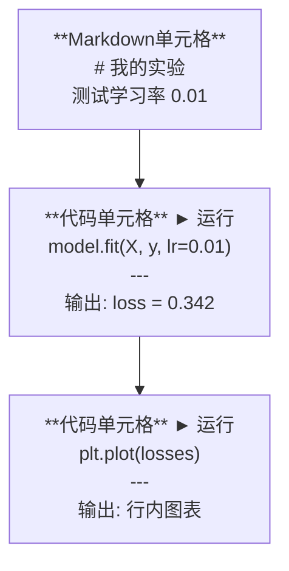
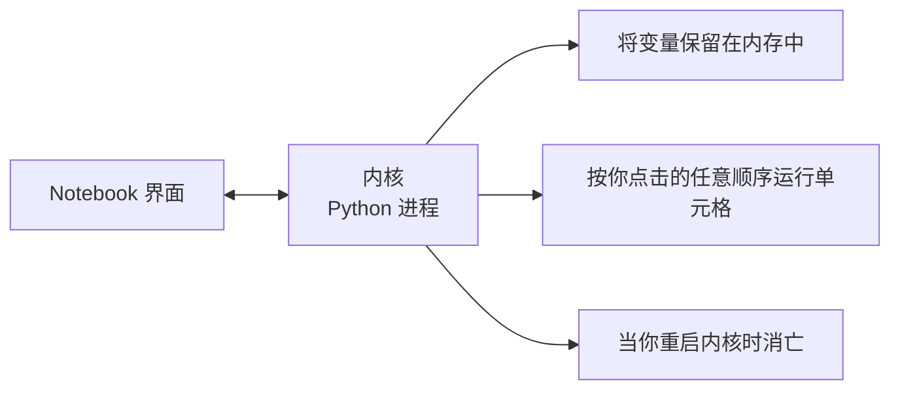

# Jupyter Notebooks

> Notebook是AI工程的实验台。你在原型设计阶段使用它，然后将能用的部分投入生产。

**类型：** 构建
**语言：** Python
**先修课程：** 第0阶段，第01课
**时间：** 约30分钟

## 学习目标

- 安装并启动JupyterLab、Jupyter Notebook或带有Jupyter扩展的VS Code
- 使用魔法命令（`%timeit`、`%%time`、`%matplotlib inline`）进行基准测试和行内可视化
- 区分何时使用Notebook与脚本，并应用"在Notebook中探索，用脚本交付"的工作流程
- 识别并避免常见的Notebook陷阱：乱序执行、隐藏状态和内存泄漏

## 问题

每篇AI论文、教程和Kaggle竞赛都在使用Jupyter notebooks。它们让你分块运行代码、行内查看输出、将代码与解释混合，并快速迭代。如果你尝试在不使用Notebook的情况下学习AI，就如同做数学题却没有草稿纸。

但Notebook确实存在陷阱。人们用它来做所有事情，包括那些它并不擅长的事情。知道何时用Notebook、何时用脚本，将避免你日后陷入调试噩梦。

## 概念

一个Notebook是一个单元格列表。每个单元格要么是代码，要么是文本。



内核是一个在后台运行的Python进程。当你运行一个单元格时，它会将代码发送给内核，内核执行代码并返回结果。所有单元格共享同一个内核，因此变量在单元格之间保持持久。



那个"按你点击的任意顺序"的部分既是超级能力，也是陷阱。

## 动手构建

### 第1步：选择你的界面

三种选项，同一格式：

| 界面 | 安装 | 最适合 |
|-----------|---------|----------|
| JupyterLab | `pip install jupyterlab` 然后 `jupyter lab` | 完整的IDE体验，多标签页、文件浏览器、终端 |
| Jupyter Notebook | `pip install notebook` 然后 `jupyter notebook` | 简洁、轻量、一次一个Notebook |
| VS Code | 安装"Jupyter"扩展 | 已在你编辑器中，Git集成、调试 |

三者均读写相同的`.ipynb`文件。选择你喜欢的即可。JupyterLab在AI工作中最为常见。

```bash
pip install jupyterlab
jupyter lab
```

### 第2步：重要的键盘快捷键

你可以在两种模式下操作。按`Escape`进入命令模式（左侧蓝色边框），按`Enter`进入编辑模式（绿色边框）。

**命令模式（最常用）：**

| 键 | 操作 |
|-----|--------|
| `Shift+Enter` | 运行单元格，移动到下一个 |
| `A` | 在上方插入单元格 |
| `B` | 在下方插入单元格 |
| `DD` | 删除单元格 |
| `M` | 转换为Markdown |
| `Y` | 转换为代码 |
| `Z` | 撤销单元格操作 |
| `Ctrl+Shift+H` | 显示所有快捷键 |

**编辑模式：**

| 键 | 操作 |
|-----|--------|
| `Tab` | 自动补全 |
| `Shift+Tab` | 显示函数签名 |
| `Ctrl+/` | 切换注释 |

`Shift+Enter`是你每天会用上千次的操作。先学会它。

### 第3步：单元格类型

**代码单元格**运行Python并显示输出：

```python
import numpy as np
data = np.random.randn(1000)
data.mean(), data.std()
```

输出：`(0.0032, 0.9987)`

**Markdown单元格**渲染格式化文本。用于记录你正在做什么以及为什么这么做。支持标题、粗体、斜体、LaTeX数学公式（`$E = mc^2$`）、表格和图像。

### 第4步：魔法命令

这些不是Python。它们是Jupyter特有的命令，以`%`（行魔术）或`%%`（单元格魔术）开头。

**计时你的代码：**

```python
%timeit np.random.randn(10000)
```

输出：`45.2 μs ± 1.3 μs 每次循环`

```python
%%time
model.fit(X_train, y_train, epochs=10)
```

输出：`Wall time: 2.34 s`

`%timeit`多次运行代码并取平均值。`%%time`只运行一次。对于微基准测试使用`%timeit`，对于训练运行使用`%%time`。

**启用行内绘图：**

```python
%matplotlib inline
```

每个`plt.plot()`或`plt.show()`现在都直接在Notebook中渲染。

**无需离开Notebook即可安装包：**

```python
!pip install scikit-learn
```

`!`前缀可以运行任何shell命令。

**检查环境变量：**

```python
%env CUDA_VISIBLE_DEVICES
```

### 第5步：行内显示富输出

Notebook自动显示单元格中的最后一个表达式。但你可以控制它：

```python
import pandas as pd

df = pd.DataFrame({
    "model": ["线性回归", "随机森林", "神经网络"],
    "accuracy": [0.72, 0.89, 0.94],
    "training_time": [0.1, 2.3, 45.6]
})
df
```

这会渲染一个格式化的HTML表格，而不是纯文本输出。图表同理：

```python
import matplotlib.pyplot as plt

plt.figure(figsize=(8, 4))
plt.plot([1, 2, 3, 4], [1, 4, 2, 3])
plt.title("行内图")
plt.show()
```

图表直接出现在单元格下方。这就是Notebook主导AI工作的原因。你同时看到数据、图表和代码。

对于图像：

```python
from IPython.display import Image, display
display(Image(filename="architecture.png"))
```

### 第6步：Google Colab

Colab是云端的免费Jupyter notebook。它为你提供GPU、预安装的库和Google Drive集成。无需设置。

1. 访问 [colab.research.google.com](https://colab.research.google.com)
2. 上传本课程中的任意`.ipynb`文件
3. 运行时 > 更改运行时类型 > T4 GPU（免费）

Colab与本地Jupyter的区别：
- 文件在会话之间不会持久化（保存到Drive或下载）
- 预安装：numpy、pandas、matplotlib、torch、tensorflow、sklearn
- `from google.colab import files` 上传/下载文件
- `from google.colab import drive; drive.mount('/content/drive')` 用于持久存储
- 空闲90分钟后会话超时（免费版）

## 使用它

### Notebooks vs 脚本：何时使用哪种

| 使用Notebook的场景 | 使用脚本的场景 |
|-------------------|-----------------|
| 探索数据集 | 训练流水线 |
| 原型设计模型 | 可复用的工具函数 |
| 可视化结果 | 包含`if __name__`的代码 |
| 解释你的工作 | 按计划运行的代码 |
| 快速实验 | 生产代码 |
| 课程练习 | 包和库 |

规则：**在Notebook中探索，用脚本交付**。

AI中的常见工作流程：
1. 在Notebook中探索数据
2. 在Notebook中原型设计模型
3. 一旦能工作，将代码移到`.py`文件中
4. 将这些`.py`文件导入回Notebook以进行进一步实验

### 常见陷阱

**乱序执行。** 你运行了单元格5，然后单元格2，再单元格7。Notebook在你的机器上工作正常，但当别人从上到下运行时却出错。修复方法：分享前先执行 内核 > 重启并运行所有单元格。

**隐藏状态。** 你删除了一个单元格，但其中创建的变量仍在内存中。Notebook看起来干净，但依赖于一个幽灵单元格。修复方法：定期重启内核。

**内存泄漏。** 加载4GB数据集，训练模型，再加载另一个数据集。没有任何内容被释放。修复方法：`del variable_name` 和 `gc.collect()`，或重启内核。

## 交付品

本课程产出：
- `outputs/prompt-notebook-helper.md` 用于调试Notebook问题

## 练习

1. 打开JupyterLab，创建一个Notebook，使用`%timeit`比较列表推导式与numpy创建10万个随机数数组的性能
2. 创建一个Notebook，包含markdown和代码单元格，加载一个CSV文件，显示数据框，并绘制图表。然后运行 内核 > 重启并运行所有单元格，验证其能否从头到尾正常工作
3. 从 `code/notebook_tips.py` 中获取代码，粘贴到Colab Notebook中，并使用免费GPU运行

## 关键术语

| 术语 | 人们常说 | 实际含义 |
|------|----------------|----------------------|
| 内核（Kernel） | "运行我代码的东西" | 一个独立的Python进程，执行单元格并将变量保留在内存中 |
| 单元格（Cell） | "一个代码块" | Notebook中一个可独立运行的单元，可以是代码或Markdown |
| 魔法命令（Magic command） | "Jupyter小技巧" | 以`%`或`%%`为前缀的特殊命令，用于控制Notebook环境 |
| `.ipynb` | "Notebook文件" | 一个JSON文件，包含单元格、输出和元数据。代表IPython Notebook |

## 进一步阅读

- [JupyterLab文档](https://jupyterlab.readthedocs.io/) 查看完整功能集
- [Google Colab FAQ](https://research.google.com/colaboratory/faq.html) 了解Colab特有的限制和功能
- [28个Jupyter Notebook技巧](https://www.dataquest.io/blog/jupyter-notebook-tips-tricks-shortcuts/) 获取高级用户快捷键