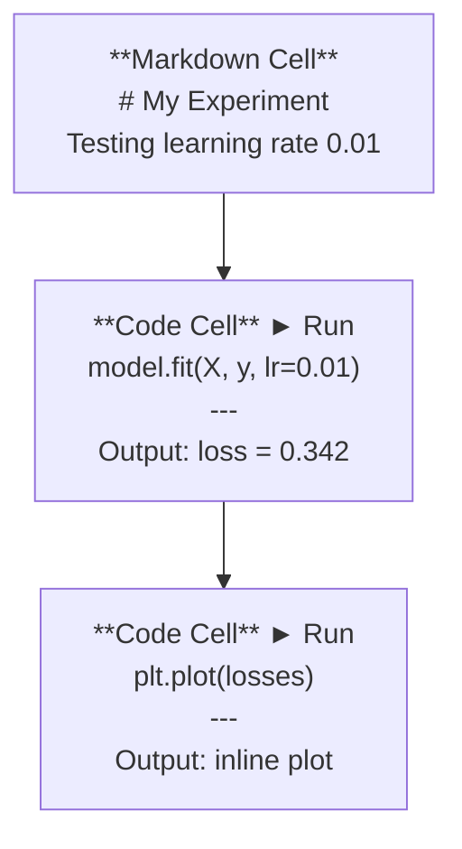
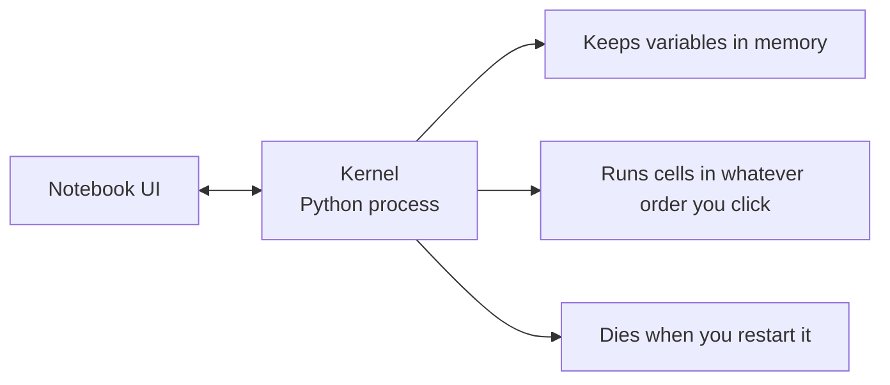

# 05 · Jupyter 笔记本

> 笔记本是 AI 工程的实验台。你在这里做原型，再把可行的部分迁移到生产环境。

**类型：** 构建
**语言：** Python
**前置：** 阶段 0，第 01 课
**时长：** 约 30 分钟

## 学习目标

- 安装并启动 JupyterLab、Jupyter Notebook，或装有 Jupyter 扩展的 VS Code
- 使用魔法命令「magic commands」（`%timeit`、`%%time`、`%matplotlib inline`）进行基准测试并内联可视化
- 区分何时该用笔记本、何时该用脚本，并贯彻「在笔记本里探索，用脚本发布」的工作流
- 识别并规避常见的笔记本陷阱：乱序执行、隐藏状态、内存泄漏

## 问题所在

每一篇 AI 论文、每一份教程、每一场 Kaggle 竞赛都在用 Jupyter 笔记本。它们让你分段运行代码、内联查看输出、把代码与说明混排在一起，并快速迭代。如果你想绕开笔记本来学 AI，那就好比做数学作业却不打草稿。

但笔记本也有实打实的陷阱。人们把它用在一切场景，包括那些它根本不擅长的地方。知道何时用笔记本、何时用脚本，能让你日后免于无数调试噩梦。

## 核心概念

一个笔记本就是一串单元格「cell」。每个单元格要么是代码，要么是文本。



内核「kernel」是一个在后台运行的 Python 进程。当你运行一个单元格时，它会把代码发送给内核，内核执行后再把结果送回来。所有单元格共享同一个内核，因此变量会在单元格之间持续存在。



那句「按你点击的任意顺序运行」既是超能力，也是会自伤的枪。

## 动手构建

### 第 1 步：选择你的界面

三种选择，一种格式：

| 界面 | 安装 | 最适合 |
|-----------|---------|----------|
| JupyterLab | `pip install jupyterlab`，然后 `jupyter lab` | 完整的 IDE 体验，多标签页、文件浏览器、终端 |
| Jupyter Notebook | `pip install notebook`，然后 `jupyter notebook` | 简洁、轻量，一次一个笔记本 |
| VS Code | 安装「Jupyter」扩展 | 已在你的编辑器中，集成 git，可调试 |

三者读写的都是同一个 `.ipynb` 文件。随你喜欢挑一个。JupyterLab 在 AI 工作中最为常见。

```bash
pip install jupyterlab
jupyter lab
```

### 第 2 步：真正要紧的键盘快捷键

你在两种模式下操作。按 `Escape` 进入命令模式（左侧出现蓝色条），按 `Enter` 进入编辑模式（绿色条）。

**命令模式（最常用）：**

| 按键 | 动作 |
|-----|--------|
| `Shift+Enter` | 运行单元格并移到下一个 |
| `A` | 在上方插入单元格 |
| `B` | 在下方插入单元格 |
| `DD` | 删除单元格 |
| `M` | 转为 markdown |
| `Y` | 转为代码 |
| `Z` | 撤销单元格操作 |
| `Ctrl+Shift+H` | 显示所有快捷键 |

**编辑模式：**

| 按键 | 动作 |
|-----|--------|
| `Tab` | 自动补全 |
| `Shift+Tab` | 显示函数签名 |
| `Ctrl+/` | 切换注释 |

`Shift+Enter` 是你每天要用上千次的那个。先把它学会。

### 第 3 步：单元格类型

**代码单元格（Code cells）** 运行 Python 并显示输出：

```python
import numpy as np
data = np.random.randn(1000)
data.mean(), data.std()
```

输出：`(0.0032, 0.9987)`

**Markdown 单元格** 渲染带格式的文本。用它们来记录你在做什么以及为什么这么做。支持标题、加粗、斜体、LaTeX 数学公式（`$E = mc^2$`）、表格和图片。

### 第 4 步：魔法命令

它们不是 Python。它们是 Jupyter 专属的命令，以 `%`（行魔法 line magic）或 `%%`（单元格魔法 cell magic）开头。

**给你的代码计时：**

```python
%timeit np.random.randn(10000)
```

输出：`45.2 us +/- 1.3 us per loop`

```python
%%time
model.fit(X_train, y_train, epochs=10)
```

输出：`Wall time: 2.34 s`

`%timeit` 会多次运行代码并取平均。`%%time` 只运行一次。微基准测试用 `%timeit`，训练运行用 `%%time`。

**启用内联绘图：**

```python
%matplotlib inline
```

此后每次 `plt.plot()` 或 `plt.show()` 都会直接渲染在笔记本里。

**不离开笔记本即可安装包：**

```python
!pip install scikit-learn
```

`!` 前缀可运行任意 shell 命令。

**查看环境变量：**

```python
%env CUDA_VISIBLE_DEVICES
```

### 第 5 步：内联展示富输出

笔记本会自动展示单元格中的最后一个表达式。但你也可以加以控制：

```python
import pandas as pd

df = pd.DataFrame({
    "model": ["Linear", "Random Forest", "Neural Net"],
    "accuracy": [0.72, 0.89, 0.94],
    "training_time": [0.1, 2.3, 45.6]
})
df
```

这会渲染成一张带格式的 HTML 表格，而不是一堆文本转储。绘图同理：

```python
import matplotlib.pyplot as plt

plt.figure(figsize=(8, 4))
plt.plot([1, 2, 3, 4], [1, 4, 2, 3])
plt.title("Inline Plot")
plt.show()
```

绘图会出现在单元格正下方。这正是笔记本在 AI 工作中占据主导地位的原因。你能把数据、绘图和代码一并看到。

显示图片：

```python
from IPython.display import Image, display
display(Image(filename="architecture.png"))
```

### 第 6 步：Google Colab

Colab 是云端一款免费的 Jupyter 笔记本。它给你 GPU、预装好的库，以及 Google Drive 集成。无需任何配置。

1. 前往 [colab.research.google.com](https://colab.research.google.com)
2. 上传本课程中的任意 `.ipynb` 文件
3. Runtime > Change runtime type > T4 GPU（免费）

Colab 与本地 Jupyter 的差异：
- 文件不会在会话之间保留（请保存到 Drive 或下载）
- 预装：numpy、pandas、matplotlib、torch、tensorflow、sklearn
- 用 `from google.colab import files` 上传/下载文件
- 用 `from google.colab import drive; drive.mount('/content/drive')` 实现持久化存储
- 会话在不活动 90 分钟后超时（免费层级）

## 实际运用

### 笔记本 vs 脚本：何时用哪个

| 用笔记本来做 | 用脚本来做 |
|-------------------|-----------------|
| 探索数据集 | 训练流水线 |
| 给模型做原型 | 可复用的工具函数 |
| 可视化结果 | 任何带 `if __name__` 的代码 |
| 解释你的工作 | 按计划定时运行的代码 |
| 快速实验 | 生产代码 |
| 课程练习 | 包和库 |

法则：**在笔记本里探索，用脚本发布**。

AI 中一种常见的工作流：
1. 在笔记本里探索数据
2. 在笔记本里给模型做原型
3. 一旦可行，把代码迁移到 `.py` 文件
4. 再把这些 `.py` 文件导入回笔记本，做进一步实验

### 常见陷阱

**乱序执行。** 你先运行第 5 格，再运行第 2 格，然后第 7 格。这个笔记本在你的机器上能跑，但别人从头到尾运行时就会崩。修法：分享前执行 Kernel > Restart & Run All。

**隐藏状态。** 你删掉了一个单元格，但它创建的变量仍然在内存里。笔记本看起来很干净，实际却依赖一个幽灵单元格。修法：定期重启内核。

**内存泄漏。** 加载一个 4GB 数据集、训练一个模型、再加载另一个数据集。什么都没被释放。修法：`del variable_name` 加 `gc.collect()`，或者重启内核。

## 交付成果

本课产出：
- `outputs/prompt-notebook-helper.md`，用于调试笔记本问题

## 练习

1. 打开 JupyterLab，创建一个笔记本，用 `%timeit` 比较列表推导式与 numpy 在生成一个含 100,000 个随机数的数组时的性能
2. 创建一个同时包含 markdown 与代码单元格的笔记本：加载一个 CSV、显示一个 dataframe，并绘制一张图表。然后执行 Kernel > Restart & Run All，验证它能从头到尾正常运行
3. 把 `code/notebook_tips.py` 中的代码粘贴进一个 Colab 笔记本，并用免费 GPU 运行它

## 关键术语

| 术语 | 人们怎么说 | 它实际指什么 |
|------|----------------|----------------------|
| Kernel（内核） | 「跑我代码的那个东西」 | 一个独立的 Python 进程，负责执行单元格并把变量保存在内存中 |
| Cell（单元格） | 「一段代码块」 | 笔记本中可独立运行的单元，可以是代码或 markdown |
| Magic command（魔法命令） | 「Jupyter 的小技巧」 | 以 `%` 或 `%%` 为前缀、用于控制笔记本环境的特殊命令 |
| `.ipynb` | 「笔记本文件」 | 一个包含单元格、输出和元数据的 JSON 文件。代表 IPython Notebook |

## 延伸阅读

- [JupyterLab 文档](https://jupyterlab.readthedocs.io/)，了解完整的功能集
- [Google Colab FAQ](https://research.google.com/colaboratory/faq.html)，了解 Colab 特有的限制与功能
- [28 个 Jupyter Notebook 技巧](https://www.dataquest.io/blog/jupyter-notebook-tips-tricks-shortcuts/)，进阶用户的快捷键
