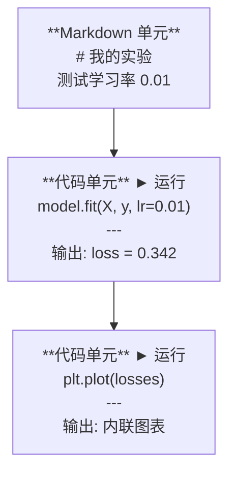
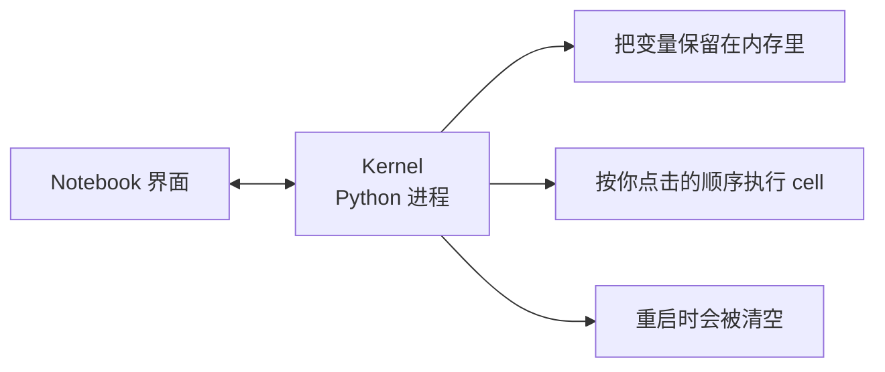

# Jupyter Notebooks（Jupyter 笔记本）

> 译注：本文译自同目录 [`en.md`](./en.md)。术语遵循仓根 [TRANSLATION_GUIDE.md](../../../../TRANSLATION_GUIDE.md)。

> Notebook 是 AI 工程的实验台。你先在这里做原型，再把跑通的部分搬到生产环境。

**Type:** Build
**Languages:** Python
**Prerequisites:** Phase 0, Lesson 01
**Time:** ~30 minutes

## 学习目标（Learning Objectives）

- 安装并启动 JupyterLab、Jupyter Notebook，或装好 Jupyter 扩展的 VS Code
- 使用 magic 命令（`%timeit`、`%%time`、`%matplotlib inline`）做基准测试和内联可视化
- 分清什么时候该用 notebook、什么时候该用脚本，并掌握「在 notebook 里探索，在脚本里上线」的工作流
- 识别并避开 notebook 的常见陷阱：乱序执行、隐藏状态、内存泄漏

## 问题（The Problem）

每一篇 AI 论文、每一个教程、每一场 Kaggle 比赛都在用 Jupyter notebook。它们让你能分块执行代码、把输出内联显示、把代码和说明混在一起，迭代飞快。如果你不用 notebook 就想学 AI，那相当于做数学作业不打草稿。

但 notebook 也有真实的坑。人们什么都拿它干，包括它根本不擅长的事。知道什么时候用 notebook、什么时候用脚本，能帮你日后省掉无数 debug 噩梦。

## 概念（The Concept）

一个 notebook 就是一组 cell。每个 cell 要么是代码，要么是文本。



kernel 是后台运行的一个 Python 进程。当你执行某个 cell 时，cell 会把代码发给 kernel，kernel 执行后把结果发回来。所有 cell 共用同一个 kernel，所以变量会在 cell 之间持续存在。



「按你点击的顺序执行」这一点既是超能力，也是脚下的雷。

## 动手实现（Build It）

### Step 1: 选一个界面

三种界面，同一种文件格式：

| 界面 | 安装 | 适合 |
|-----------|---------|----------|
| JupyterLab | `pip install jupyterlab` 然后 `jupyter lab` | 完整 IDE 体验，多标签、文件浏览器、终端 |
| Jupyter Notebook | `pip install notebook` 然后 `jupyter notebook` | 简单、轻量，一次开一个 notebook |
| VS Code | 安装 "Jupyter" 扩展 | 已经在你的编辑器里了，自带 git 集成和调试 |

三者读写的都是同一份 `.ipynb` 文件。挑你喜欢的就行。AI 工作里 JupyterLab 最常见。

```bash
pip install jupyterlab
jupyter lab
```

### Step 2: 真正重要的快捷键

你会在两种模式之间切换。按 `Escape` 进入命令模式（左侧蓝色条），按 `Enter` 进入编辑模式（绿色条）。

**命令模式（最常用）：**

| 按键 | 动作 |
|-----|--------|
| `Shift+Enter` | 运行当前 cell，光标移到下一个 |
| `A` | 在上方插入一个 cell |
| `B` | 在下方插入一个 cell |
| `DD` | 删除当前 cell |
| `M` | 转为 markdown |
| `Y` | 转为代码 |
| `Z` | 撤销 cell 操作 |
| `Ctrl+Shift+H` | 显示所有快捷键 |

**编辑模式：**

| 按键 | 动作 |
|-----|--------|
| `Tab` | 自动补全 |
| `Shift+Tab` | 显示函数签名 |
| `Ctrl+/` | 切换注释 |

`Shift+Enter` 你一天会按上千次，先把它练成肌肉记忆。

### Step 3: cell 的类型

**代码 cell** 运行 Python 并显示输出：

```python
import numpy as np
data = np.random.randn(1000)
data.mean(), data.std()
```

输出：`(0.0032, 0.9987)`

**Markdown cell** 渲染格式化的文本。用它来记录你在做什么、为什么这么做。支持标题、加粗、斜体、LaTeX 数学（`$E = mc^2$`）、表格和图片。

### Step 4: magic 命令

它们不是 Python，而是 Jupyter 专属的命令，以 `%`（行 magic）或 `%%`（cell magic）开头。

**给代码计时：**

```python
%timeit np.random.randn(10000)
```

输出：`45.2 us +/- 1.3 us per loop`

```python
%%time
model.fit(X_train, y_train, epochs=10)
```

输出：`Wall time: 2.34 s`

`%timeit` 会把代码跑很多次然后取平均；`%%time` 只跑一次。微基准用 `%timeit`，训练任务用 `%%time`。

**启用内联绘图：**

```python
%matplotlib inline
```

之后每个 `plt.plot()` 或 `plt.show()` 都会直接渲染在 notebook 里。

**不离开 notebook 就装包：**

```python
!pip install scikit-learn
```

`!` 前缀可以执行任何 shell 命令。

**查看环境变量：**

```python
%env CUDA_VISIBLE_DEVICES
```

### Step 5: 内联展示富输出

notebook 会自动显示 cell 里最后一个表达式。但你可以自己控制：

```python
import pandas as pd

df = pd.DataFrame({
    "model": ["Linear", "Random Forest", "Neural Net"],
    "accuracy": [0.72, 0.89, 0.94],
    "training_time": [0.1, 2.3, 45.6]
})
df
```

这会渲染成一个格式化的 HTML 表格，而不是一坨文本。绘图也一样：

```python
import matplotlib.pyplot as plt

plt.figure(figsize=(8, 4))
plt.plot([1, 2, 3, 4], [1, 4, 2, 3])
plt.title("Inline Plot")
plt.show()
```

图就出现在 cell 正下方。这就是 notebook 在 AI 工作里大行其道的原因——数据、图、代码同时在你眼前。

显示图片：

```python
from IPython.display import Image, display
display(Image(filename="architecture.png"))
```

### Step 6: Google Colab

Colab 是云上的免费 Jupyter notebook。给你一块 GPU、预装好的库，还能跟 Google Drive 打通，零配置。

1. 打开 [colab.research.google.com](https://colab.research.google.com)
2. 上传本课程里任意一个 `.ipynb` 文件
3. Runtime > Change runtime type > T4 GPU（免费）

Colab 与本地 Jupyter 的差异：
- 文件不会在 session 之间持久化（要保存到 Drive 或下载下来）
- 已预装：numpy、pandas、matplotlib、torch、tensorflow、sklearn
- `from google.colab import files` 用于上传/下载文件
- `from google.colab import drive; drive.mount('/content/drive')` 接入持久化存储
- 免费版 session 闲置 90 分钟后会超时断开

## 用起来（Use It）

### Notebook 还是脚本：什么时候用哪个

| Notebook 适合 | 脚本适合 |
|-------------------|-----------------|
| 探索数据集 | 训练流水线 |
| 给模型搭原型 | 可复用的工具函数 |
| 可视化结果 | 任何带 `if __name__` 的代码 |
| 解释你的工作 | 定时任务里跑的代码 |
| 快速实验 | 生产代码 |
| 课程练习 | 包和库 |

口诀：**在 notebook 里探索，在脚本里上线（explore in notebooks, ship in scripts）**。

AI 里的常见工作流：
1. 在 notebook 里探索数据
2. 在 notebook 里给模型搭原型
3. 一旦能跑通，就把代码搬到 `.py` 文件里
4. 再把那些 `.py` 文件 import 回 notebook，继续做后续实验

### 常见陷阱

**乱序执行（Out-of-order execution）。** 你先跑了 cell 5，再跑 cell 2，再跑 cell 7。在你机器上一切正常，但别人从上到下重跑就崩了。解法：分享前先 Kernel > Restart & Run All。

**隐藏状态（Hidden state）。** 你删掉了某个 cell，但它创建的变量还在内存里。notebook 看着干净，实际上依赖一个早就不在的「鬼魂 cell」。解法：定期重启 kernel。

**内存泄漏（Memory leaks）。** 加载一个 4GB 数据集，训练一个模型，再加载另一个数据集。什么都没释放。解法：`del variable_name` 加 `gc.collect()`，或者干脆重启 kernel。

## 上线部署（Ship It）

本课产出：
- `outputs/prompt-notebook-helper.md`，用来 debug notebook 问题

## 练习（Exercises）

1. 打开 JupyterLab，新建一个 notebook，用 `%timeit` 比较「列表推导式」与「numpy」生成 10 万个随机数的速度
2. 新建一个同时含 markdown 和代码 cell 的 notebook，加载一个 CSV、显示 dataframe、画一张图。然后用 Kernel > Restart & Run All 验证它能从上到下完整跑通
3. 把 `code/notebook_tips.py` 里的代码复制到一个 Colab notebook 里，挂上免费 GPU 跑一遍

## 关键术语（Key Terms）

| 术语 | 大家怎么说 | 它实际是什么 |
|------|----------------|----------------------|
| Kernel | 「跑我代码的那玩意」 | 一个独立的 Python 进程，负责执行 cell 并把变量留在内存里 |
| Cell | 「一个代码块」 | notebook 里能独立运行的单元，要么是代码要么是 markdown |
| Magic command | 「Jupyter 的小花招」 | 以 `%` 或 `%%` 开头的特殊命令，用来控制 notebook 环境 |
| `.ipynb` | 「notebook 文件」 | 一个 JSON 文件，里面装着 cell、输出和元数据。名字源自 IPython Notebook |

## 延伸阅读（Further Reading）

- [JupyterLab Docs](https://jupyterlab.readthedocs.io/) 完整功能集
- [Google Colab FAQ](https://research.google.com/colaboratory/faq.html) Colab 特有的限制和功能
- [28 Jupyter Notebook Tips](https://www.dataquest.io/blog/jupyter-notebook-tips-tricks-shortcuts/) 高玩级别的快捷键和技巧
