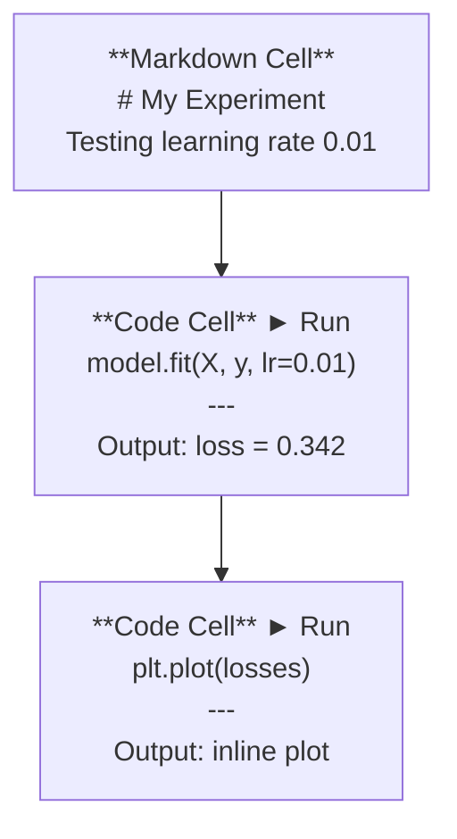
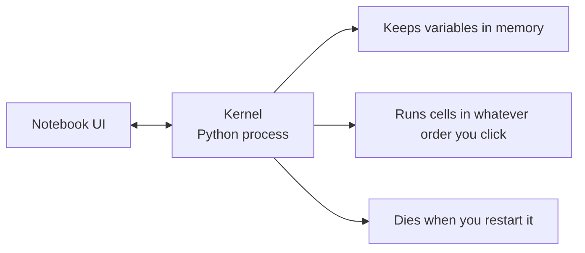

# Jupyter Notebooks

> 笔记本是人工智能工程的实验室工作台。您可以在这里制作原型，然后将有效的产品转移到生产中。

** 类型：** 构建
** 语言：** Python
** 先决条件：** 第0阶段，第01课
** 时间：** ~30分钟

## Learning Objectives

- Install and launch JupyterLab, Jupyter Notebook, or VS Code with the Jupyter extension
- 使用魔法命令（“%timeit”、“%%time”、“%matplotlib inline”）进行基准测试和内联可视化
- 区分何时使用笔记本电脑和脚本并应用“在笔记本电脑中探索，在脚本中交付”的工作流程
- 识别并避免常见的Notebook陷阱：无序执行、隐藏状态和内存泄漏

## The Problem

每份人工智能论文、教程和Kaggle竞赛都使用Friendyter笔记本。它们允许您分批运行代码、查看内联输出、混合代码与解释以及快速卸载。如果您试图在没有笔记本的情况下学习人工智能，那么您就是在没有草稿纸的情况下做数学作业。

但笔记本电脑有真正的陷阱。人们用它们来做任何事情，包括他们不擅长的事情。了解何时使用笔记本以及何时使用脚本将使您免于以后的调试噩梦。

## 概念

笔记本是一个单元格列表。每个单元格要么是代码，要么是文本。



内核是一个在后台运行的Python进程。当您运行单元时，它会将代码发送到内核，内核执行该代码并发送回结果。所有单元共享同一个内核，因此变量在单元之间持久存在。



“无论你点击什么命令”的部分既是超能力，也是脚枪。

## Build It

### 第1步：选择您的界面

三种选择，一种格式：

| Interface | Install | 最适合 |
|-----------|---------|----------|
| JupyterLab | `pip install jupyterlab` then `jupyter lab` | Full IDE experience, multiple tabs, file browser, terminal |
| Jupyter Notebook | ' pip安装笔记本'然后' jupyter笔记本' | 简单、轻便，一次一台笔记本电脑 |
| VS Code | 安装“Deliveryter”扩展 | 已在您的编辑器、git集成、调试中 |

这三个文件都读写同一个'.ipynb '文件。选择你喜欢的任何东西。DeliveryterLab是人工智能工作中最常见的。

```bash
pip install jupyterlab
jupyter lab
```

### Step 2: Keyboard shortcuts that matter

您在两种模式下操作。按“Escape”即可进入命令模式（左侧蓝色条），按“Enter”即可进入编辑模式（绿色条）。

** 命令模式（最常用）：**

| Key | Action |
|-----|--------|
| `Shift+Enter` | 运行单元格，移至下一个 |
| `A` | Insert cell above |
| `B` | 在下面插入单元格 |
| ' DD ' | 删除单元 |
| `M` | 转换为降价 |
| '是' | 转换为代码 |
| “Z” | 撤销单元格操作 |
| ' Alt +H ' | Show all shortcuts |

** 编辑模式：**

| 关键 | 行动 |
|-----|--------|
| `Tab` | 自动完成 |
| ' Alt +Tab ' | 显示功能签名 |
| `Ctrl+/` | 切换评论 |

“转移+输入”是您一天会使用一千次的选项。先学习一下。

### 第3步：细胞类型

** 代码单元格 ** 运行Python并显示输出：

```python
import numpy as np
data = np.random.randn(1000)
data.mean(), data.std()
```

输出：'（0.0032，0.9987）'

**Markdown单元格 ** 渲染格式化文本。使用它们来记录您正在做的事情以及原因。支持标题、粗体、Italian、LaTeX数学（'$E = mc ' 2 $'）、表格和图像。

### Step 4: Magic commands

这些不是Python。它们是特定于字节的命令，以“%”（行魔法）或“%%”（单元格魔法）开头。

** 为代码计时：**

```python
%timeit np.random.randn(10000)
```

输出：“每个循环45.2 us +/- 1.3 us”

```python
%%time
model.fit(X_train, y_train, epochs=10)
```

输出：`墙时间：2.34 s`

“%timeit”多次运行代码并求平均值。“%%time”运行一次。使用“%timeit”进行微基准测试，使用“%time”进行训练运行。

** 启用内联图：**

```python
%matplotlib inline
```

Every `plt.plot()` or `plt.show()` now renders directly in the notebook.

** 无需离开笔记本即可安装包：**

```python
!pip install scikit-learn
```

“！”前置码运行任何shell命令。

** 检查环境变量：**

```python
%env CUDA_VISIBLE_DEVICES
```

### Step 5: Display rich output inline

笔记本会自动显示单元格中的最后一个运算式。但你可以控制它：

```python
import pandas as pd

df = pd.DataFrame({
    "model": ["Linear", "Random Forest", "Neural Net"],
    "accuracy": [0.72, 0.89, 0.94],
    "training_time": [0.1, 2.3, 45.6]
})
df
```

这会呈现格式化的HTML表，而不是文本转储。情节相同：

```python
import matplotlib.pyplot as plt

plt.figure(figsize=(8, 4))
plt.plot([1, 2, 3, 4], [1, 4, 2, 3])
plt.title("Inline Plot")
plt.show()
```

该图显示在单元格的正下方。这就是笔记本电脑主导人工智能工作的原因。您可以一起看到数据、情节和代码。

For images:

```python
from IPython.display import Image, display
display(Image(filename="architecture.png"))
```

### 第6步：Google Colab

Colab是一款免费的云端笔记本电脑。它为您提供了一个图形处理器、预安装库和Google Drive集成。无需设置。

1. 转到[colab.research.google.com]（https：//colab.research.google.com）
2. Upload any `.ipynb` file from this course
3. >更改运行时类型> T4图形处理器（免费）

Colab与当地啤酒的区别：
- 文件不会在会话之间持久存在（保存到Drive或下载）
- 预装：numpy、pandas、matplotlib、torch、tensorflow、sklearn
- `from google.colab import files`上传/下载文件
- '来自google.colab导入驱动器; drive.芒特（'/content/drive '）'用于持久存储
- Sessions time out after 90 minutes of inactivity (free tier)

## Use It

### 笔记本与收件箱：何时使用哪一个

| 使用笔记本电脑 | 使用脚本 |
|-------------------|-----------------|
| 探索数据集 | 培训管道 |
| 模型原型设计 | 可重复使用的公用事业 |
| 可视化结果 | 任何带有“if _Name__'的东西 |
| Explaining your work | 按计划运行的代码 |
| 快速实验 | 生产代码 |
| Course exercises | 包和库 |

规则：** 在笔记本中探索，在脚本中交付 **。

人工智能中的常见工作流程：
1. Explore data in a notebook
2. 在笔记本中制作您的模型原型
3. 工作后，将代码移动到'.py '文件
4. 将这些'.py '文件导入笔记本以进行进一步实验

### Common traps

** 无序执行。**运行单元5，然后运行单元2，然后运行单元7。笔记本电脑在您的机器上正常工作，但当有人从上到下运行时，笔记本电脑就会损坏。修复：内核>在共享之前重新启动并运行全部。

** 隐藏状态。**您删除了一个单元格，但它创建的变量仍在内存中。笔记本看起来很干净，但依赖于幽灵细胞。修复：定期重新启动内核。

**Memory leaks.** Loading a 4GB dataset, training a model, loading another dataset. Nothing gets freed. Fix: `del variable_name` and `gc.collect()`, or restart the kernel.

## Ship It

本课产生：
- “oututs/prompt-notebook-helper.md”用于调试笔记本问题

## 演习

1. Open JupyterLab, create a notebook, and use `%timeit` to compare list comprehension vs numpy for creating an array of 100,000 random numbers
2. Create a notebook with both markdown and code cells that loads a CSV, displays a dataframe, and plots a chart. Then run Kernel > Restart & Run All to verify it works top to bottom
3. 从`code/notebook_tips.py`中获取代码，将其粘贴到Colab笔记本中，并使用免费的GPU运行它

## 关键术语

| Term | What people say | What it actually means |
|------|----------------|----------------------|
| 内核 | “运行我代码的东西” | A separate Python process that executes cells and keeps variables in memory |
| Cell | "A code block" | 笔记本中可独立运行的单元，可以是代码，也可以是降价 |
| 魔法命令 | “小丑技巧” | Special commands prefixed with `%` or `%%` that control the notebook environment |
| `.ipynb` | “笔记本文件” | 包含单元格、输出和元数据的JSON文件。IPython Notebook |

## Further Reading

- [JupyterLab Docs](https://jupyterlab.readthedocs.io/) for the full feature set
- [Google Colab FAQ](https://research.google.com/colaboratory/faq.html) for Colab-specific limits and features
- [28 Deliveryter笔记本提示]（https：//www.dataquest.io/blog/jupyter-notebook-tips-tricks-shortcuts/）用于高级用户快捷方式
