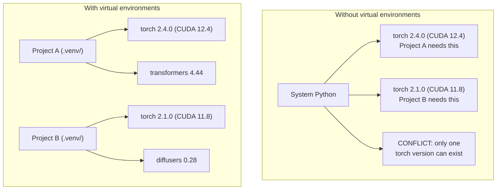

# Python環境

> 依存関係地獄は実在します。仮想環境はその治療法です。

**タイプ:** 作ってみる
**言語:** Shell
**前提条件:** フェーズ0、レッスン01
**時間:** 約30分

## 学習目標

- `uv`、`venv`、`conda` を使って分離された仮想環境を作成する
- 任意の依存関係グループを持つ `pyproject.toml` を書き、再現性のためにlockfileを生成する
- global install、pip/condaの混在、CUDAバージョン不一致などのよくある落とし穴を診断して修正する
- 依存関係が衝突するプロジェクトのために、フェーズごとの環境戦略を実装する

## 課題

fine-tuningプロジェクト用にPyTorch 2.4をインストールしたとします。翌週、別のプロジェクトがCUDAビルドを固定しているためPyTorch 2.1を必要とします。globalにアップグレードすると最初のプロジェクトが壊れます。ダウングレードすると2つ目が壊れます。

これが依存関係地獄です。AI/ML作業では常に起こります。理由は次のとおりです。

- PyTorch、JAX、TensorFlowはそれぞれ独自のCUDA bindingsを同梱している
- モデルライブラリは特定のframework versionを固定する
- globalな `pip install` は以前そこにあったものを上書きする
- CUDA 11.8向けbuildはCUDA 12.x driverで動かない（逆も同じ）

修正方法: すべてのプロジェクトに、独自のpackageを持つ分離環境を用意します。

## 考え方



## 作ってみる

### 選択肢1: uv venv（推奨）

`uv` は最速のPythonパッケージマネージャーです（pipより10〜100倍高速）。仮想環境、Pythonバージョン、依存関係解決を1つのツールで扱います。

```bash
curl -LsSf https://astral.sh/uv/install.sh | sh

uv python install 3.12

cd your-project
uv venv
source .venv/bin/activate
```

パッケージをインストールします。

```bash
uv pip install torch numpy
```

`pyproject.toml` 付きのプロジェクトを1ステップで作成します。

```bash
uv init my-ai-project
cd my-ai-project
uv add torch numpy matplotlib
```

### 選択肢2: venv（標準搭載）

`uv` をインストールできない場合、Pythonには `venv` が付属しています。

```bash
python3 -m venv .venv
source .venv/bin/activate  # Linux/macOS
.venv\Scripts\activate     # Windows

pip install torch numpy
```

`uv` より遅いですが、Pythonがインストールされている場所ならどこでも動きます。

### 選択肢3: conda（必要な場合）

CondaはCUDA toolkit、cuDNN、C libraryなどの非Python依存関係を管理します。次の場合に使います。

- システム全体にインストールせず、特定のCUDA toolkit versionが必要
- system packageをインストールできない共有cluster上にいる
- ライブラリのインストール手順に「condaを使う」と書かれている

```bash
# Install miniconda (not the full Anaconda)
curl -LsSf https://repo.anaconda.com/miniconda/Miniconda3-latest-Linux-x86_64.sh -o miniconda.sh
bash miniconda.sh -b

conda create -n myproject python=3.12
conda activate myproject

conda install pytorch torchvision torchaudio pytorch-cuda=12.4 -c pytorch -c nvidia
```

ルールは1つです。ある環境でcondaを使うなら、その環境のすべてのpackageをcondaで扱います。conda envに `pip install` を混ぜると、デバッグがつらい依存関係衝突が起きます。

### このコースでは: フェーズごとの戦略

コース全体で1つの環境を作ることもできます。そうしないでください。フェーズごとに異なる、時には衝突する依存関係が必要です。

戦略:

```
ai-engineering-from-scratch/
├── .venv/                    <-- shared lightweight env for phases 0-3
├── phases/
│   ├── 04-neural-networks/
│   │   └── .venv/            <-- PyTorch env
│   ├── 05-cnns/
│   │   └── .venv/            <-- same PyTorch env (symlink or shared)
│   ├── 08-transformers/
│   │   └── .venv/            <-- might need different transformer versions
│   └── 11-llm-apis/
│       └── .venv/            <-- API SDKs, no torch needed
```

`code/env_setup.sh` のscriptは、このコースの基本環境を作成します。

## pyproject.tomlの基本

すべてのPythonプロジェクトは `pyproject.toml` を持つべきです。これは `setup.py`、`setup.cfg`、`requirements.txt` を1つのファイルで置き換えます。

```toml
[project]
name = "ai-engineering-from-scratch"
version = "0.1.0"
requires-python = ">=3.11"
dependencies = [
    "numpy>=1.26",
    "matplotlib>=3.8",
    "jupyter>=1.0",
    "scikit-learn>=1.4",
]

[project.optional-dependencies]
torch = ["torch>=2.3", "torchvision>=0.18"]
llm = ["anthropic>=0.39", "openai>=1.50"]
```

次のようにインストールします。

```bash
uv pip install -e ".[torch]"    # base + PyTorch
uv pip install -e ".[llm]"     # base + LLM SDKs
uv pip install -e ".[torch,llm]" # everything
```

## Lockfile

lockfileは、すべての依存関係（推移的依存関係を含む）を正確なversionへ固定します。これにより再現性が保証されます。lockfileからインストールすれば、誰でもまったく同じpackageを取得します。

```bash
# uv generates uv.lock automatically when using uv add
uv add numpy

# pip-tools approach
uv pip compile pyproject.toml -o requirements.lock
uv pip install -r requirements.lock
```

lockfileはgitにcommitしてください。誰かがrepoをcloneしたら、lockfileからインストールし、同一versionを取得します。

## よくある間違い

### 1. globalにインストールする

```bash
pip install torch  # BAD: installs to system Python

source .venv/bin/activate
pip install torch  # GOOD: installs to virtual environment
```

packageのインストール先を確認します。

```bash
which python       # should show .venv/bin/python, not /usr/bin/python
which pip           # should show .venv/bin/pip
```

### 2. pipとcondaを混ぜる

```bash
conda create -n myenv python=3.12
conda activate myenv
conda install pytorch -c pytorch
pip install some-other-package   # BAD: can break conda's dependency tracking
conda install some-other-package # GOOD: let conda manage everything
```

conda内でどうしてもpipを使う必要がある場合（一部packageがpipのみの場合）、先にすべてのconda packageを入れ、最後にpip packageを入れます。

### 3. activateし忘れる

```bash
python train.py           # uses system Python, missing packages
source .venv/bin/activate
python train.py           # uses project Python, packages found
```

shell promptには環境名が表示されるはずです。

```
(.venv) $ python train.py
```

### 4. .venvをgitにcommitする

```bash
echo ".venv/" >> .gitignore
```

仮想環境は200MB〜2GBあります。ローカル専用であり、マシン間で移植できません。代わりに `pyproject.toml` とlockfileをcommitします。

### 5. CUDAバージョン不一致

```bash
nvidia-smi                # shows driver CUDA version (e.g., 12.4)
python -c "import torch; print(torch.version.cuda)"  # shows PyTorch CUDA version

# These must be compatible.
# PyTorch CUDA version must be <= driver CUDA version.
```

## 使ってみる

setup scriptを実行して、コース用の環境を作成します。

```bash
bash phases/00-setup-and-tooling/06-python-environments/code/env_setup.sh
```

これはrepo rootに `.venv` を作成し、core dependenciesをインストールして検証します。

## 演習

1. `env_setup.sh` を実行し、すべてのcheckが通ることを確認する
2. 2つ目の仮想環境を作成し、そこに別versionのnumpyをインストールして、2つの環境が分離されていることを確認する
3. PyTorchとAnthropic SDKの両方を必要とするプロジェクト用の `pyproject.toml` を書く
4. わざとvenvをactivateせずにpackageをglobal installし、どこに入るかを確認してからuninstallする

## 重要用語

| 用語 | よくある言い方 | 実際の意味 |
|------|----------------|----------------------|
| Virtual environment | 「venv」 | system Pythonとは別に、Python interpreterとpackageを含む分離ディレクトリ |
| Lockfile | 「固定された依存関係」 | すべてのpackageと正確なversionを列挙し、マシン間で同一installを保証するファイル |
| pyproject.toml | 「新しいsetup.py」 | setup.py/setup.cfg/requirements.txtを置き換える、標準のPythonプロジェクト設定ファイル |
| Transitive dependency | 「依存関係の依存関係」 | package BがCに依存する。Bに依存するAをinstallすると、CはAの推移的依存関係になる |
| CUDA mismatch | 「GPUが動かない」 | PyTorchが、GPU driverが対応するCUDA versionとは違うversion向けにcompileされている状態 |
