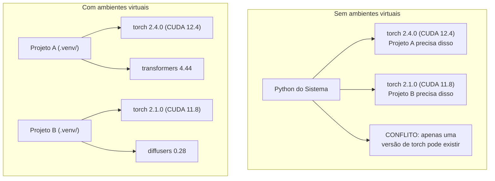

# Ambientes Python

> O inferno das dependências é real. Ambientes virtuais são a cura.

**Tipo:** Build
**Linguagens:** Shell
**Pré-requisitos:** Fase 0, Aula 01
**Tempo:** ~30 minutos

## Objetivos de Aprendizado

- Criar ambientes virtuais isolados usando `uv`, `venv` ou `conda`
- Escrever um `pyproject.toml` com grupos de dependências opcionais e gerar lockfiles para reproduzibilidade
- Diagnosticar e corrigir armadilhas comuns: instalações globais, mistura pip/conda, incompatibilidades de versão CUDA
- Implementar uma estratégia de ambiente por fase para projetos com dependências conflitantes

## O Problema

Você instala PyTorch 2.4 para um projeto de fine-tuning. Na semana seguinte, um projeto diferente precisa de PyTorch 2.1 porque o build de CUDA dele está fixo. Você atualiza globalmente e o primeiro projeto quebra. Você faz downgrade e o segundo quebra.

Isso é o inferno das dependências. Acontece o tempo todo em trabalho de IA/ML porque:

- PyTorch, JAX e TensorFlow cada um envia seus próprios bindings de CUDA
- Bibliotecas de modelos fixam versões eespecificaçãoíficas de frameworks
- Um `pip install` global sobrescreve o que estava lá antes
- Builds do CUDA 11.8 não funcionam com drivers CUDA 12.x (e vice-versa)

A solução: cada projeto ganha seu próprio ambiente isolado com seus próprios pacotes.

## O Conceito



## Construa

### Opção 1: uv venv (Recomendado)

`uv` é o gerenciador de pacotes Python mais rápido (10-100x mais rápido que pip). Ele lida com ambientes virtuais, versões do Python e resolução de dependências em uma ferramenta.

```bash
curl -LsSf https://astral.sh/uv/install.sh | sh

uv python install 3.12

cd seu-projeto
uv venv
source .venv/bin/activate
```

Instale pacotes:

```bash
uv pip install torch numpy
```

Crie um projeto com `pyproject.toml` em um passo:

```bash
uv init meu-projeto-ia
cd meu-projeto-ia
uv add torch numpy matplotlib
```

### Opção 2: venv (Embutido)

Se você não conseguir instalar `uv`, Python já vem com `venv`:

```bash
python3 -m venv .venv
source .venv/bin/activate  # Linux/macOS
.venv\Scripts\activate     # Windows

pip install torch numpy
```

Mais lento que `uv`, mas funciona em qualquer lugar que Python esteja instalado.

### Opção 3: Conda (Quando Precisar)

Conda gerencia dependências não-Python como toolkits CUDA, cuDNN e bibliotecas C. Use quando:

- Você precisa de uma versão eespecificaçãoífica do toolkit CUDA sem instalar no sistema inteiro
- Está num cluster compartilhado onde não pode instalar pacotes do sistema
- As instruções de instalação de uma biblioteca dizem "use conda"

```bash
# Instale miniconda (não o Anaconda completo)
curl -LsSf https://repo.anaconda.com/miniconda/Miniconda3-latest-Linux-x86_64.sh -o miniconda.sh
bash miniconda.sh -b

conda create -n meu-projeto python=3.12
conda activate meu-projeto

conda install pytorch torchvision torchaudio pytorch-cuda=12.4 -c pytorch -c nvidia
```

Uma regra: se você usa conda pra um ambiente, use conda pra todos os pacotes naquele ambiente. Misturar `pip install` num ambiente conda causa conflitos de dependência difíceis de debugar.

## Uso Neste Curso: Estratégia por Fase

```
ai-engineering-from-scratch/
├── .venv/                    <-- env compartilhado leve para fases 0-3
├── phases/
│   ├── 04-neural-networks/
│   │   └── .venv/            <-- env PyTorch
│   ├── 05-cnns/
│   │   └── .venv/            <-- mesmo env PyTorch (symlink ou compartilhado)
│   ├── 08-transformers/
│   │   └── .venv/            <-- pode precisar de versões diferentes de transformers
│   └── 11-llm-apis/
│       └── .venv/            <-- SDKs de API, sem torch necessário
```

## Erros Comuns

### 1. Instalar globalmente

```bash
pip install torch  # RUIM: instala no Python do sistema

source .venv/bin/activate
pip install torch  # BOM: instala no ambiente virtual
```

### 2. Misturar pip e conda

```bash
conda create -n meuenv python=3.12
conda activate meuenv
conda install pytorch -c pytorch
pip install algum-pacote   # RUIM: pode quebrar o tracking de dependências do conda
conda install algum-pacote # BOM: deixe o conda gerenciar tudo
```

### 3. Esquecer de ativar

```bash
python train.py           # usa o Python do sistema, pacotes faltando
source .venv/bin/activate
python train.py           # usa o Python do projeto, pacotes encontrados
```

### 4. Fazer commit de .venv no git

```bash
echo ".venv/" >> .gitignore
```

Ambientes virtuais têm 200MB-2GB. São locais, não portáveis entre máquinas. Faça commit do `pyproject.toml` e do lockfile no lugar.

### 5. Incompatibilidade de versão CUDA

```bash
nvidia-smi                # mostra versão CUDA do driver (ex: 12.4)
python -c "import torch; print(torch.version.cuda)"  # mostra versão CUDA do PyTorch

# Estas devem ser compatíveis.
# A versão CUDA do PyTorch deve ser <= versão CUDA do driver.
```

## Use

Execute o script de configuração para criar seu ambiente do curso:

```bash
bash phases/00-setup-and-tooling/06-python-environments/code/env_setup.sh
```

## Exercícios

1. Execute `env_setup.sh` e verifique que todas as verificações passam
2. Crie um segundo ambiente virtual, instale uma versão diferente de numpy nele e confirme que os dois ambientes estão isolados
3. Escreva um `pyproject.toml` para um projeto que precisa tanto de PyTorch quanto do SDK Anthropic
4. Instale propositalmente um pacote globalmente (sem ativar um venv), note onde ele vai, depois desinstale-o
