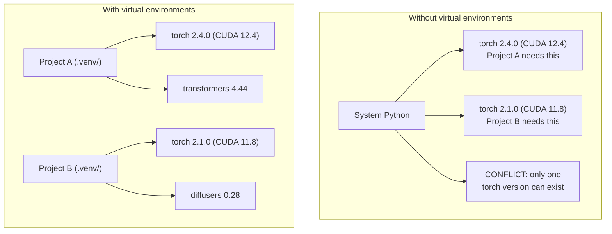

# Python Ortamları

> Bağımlılık cehennemi gerçektir. Bunun çaresi sanal ortamlardır.

**Tür:** Yapım
**Diller:** Kabuk
**Önkoşullar:** Aşama 0, Ders 01
**Süre:** ~30 dakika

## Öğrenme Hedefleri

- `uv`, `venv` veya `conda` kullanarak yalıtılmış sanal ortamlar oluşturun
- İsteğe bağlı bağımlılık gruplarıyla bir `pyproject.toml` yazın ve tekrarlanabilirlik için kilit dosyaları oluşturun
- Yaygın tuzakları teşhis edin ve düzeltin: küresel kurulumlar, pip/conda karıştırma, CUDA sürüm uyumsuzlukları
- Çakışan bağımlılıklara sahip projeler için her aşama için bir ortam stratejisi uygulayın

## Sorun

Bir fine-tuning projesi için PyTorch 2.4'ü yüklediniz. Gelecek hafta farklı bir projenin CUDA yapısı sabitlendiğinden PyTorch 2.1'e ihtiyacı var. Küresel olarak yükseltme yaparsınız ve ilk proje bozulur. Seviyenizi düşürürsünüz ve ikincisi bozulur.

Bu bağımlılık cehennemidir. AI/ML çalışmalarında bu durum sürekli olarak gerçekleşir çünkü:

- PyTorch, JAX ve TensorFlow'un her biri kendi CUDA bağlamalarını gönderir
- Model kitaplıkları belirli framework sürümlerini sabitler
- Global bir `pip install` daha önce orada olanın üzerine yazar
- CUDA 11.8 yapıları CUDA 12.x sürücüleriyle çalışmaz (ve tam tersi)

Çözüm: Her proje, kendi paketleriyle kendi yalıtılmış ortamına sahip olur.

## Konsept



## İnşa Et

### Seçenek 1: uv venv (Önerilen)

`uv` en hızlı Python paket yöneticisidir (pip'ten 10-100 kat daha hızlı). Sanal ortamları, Python sürümlerini ve bağımlılık çözümlemesini tek bir araçta yönetir.

```bash
curl -LsSf https://astral.sh/uv/install.sh | sh

uv python install 3.12

cd your-project
uv venv
source .venv/bin/activate
```

Paketleri yükleyin:

```bash
uv pip install torch numpy
```

Tek adımda `pyproject.toml` ile bir proje oluşturun:

```bash
uv init my-ai-project
cd my-ai-project
uv add torch numpy matplotlib
```

### Seçenek 2: venv (Yerleşik)

`uv`'ı yükleyemiyorsanız Python, `venv` ile birlikte gelir:

```bash
python3 -m venv .venv
source .venv/bin/activate  # Linux/macOS
.venv\Scripts\activate     # Windows

pip install torch numpy
```

`uv`'dan daha yavaştır ancak Python'un kurulu olduğu her yerde çalışır.

### Seçenek 3: conda (İhtiyacınız Olduğunda)

Conda, CUDA araç setleri, cuDNN ve C kitaplıkları gibi Python dışı bağımlılıkları yönetir. Şu durumlarda kullanın:

- Sistem genelinde kurulum yapmadan belirli bir CUDA araç seti sürümüne ihtiyacınız var
- Sistem paketlerini yükleyemediğiniz paylaşılan bir kümedesiniz
- Bir kütüphanenin kurulum talimatlarında "conda kullan" yazıyor

```bash
# Install miniconda (not the full Anaconda)
curl -LsSf https://repo.anaconda.com/miniconda/Miniconda3-latest-Linux-x86_64.sh -o miniconda.sh
bash miniconda.sh -b

conda create -n myproject python=3.12
conda activate myproject

conda install pytorch torchvision torchaudio pytorch-cuda=12.4 -c pytorch -c nvidia
```

Tek kural: Bir ortam için conda kullanıyorsanız, o ortamdaki tüm paketler için conda kullanın. `pip install`'yi bir conda env'ye karıştırmak, hata ayıklaması zahmetli olan bağımlılık çatışmalarına neden olur.

### Bu Kurs İçin: Aşama Başına Strateji

Kursun tamamı için tek bir ortam oluşturabilirsiniz. Yapma. Farklı aşamalar farklı (bazen çelişen) bağımlılıklara ihtiyaç duyar.

Strateji:

```
ai-engineering-from-scratch/
├── .venv/                    <-- shared lightweight env for phases 0-3
├── phases/
│   ├── 04-neural-networks/
│   │   └── .venv/            <-- PyTorch env
│   ├── 05-cnns/
│   │   └── .venv/            <-- same PyTorch env (symlink or shared)
│   ├── 08-transformers/
│   │   └── .venv/            <-- might need different transformer versions
│   └── 11-llm-apis/
│       └── .venv/            <-- API SDKs, no torch needed
```

`code/env_setup.sh` dosyasındaki komut dosyası bu kurs için temel ortamı oluşturur.

## pyproject.toml Temel Bilgiler

Her Python projesinde bir `pyproject.toml` bulunmalıdır. Tek dosyada `setup.py`, `setup.cfg` ve `requirements.txt`'nin yerini alır.

```toml
[project]
name = "ai-engineering-from-scratch"
version = "0.1.0"
requires-python = ">=3.11"
dependencies = [
    "numpy>=1.26",
    "matplotlib>=3.8",
    "jupyter>=1.0",
    "scikit-learn>=1.4",
]

[project.optional-dependencies]
torch = ["torch>=2.3", "torchvision>=0.18"]
llm = ["anthropic>=0.39", "openai>=1.50"]
```

Ardından şunu yükleyin:

```bash
uv pip install -e ".[torch]"    # base + PyTorch
uv pip install -e ".[llm]"     # base + LLM SDKs
uv pip install -e ".[torch,llm]" # everything
```

## Dosyaları kilitle

Bir kilit dosyası her bağımlılığı (geçişli olanlar dahil) tam sürümlere sabitler. Bu, tekrarlanabilirliği garanti eder: Kilit dosyasından kurulum yapan herkes tamamen aynı paketleri alır.

```bash
# uv generates uv.lock automatically when using uv add
uv add numpy

# pip-tools approach
uv pip compile pyproject.toml -o requirements.lock
uv pip install -r requirements.lock
```

Kilit dosyanızı git'e kaydedin. Birisi repoyu klonladığında kilit dosyasından yükler ve aynı sürümleri alır.

## Yaygın Hatalar

### 1. Global kurulum

```bash
pip install torch  # BAD: installs to system Python

source .venv/bin/activate
pip install torch  # GOOD: installs to virtual environment
```

Paketlerinizin nereye gittiğini kontrol edin:

```bash
which python       # should show .venv/bin/python, not /usr/bin/python
which pip           # should show .venv/bin/pip
```

### 2. Pip ve conda'nın karıştırılması

```bash
conda create -n myenv python=3.12
conda activate myenv
conda install pytorch -c pytorch
pip install some-other-package   # BAD: can break conda's dependency tracking
conda install some-other-package # GOOD: let conda manage everything
```

Conda içinde pip kullanmanız gerekiyorsa (bazı paketler yalnızca pip içindir), önce tüm conda paketlerini, ardından en son pip paketlerini yükleyin.

### 3. Etkinleştirmeyi unutmak

```bash
python train.py           # uses system Python, missing packages
source .venv/bin/activate
python train.py           # uses project Python, packages found
```

prompt kabuğunuz ortam adını göstermelidir:

```
(.venv) $ python train.py
```

### 4. .venv'yi git'e işlemek

```bash
echo ".venv/" >> .gitignore
```

Sanal ortamlar 200MB-2GB'tır. Yereldirler, makineler arasında taşınabilir değillerdir. Bunun yerine `pyproject.toml` ve kilit dosyasını kaydedin.

### 5. CUDA sürüm uyuşmazlığı

```bash
nvidia-smi                # shows driver CUDA version (e.g., 12.4)
python -c "import torch; print(torch.version.cuda)"  # shows PyTorch CUDA version

# These must be compatible.
# PyTorch CUDA version must be <= driver CUDA version.
```

## Kullan onu

Kurs ortamınızı oluşturmak için kurulum komut dosyasını çalıştırın:

```bash
bash phases/00-setup-and-tooling/06-python-environments/code/env_setup.sh
```

Bu, repo kökünde çekirdek bağımlılıkları yüklenmiş ve doğrulanmış bir `.venv` oluşturur.

## Egzersizler

1. `env_setup.sh` komutunu çalıştırın ve tüm kontrollerin başarılı olduğunu doğrulayın
2. İkinci bir sanal ortam oluşturun, bu ortama farklı bir numpy sürümü yükleyin ve iki ortamın yalıtılmış olduğunu doğrulayın
3. Hem PyTorch hem de Anthropic SDK'ya ihtiyaç duyan bir proje için bir `pyproject.toml` yazın
4. Bir paketi kasıtlı olarak global olarak yükleyin (venv'yi etkinleştirmeden), nereye gittiğine dikkat edin ve ardından kaldırın

## Anahtar Terimler

| Dönem | İnsanlar ne diyor | Aslında ne anlama geliyor |
|------|----------------|----------------------|
| Sanal ortam | "Bir venv" | Python yorumlayıcısını ve paketlerini içeren, Python sisteminden ayrı, yalıtılmış bir dizin |
| Kilit dosyası | "Sabitlenmiş bağımlılıklar" | Makineler arasında aynı kurulumu garanti eden, her paketi ve paketin tam sürümünü listeleyen bir dosya |
| pyproject.toml | "Yeni setup.py" | Standart Python proje yapılandırma dosyası, setup.py/setup.cfg/requirements.txt |
| Geçişli bağımlılık | "Bir bağımlılığın bağımlılığı" | B paketi C'ye bağlıdır; B'ye bağlı olan A'yı yüklerseniz, C, A'nın geçişli bağımlılığıdır |
| CUDA uyumsuzluğu | "GPU'm çalışmıyor" | PyTorch, GPU sürücünüzün desteklediğinden farklı bir CUDA sürümü için derlendi |
