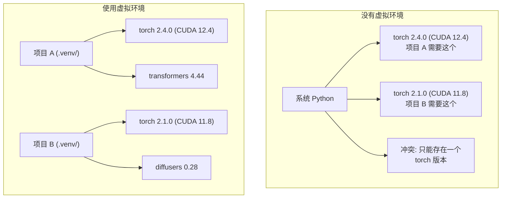

# Python 环境（Python Environments）

> 译注：本文译自同目录 [`en.md`](./en.md)。术语遵循仓根 [TRANSLATION_GUIDE.md](../../../../TRANSLATION_GUIDE.md)。

> 依赖地狱真实存在。虚拟环境就是解药。

**Type:** Build
**Languages:** Shell
**Prerequisites:** Phase 0, Lesson 01
**Time:** ~30 minutes

## 学习目标（Learning Objectives）

- 用 `uv`、`venv` 或 `conda` 创建隔离的虚拟环境
- 写一份 `pyproject.toml`，配上可选依赖组（optional dependency groups），并生成 lockfile 保证可复现性
- 诊断并修复常见坑：全局安装、pip/conda 混用、CUDA 版本不匹配
- 为存在依赖冲突的项目设计「按 phase 拆分环境」的策略

## 问题（The Problem）

你为某个微调项目装了 PyTorch 2.4。下周另一个项目要 PyTorch 2.1，因为它的 CUDA 构建被 pin 死了。你全局升级，第一个项目就坏；你降级，第二个又坏。

这就是依赖地狱。在 AI/ML 工作中它几乎天天上演，原因是：

- PyTorch、JAX、TensorFlow 各自带着自己的 CUDA bindings
- 模型库会 pin 死特定的框架版本
- 全局 `pip install` 会直接覆盖之前装的版本
- CUDA 11.8 构建跟 CUDA 12.x 驱动彼此不兼容（反之亦然）

解法：每个项目都有自己的隔离环境，自己装自己的包。

## 概念（The Concept）



## 动手实现（Build It）

### 方案 1：uv venv（推荐）

`uv` 是目前最快的 Python 包管理器（比 pip 快 10–100 倍）。它把虚拟环境、Python 版本、依赖求解都集成在一个工具里。

```bash
curl -LsSf https://astral.sh/uv/install.sh | sh

uv python install 3.12

cd your-project
uv venv
source .venv/bin/activate
```

安装包：

```bash
uv pip install torch numpy
```

一步创建一个带 `pyproject.toml` 的项目：

```bash
uv init my-ai-project
cd my-ai-project
uv add torch numpy matplotlib
```

### 方案 2：venv（内置）

如果你装不了 `uv`，Python 自带 `venv`：

```bash
python3 -m venv .venv
source .venv/bin/activate  # Linux/macOS
.venv\Scripts\activate     # Windows

pip install torch numpy
```

比 `uv` 慢，但只要装了 Python 就能用。

### 方案 3：conda（在你确实需要时）

Conda 能管 Python 之外的依赖，比如 CUDA toolkit、cuDNN、C 库。下面这些场景用它：

- 你需要某个特定版本的 CUDA toolkit，又不想全局安装
- 你在共享集群上，没权限装系统包
- 某个库的安装说明明确写着「用 conda」

```bash
# Install miniconda (not the full Anaconda)
curl -LsSf https://repo.anaconda.com/miniconda/Miniconda3-latest-Linux-x86_64.sh -o miniconda.sh
bash miniconda.sh -b

conda create -n myproject python=3.12
conda activate myproject

conda install pytorch torchvision torchaudio pytorch-cuda=12.4 -c pytorch -c nvidia
```

一条规矩：如果某个环境用了 conda，那这个环境里所有包都用 conda 装。在 conda env 里掺 `pip install` 会引发极难排查的依赖冲突。

### 本课程的策略：每个 phase 一个环境

你完全可以给整门课只建一个环境。但别这么干。不同 phase 的依赖不一样，有时候还互相冲突。

策略：

```
ai-engineering-from-scratch/
├── .venv/                    <-- shared lightweight env for phases 0-3
├── phases/
│   ├── 04-neural-networks/
│   │   └── .venv/            <-- PyTorch env
│   ├── 05-cnns/
│   │   └── .venv/            <-- same PyTorch env (symlink or shared)
│   ├── 08-transformers/
│   │   └── .venv/            <-- might need different transformer versions
│   └── 11-llm-apis/
│       └── .venv/            <-- API SDKs, no torch needed
```

`code/env_setup.sh` 这个脚本会为本课程创建基础环境。

## pyproject.toml 基础

每个 Python 项目都应该有一份 `pyproject.toml`。它把 `setup.py`、`setup.cfg`、`requirements.txt` 三者合并到一个文件里。

```toml
[project]
name = "ai-engineering-from-scratch"
version = "0.1.0"
requires-python = ">=3.11"
dependencies = [
    "numpy>=1.26",
    "matplotlib>=3.8",
    "jupyter>=1.0",
    "scikit-learn>=1.4",
]

[project.optional-dependencies]
torch = ["torch>=2.3", "torchvision>=0.18"]
llm = ["anthropic>=0.39", "openai>=1.50"]
```

然后这样安装：

```bash
uv pip install -e ".[torch]"    # base + PyTorch
uv pip install -e ".[llm]"     # base + LLM SDKs
uv pip install -e ".[torch,llm]" # everything
```

## Lockfile

lockfile 把每一个依赖（包括传递依赖，transitive dependency）都 pin 到精确版本。这能保证可复现：任何人从 lockfile 安装，拿到的都是完全一样的一组包。

```bash
# uv generates uv.lock automatically when using uv add
uv add numpy

# pip-tools approach
uv pip compile pyproject.toml -o requirements.lock
uv pip install -r requirements.lock
```

把 lockfile 提交进 git。别人 clone 仓库后从 lockfile 安装，拿到的是完全相同的版本。

## 常见错误

### 1. 全局安装

```bash
pip install torch  # BAD: installs to system Python

source .venv/bin/activate
pip install torch  # GOOD: installs to virtual environment
```

检查包到底装到哪儿了：

```bash
which python       # should show .venv/bin/python, not /usr/bin/python
which pip           # should show .venv/bin/pip
```

### 2. pip 和 conda 混用

```bash
conda create -n myenv python=3.12
conda activate myenv
conda install pytorch -c pytorch
pip install some-other-package   # BAD: can break conda's dependency tracking
conda install some-other-package # GOOD: let conda manage everything
```

如果你必须在 conda 里用 pip（有些包只在 pip 上有），先把所有 conda 包装完，最后再装 pip 包。

### 3. 忘了 activate

```bash
python train.py           # uses system Python, missing packages
source .venv/bin/activate
python train.py           # uses project Python, packages found
```

shell 提示符应该显示出环境名：

```
(.venv) $ python train.py
```

### 4. 把 .venv 提交进 git

```bash
echo ".venv/" >> .gitignore
```

虚拟环境动辄 200MB–2GB，是机器本地的，跨机器并不可移植。该提交的是 `pyproject.toml` 和 lockfile。

### 5. CUDA 版本不匹配

```bash
nvidia-smi                # shows driver CUDA version (e.g., 12.4)
python -c "import torch; print(torch.version.cuda)"  # shows PyTorch CUDA version

# These must be compatible.
# PyTorch CUDA version must be <= driver CUDA version.
```

## 用起来（Use It）

跑下面的脚本来创建本课程的环境：

```bash
bash phases/00-setup-and-tooling/06-python-environments/code/env_setup.sh
```

它会在仓库根目录创建一个 `.venv`，装好核心依赖并做好校验。

## 练习（Exercises）

1. 跑一遍 `env_setup.sh`，确认所有检查项都通过
2. 再建一个虚拟环境，在里面装一个不同版本的 numpy，确认两个环境是相互隔离的
3. 为一个同时需要 PyTorch 和 Anthropic SDK 的项目写一份 `pyproject.toml`
4. 故意全局安装一个包（不 activate venv），观察它装到哪里去了，然后再卸载掉

## 关键术语（Key Terms）

| Term | What people say | What it actually means |
|------|----------------|----------------------|
| Virtual environment | "A venv" | 一个隔离的目录，里面有自己的 Python 解释器和包，与系统 Python 完全分开 |
| Lockfile | "Pinned dependencies" | 一份列出每个包及其精确版本的文件，确保跨机器装出来一模一样 |
| pyproject.toml | "The new setup.py" | Python 项目的标准配置文件，取代 setup.py / setup.cfg / requirements.txt |
| Transitive dependency | "A dependency of a dependency" | 包 B 依赖 C；你装的 A 依赖 B，那 C 就是 A 的传递依赖 |
| CUDA mismatch | "My GPU isn't working" | PyTorch 编译时用的 CUDA 版本和你 GPU 驱动支持的 CUDA 版本对不上 |
