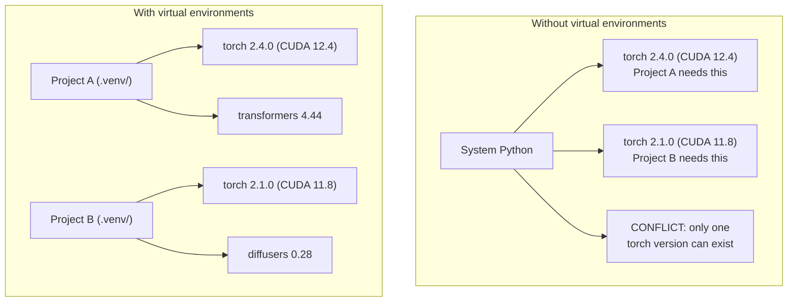

# Python环境

> 依赖地狱是真实的。虚拟环境是治愈之道。

** 类型：** 构建
** 语言：** Python
** 先决条件：** 第0阶段，第01课
** 时间：** ~30分钟

## 学习目标

- 使用“uv”、“venv”或“conda”创建隔离的虚拟环境
- Write a `pyproject.toml` with optional dependency groups and generate lockfiles for reproducibility
- Diagnose and fix common pitfalls: global installs, pip/conda mixing, CUDA version mismatches
- 为具有冲突依赖关系的项目实施每个阶段的环境策略

## 问题

您为微调项目安装PyTorch 2.4。下周，另一个项目需要PyTorch 2.1，因为其CUDA构建已被固定。您在全球范围内升级，第一个项目就会崩溃。你降级，第二个就会崩溃。

This is dependency hell. It happens constantly in AI/ML work because:

- PyTorch、JAX和TensorFlow各自提供自己的CUDA绑定
- 模型库固定特定的框架版本
- 全局“pip安装”会覆盖之前的任何内容
- CUDA 11.8 builds don't work with CUDA 12.x drivers (and vice versa)

修复方法：每个项目都有自己的隔离环境和自己的包。

## 概念



## 建设党

### Option 1: uv venv (Recommended)

' uv '是最快的Python包管理器（比pip快10- 100倍）。它在一个工具中处理虚拟环境、Python版本和依赖项解析。

```bash
curl -LsSf https://astral.sh/uv/install.sh | sh

uv python install 3.12

cd your-project
uv venv
source .venv/bin/activate
```

安装包：

```bash
uv pip install torch numpy
```

Create a project with `pyproject.toml` in one step:

```bash
uv init my-ai-project
cd my-ai-project
uv add torch numpy matplotlib
```

### Option 2: venv (Built-in)

If you can't install `uv`, Python ships with `venv`:

```bash
python3 -m venv .venv
source .venv/bin/activate  # Linux/macOS
.venv\Scripts\activate     # Windows

pip install torch numpy
```

比“uv”慢，但在任何安装Python的地方都适用。

### 选项3：conda（当您需要时）

Conda manages non-Python dependencies like CUDA toolkits, cuDNN, and C libraries. Use it when:

- You need a specific CUDA toolkit version without installing it system-wide
- You're on a shared cluster where you can't install system packages
- 图书馆的安装说明上写着“使用conda”

```bash
# Install miniconda (not the full Anaconda)
curl -LsSf https://repo.anaconda.com/miniconda/Miniconda3-latest-Linux-x86_64.sh -o miniconda.sh
bash miniconda.sh -b

conda create -n myproject python=3.12
conda activate myproject

conda install pytorch torchvision torchaudio pytorch-cuda=12.4 -c pytorch -c nvidia
```

一条规则：如果您对某个环境使用conda，则对该环境中的所有包使用conda。将“pip connect”混合到conda dev中会导致依赖项冲突，调试起来很痛苦。

### 本课程：每阶段策略

You could create one environment for the whole course. Don't. Different phases need different (sometimes conflicting) dependencies.

策略：

```
ai-engineering-from-scratch/
├── .venv/                    <-- shared lightweight env for phases 0-3
├── phases/
│   ├── 04-neural-networks/
│   │   └── .venv/            <-- PyTorch env
│   ├── 05-cnns/
│   │   └── .venv/            <-- same PyTorch env (symlink or shared)
│   ├── 08-transformers/
│   │   └── .venv/            <-- might need different transformer versions
│   └── 11-llm-apis/
│       └── .venv/            <-- API SDKs, no torch needed
```

' code/dev_setup.sh '中的脚本为本课程创建基本环境。

## pyproject.toml Basics

Every Python project should have a `pyproject.toml`. It replaces `setup.py`, `setup.cfg`, and `requirements.txt` in one file.

```toml
[project]
name = "ai-engineering-from-scratch"
version = "0.1.0"
requires-python = ">=3.11"
dependencies = [
    "numpy>=1.26",
    "matplotlib>=3.8",
    "jupyter>=1.0",
    "scikit-learn>=1.4",
]

[project.optional-dependencies]
torch = ["torch>=2.3", "torchvision>=0.18"]
llm = ["anthropic>=0.39", "openai>=1.50"]
```

Then install:

```bash
uv pip install -e ".[torch]"    # base + PyTorch
uv pip install -e ".[llm]"     # base + LLM SDKs
uv pip install -e ".[torch,llm]" # everything
```

## 锁定文件

锁文件将每个依赖项（包括传递依赖项）固定到确切的版本。这保证了可重复性：任何从锁文件安装的人都会获得完全相同的包。

```bash
# uv generates uv.lock automatically when using uv add
uv add numpy

# pip-tools approach
uv pip compile pyproject.toml -o requirements.lock
uv pip install -r requirements.lock
```

Commit your lockfile to git. When someone clones the repo, they install from the lockfile and get identical versions.

## Common Mistakes

### 1. Installing globally

```bash
pip install torch  # BAD: installs to system Python

source .venv/bin/activate
pip install torch  # GOOD: installs to virtual environment
```

检查您的包裹去向：

```bash
which python       # should show .venv/bin/python, not /usr/bin/python
which pip           # should show .venv/bin/pip
```

### 2.混合花籽和conda

```bash
conda create -n myenv python=3.12
conda activate myenv
conda install pytorch -c pytorch
pip install some-other-package   # BAD: can break conda's dependency tracking
conda install some-other-package # GOOD: let conda manage everything
```

如果您必须在conda中使用pip（某些包仅限pip），请首先安装所有conda包，然后最后安装pip包。

### 3. Forgetting to activate

```bash
python train.py           # uses system Python, missing packages
source .venv/bin/activate
python train.py           # uses project Python, packages found
```

您的Shell提示符应该显示环境名称：

```
(.venv) $ python train.py
```

### 4.将.venv提交到git

```bash
echo ".venv/" >> .gitignore
```

虚拟环境为200 MB-2GB。它们是本地的，不能在机器之间移植。提交“pyproject.toml”和锁文件。

### 5. CUDA版本不匹配

```bash
nvidia-smi                # shows driver CUDA version (e.g., 12.4)
python -c "import torch; print(torch.version.cuda)"  # shows PyTorch CUDA version

# These must be compatible.
# PyTorch CUDA version must be <= driver CUDA version.
```

## 使用它

运行安装脚本以创建您的课程环境：

```bash
bash phases/00-setup-and-tooling/06-python-environments/code/env_setup.sh
```

这会在仓库根创建一个“.venv”，其中安装并验证了核心依赖项。

## 演习

1. 运行' env_setup.sh '并验证所有检查均通过
2. Create a second virtual environment, install a different version of numpy in it, and confirm the two environments are isolated
3. Write a `pyproject.toml` for a project that needs both PyTorch and the Anthropic SDK
4. 故意全局安装包（不激活venv），注意它的位置，然后卸载它

## 关键术语

| Term | What people say | 它实际上意味着什么 |
|------|----------------|----------------------|
| 虚拟环境 | “一个Venv” | An isolated directory containing a Python interpreter and packages, separate from the system Python |
| Lockfile | “固定依赖关系” | 列出每个包及其确切版本的文件，确保跨机器安装相同 |
| pyproject.toml | "The new setup.py" | 标准Python项目配置文件，取代setup.py/setup.cfg/requirements.txt |
| 传递依赖 | “依赖的依赖” | Package B depends on C; if you install A which depends on B, C is a transitive dependency of A |
| CUDA不匹配 | “我的图形处理器不工作” | PyTorch是为与您的图形处理器驱动程序支持的不同的CUDA版本而编译的 |
