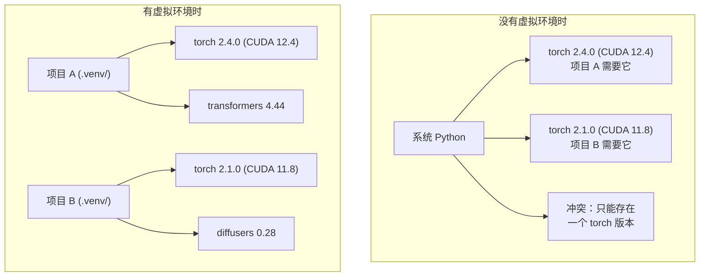

# 06 · Python 环境管理

> 依赖地狱真实存在，而虚拟环境（virtual environment）就是它的解药。

**类型：** 构建
**语言：** Shell
**前置：** 阶段 0，第 01 课
**时长：** 约 30 分钟

## 学习目标

- 使用 `uv`、`venv` 或 `conda` 创建隔离的虚拟环境
- 编写带有可选依赖分组（optional dependency groups）的 `pyproject.toml`，并生成锁文件（lockfile）以保证可复现性
- 诊断并修复常见陷阱：全局安装、pip/conda 混用、CUDA 版本不匹配
- 针对依赖相互冲突的项目，实施按阶段（per-phase）的环境策略

## 问题所在

你为一个微调项目安装了 PyTorch 2.4。下周，另一个项目需要 PyTorch 2.1，因为它锁定了某个特定的 CUDA 构建版本。你在全局升级，第一个项目就崩了；你降级回去，第二个又崩了。

这就是依赖地狱（dependency hell）。它在 AI/ML 工作中频繁发生，原因在于：

- PyTorch、JAX 和 TensorFlow 各自携带自己的 CUDA 绑定
- 模型库会锁定特定的框架版本
- 一次全局 `pip install` 会覆盖之前安装的任何内容
- CUDA 11.8 的构建版本无法与 CUDA 12.x 驱动配合工作（反之亦然）

解决办法：每个项目都拥有自己独立隔离的环境和自己的软件包。

## 核心概念



## 动手构建

### 方案一：uv venv（推荐）

`uv` 是目前最快的 Python 包管理器（比 pip 快 10-100 倍）。它将虚拟环境管理、Python 版本管理和依赖解析整合在一个工具中。

```bash
curl -LsSf https://astral.sh/uv/install.sh | sh

uv python install 3.12

cd your-project
uv venv
source .venv/bin/activate
```

安装软件包：

```bash
uv pip install torch numpy
```

一步创建带有 `pyproject.toml` 的项目：

```bash
uv init my-ai-project
cd my-ai-project
uv add torch numpy matplotlib
```

### 方案二：venv（内置）

如果你无法安装 `uv`，Python 自带了 `venv`：

```bash
python3 -m venv .venv
source .venv/bin/activate  # Linux/macOS
.venv\Scripts\activate     # Windows

pip install torch numpy
```

它比 `uv` 慢，但只要安装了 Python 的地方就能用。

### 方案三：conda（在你确实需要时）

Conda 能管理 CUDA 工具包、cuDNN 和 C 库等非 Python 依赖。在以下情况使用它：

- 你需要某个特定版本的 CUDA 工具包，但不想在系统全局安装它
- 你在一个无法安装系统级软件包的共享集群上
- 某个库的安装说明明确写着「使用 conda」

```bash
# 安装 miniconda（而非完整的 Anaconda）
curl -LsSf https://repo.anaconda.com/miniconda/Miniconda3-latest-Linux-x86_64.sh -o miniconda.sh
bash miniconda.sh -b

conda create -n myproject python=3.12
conda activate myproject

conda install pytorch torchvision torchaudio pytorch-cuda=12.4 -c pytorch -c nvidia
```

一条铁律：如果你用 conda 创建某个环境，就要用 conda 来管理该环境中的所有软件包。在 conda 环境里混入 `pip install` 会引发极难调试的依赖冲突。

### 本课程的做法：按阶段策略

你可以为整个课程只创建一个环境。但别这么做。不同阶段需要不同的（有时相互冲突的）依赖。

策略：

```
ai-engineering-from-scratch/
├── .venv/                    <-- 阶段 0-3 共用的轻量级环境
├── phases/
│   ├── 04-neural-networks/
│   │   └── .venv/            <-- PyTorch 环境
│   ├── 05-cnns/
│   │   └── .venv/            <-- 同一个 PyTorch 环境（软链接或共享）
│   ├── 08-transformers/
│   │   └── .venv/            <-- 可能需要不同的 transformer 版本
│   └── 11-llm-apis/
│       └── .venv/            <-- API SDK，无需 torch
```

`code/env_setup.sh` 中的脚本会为本课程创建基础环境。

## pyproject.toml 基础

每个 Python 项目都应该有一个 `pyproject.toml`。它用一个文件取代了 `setup.py`、`setup.cfg` 和 `requirements.txt`。

```toml
[project]
name = "ai-engineering-from-scratch"
version = "0.1.0"
requires-python = ">=3.11"
dependencies = [
    "numpy>=1.26",
    "matplotlib>=3.8",
    "jupyter>=1.0",
    "scikit-learn>=1.4",
]

[project.optional-dependencies]
torch = ["torch>=2.3", "torchvision>=0.18"]
llm = ["anthropic>=0.39", "openai>=1.50"]
```

然后安装：

```bash
uv pip install -e ".[torch]"    # 基础依赖 + PyTorch
uv pip install -e ".[llm]"     # 基础依赖 + LLM SDK
uv pip install -e ".[torch,llm]" # 全部
```

## 锁文件

锁文件（lockfile）会把每一个依赖（包括传递依赖）都固定到确切的版本。这保证了可复现性：任何人从锁文件安装，得到的软件包都完全一致。

```bash
# 使用 uv add 时，uv 会自动生成 uv.lock
uv add numpy

# pip-tools 的做法
uv pip compile pyproject.toml -o requirements.lock
uv pip install -r requirements.lock
```

把锁文件提交到 git。当别人克隆这个仓库时，他们从锁文件安装，就能得到完全相同的版本。

## 常见错误

### 1. 全局安装

```bash
pip install torch  # 错误：安装到了系统 Python

source .venv/bin/activate
pip install torch  # 正确：安装到虚拟环境
```

检查你的软件包安装到了哪里：

```bash
which python       # 应显示 .venv/bin/python，而非 /usr/bin/python
which pip           # 应显示 .venv/bin/pip
```

### 2. 混用 pip 和 conda

```bash
conda create -n myenv python=3.12
conda activate myenv
conda install pytorch -c pytorch
pip install some-other-package   # 错误：可能破坏 conda 的依赖跟踪
conda install some-other-package # 正确：让 conda 管理一切
```

如果你必须在 conda 中使用 pip（某些软件包只能通过 pip 安装），请先安装所有 conda 软件包，最后再安装 pip 软件包。

### 3. 忘记激活环境

```bash
python train.py           # 使用系统 Python，缺少软件包
source .venv/bin/activate
python train.py           # 使用项目 Python，能找到软件包
```

你的 shell 提示符应当显示环境名称：

```
(.venv) $ python train.py
```

### 4. 把 .venv 提交到 git

```bash
echo ".venv/" >> .gitignore
```

虚拟环境的体积在 200MB 到 2GB 之间。它们是本地的，无法在机器之间移植。应当提交 `pyproject.toml` 和锁文件，而不是它。

### 5. CUDA 版本不匹配

```bash
nvidia-smi                # 显示驱动的 CUDA 版本（例如 12.4）
python -c "import torch; print(torch.version.cuda)"  # 显示 PyTorch 的 CUDA 版本

# 这两者必须兼容。
# PyTorch 的 CUDA 版本必须 <= 驱动的 CUDA 版本。
```

## 实际运用

运行安装脚本来创建你的课程环境：

```bash
bash phases/00-setup-and-tooling/06-python-environments/code/env_setup.sh
```

这会在仓库根目录创建一个 `.venv`，并安装和验证好核心依赖。

## 练习

1. 运行 `env_setup.sh`，确认所有检查都通过
2. 创建第二个虚拟环境，在其中安装一个不同版本的 numpy，确认两个环境彼此隔离
3. 为一个同时需要 PyTorch 和 Anthropic SDK 的项目编写 `pyproject.toml`
4. 故意进行一次全局安装（不激活任何 venv），观察它装到了哪里，然后卸载它

## 关键术语

| 术语 | 人们常说的 | 它实际的含义 |
|------|----------------|----------------------|
| 虚拟环境 | 「一个 venv」 | 一个隔离的目录，包含一个 Python 解释器和若干软件包，与系统 Python 相互独立 |
| 锁文件 | 「固定依赖」 | 一个列出每个软件包及其确切版本的文件，保证跨机器安装结果完全一致 |
| pyproject.toml | 「新版的 setup.py」 | 标准的 Python 项目配置文件，取代 setup.py/setup.cfg/requirements.txt |
| 传递依赖 | 「依赖的依赖」 | 软件包 B 依赖 C；如果你安装了依赖 B 的 A，那么 C 就是 A 的传递依赖 |
| CUDA 不匹配 | 「我的 GPU 用不了」 | PyTorch 编译时针对的 CUDA 版本与你的 GPU 驱动所支持的不一致 |
