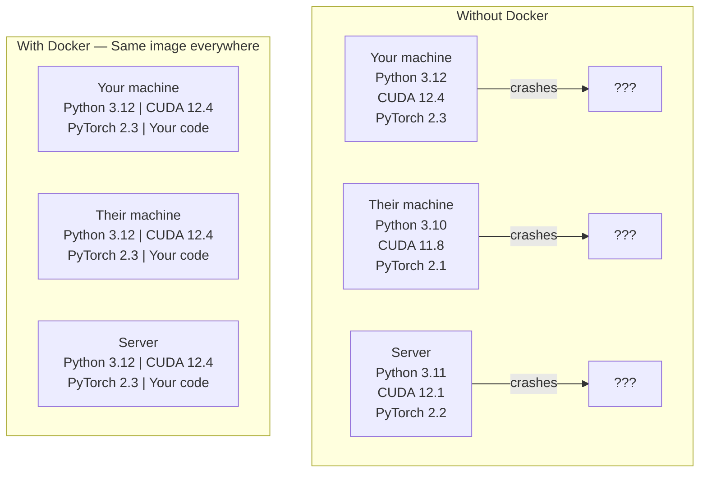

# AIのためのDocker

> containerは「自分のマシンでは動く」を過去のものにします。

**タイプ:** 作ってみる
**言語:** Docker
**前提条件:** フェーズ0、レッスン01と03
**時間:** 約60分

## 学習目標

- Dockerfileから、CUDA、PyTorch、AIライブラリを含むGPU対応Docker imageをbuildする
- host directoryをvolumeとしてmountし、container再build後もmodel、dataset、codeを保持する
- NVIDIA Container Toolkitを設定し、container内からGPUを見えるようにする
- Docker Composeを使って、複数serviceのAIアプリケーション（inference server + vector database）をorchestrateする

## 課題

あなたはPyTorch 2.3、CUDA 12.4、Python 3.12でノートPC上にmodelを学習しました。同僚の環境はPyTorch 2.1、CUDA 11.8、Python 3.10です。そのマシンではmodelがcrashします。Dockerfileならどちらでも動きます。

AIプロジェクトは依存関係の悪夢です。典型的なstackにはPython、PyTorch、CUDA driver、cuDNN、system-level C library、そして正確なcompiler versionを必要とするflash-attnのような特殊packageが含まれます。Dockerはこれらすべてを、どこでも同じように動く単一のimageへまとめます。

## 考え方

Dockerは、code、runtime、library、system toolをcontainerと呼ばれる分離された単位へ包みます。軽量な仮想マシンのようなものですが、独自kernelを起動せずhost OS kernelを共有するため、数分ではなく数秒で起動します。



### AIプロジェクトでDockerが特に必要な理由

1. **GPU driverは壊れやすい。** CUDA 12.4向けcodeはCUDA 11.8では動きません。Dockerはcontainer内でCUDA toolkitを分離し、NVIDIA Container Toolkitを通じてhost GPU driverを共有します。

2. **model weightは大きい。** 7B parameter modelはfp16で14GBあります。buildし直すたびに再downloadしたくはありません。Docker volumeを使うと、host上のmodels directoryをmountできます。

3. **multi-service architectureが一般的。** 実際のAIアプリケーションはPython scriptだけではありません。inference server、RAG用vector database、場合によってはweb frontendもあります。Docker Composeはそれらすべてを1つのcommandでorchestrateします。

### 重要語彙

| 用語 | 意味 |
|------|---------------|
| Image | read-onlyのtemplate。recipe。Dockerfileからbuildされる。 |
| Container | imageの実行中instance。作業場。 |
| Dockerfile | imageをbuildする指示。layerごとに構成される。 |
| Volume | container再起動後も残る永続storage。 |
| docker-compose | multi-container applicationをYAMLで定義するtool。 |

### AIでよく使うcontainer pattern

```
Dev Container
  Full toolkit. Editor support. Jupyter. Debugging tools.
  Used during development and experimentation.

Training Container
  Minimal. Just the training script and dependencies.
  Runs on GPU clusters. No editor, no Jupyter.

Inference Container
  Optimized for serving. Small image. Fast cold start.
  Runs behind a load balancer in production.
```

## 作ってみる

### ステップ1: Dockerをインストールする

```bash
# macOS
brew install --cask docker
open /Applications/Docker.app

# Ubuntu
curl -fsSL https://get.docker.com | sh
sudo usermod -aG docker $USER
# Log out and back in for group change to take effect
```

確認:

```bash
docker --version
docker run hello-world
```

### ステップ2: NVIDIA Container Toolkitをインストールする（NVIDIA GPU付きLinux）

これによりDocker containerがGPUへアクセスできるようになります。macOSとWindows（WSL2）のユーザーはここを飛ばせます。Docker Desktopは、これらのplatformでGPU passthroughを別の方法で扱います。

```bash
distribution=$(. /etc/os-release;echo $ID$VERSION_ID)
curl -fsSL https://nvidia.github.io/libnvidia-container/gpgkey | sudo gpg --dearmor -o /usr/share/keyrings/nvidia-container-toolkit-keyring.gpg
curl -s -L https://nvidia.github.io/libnvidia-container/$distribution/libnvidia-container.list | \
    sed 's#deb https://#deb [signed-by=/usr/share/keyrings/nvidia-container-toolkit-keyring.gpg] https://#g' | \
    sudo tee /etc/apt/sources.list.d/nvidia-container-toolkit.list

sudo apt-get update
sudo apt-get install -y nvidia-container-toolkit
sudo nvidia-ctk runtime configure --runtime=docker
sudo systemctl restart docker
```

container内でGPU accessをtestします。

```bash
docker run --rm --gpus all nvidia/cuda:12.4.1-base-ubuntu22.04 nvidia-smi
```

GPU情報が表示されれば、toolkitは動いています。

### ステップ3: base imageを理解する

適切なbase imageを選ぶと、何時間ものdebugを避けられます。

```
nvidia/cuda:12.4.1-devel-ubuntu22.04
  Full CUDA toolkit. Compilers included.
  Use for: building packages that need nvcc (flash-attn, bitsandbytes)
  Size: ~4 GB

nvidia/cuda:12.4.1-runtime-ubuntu22.04
  CUDA runtime only. No compilers.
  Use for: running pre-built code
  Size: ~1.5 GB

pytorch/pytorch:2.3.1-cuda12.4-cudnn9-runtime
  PyTorch pre-installed on top of CUDA.
  Use for: skipping the PyTorch install step
  Size: ~6 GB

python:3.12-slim
  No CUDA. CPU only.
  Use for: inference on CPU, lightweight tools
  Size: ~150 MB
```

### ステップ4: AI開発用Dockerfileを書く

`code/Dockerfile` にあるDockerfileです。順に見ていきます。

```dockerfile
FROM nvidia/cuda:12.4.1-devel-ubuntu22.04

ENV DEBIAN_FRONTEND=noninteractive
ENV PYTHONUNBUFFERED=1

RUN apt-get update && apt-get install -y --no-install-recommends \
    python3.12 \
    python3.12-venv \
    python3.12-dev \
    python3-pip \
    git \
    curl \
    build-essential \
    && rm -rf /var/lib/apt/lists/*

RUN update-alternatives --install /usr/bin/python python /usr/bin/python3.12 1

RUN python -m pip install --no-cache-dir --upgrade pip setuptools wheel

RUN python -m pip install --no-cache-dir \
    torch==2.3.1 \
    torchvision==0.18.1 \
    torchaudio==2.3.1 \
    --index-url https://download.pytorch.org/whl/cu124

RUN python -m pip install --no-cache-dir \
    numpy \
    pandas \
    scikit-learn \
    matplotlib \
    jupyter \
    transformers \
    datasets \
    accelerate \
    safetensors

WORKDIR /workspace

VOLUME ["/workspace", "/models"]

EXPOSE 8888

CMD ["python"]
```

buildします。

```bash
docker build -t ai-dev -f phases/00-setup-and-tooling/07-docker-for-ai/code/Dockerfile .
```

初回は時間がかかります（CUDA base imageとPyTorchをdownloadするため）。2回目以降はcached layerが使われます。

実行します。

```bash
docker run --rm -it --gpus all \
    -v $(pwd):/workspace \
    -v ~/models:/models \
    ai-dev python -c "import torch; print(f'PyTorch {torch.__version__}, CUDA: {torch.cuda.is_available()}')"
```

container内でJupyterを実行します。

```bash
docker run --rm -it --gpus all \
    -v $(pwd):/workspace \
    -v ~/models:/models \
    -p 8888:8888 \
    ai-dev jupyter notebook --ip=0.0.0.0 --port=8888 --no-browser --allow-root
```

### ステップ5: dataとmodel用のvolume mount

volume mountはAI作業に不可欠です。これがなければ、containerが止まった時に14GBのmodel downloadが消えます。

```bash
# Mount your code
-v $(pwd):/workspace

# Mount a shared models directory
-v ~/models:/models

# Mount datasets
-v ~/datasets:/data
```

training script内では、mountされたpathから読み込みます。

```python
from transformers import AutoModel

model = AutoModel.from_pretrained("/models/llama-7b")
```

modelはhost filesystem上にあります。何度containerをbuildし直しても、再downloadは不要です。

### ステップ6: multi-service AI app用のDocker Compose

実際のRAG applicationには、inference serverとvector databaseが必要です。Docker Composeは両方を1つのcommandで実行します。

`code/docker-compose.yml` を見てください。

```yaml
services:
  ai-dev:
    build:
      context: .
      dockerfile: Dockerfile
    deploy:
      resources:
        reservations:
          devices:
            - driver: nvidia
              count: all
              capabilities: [gpu]
    volumes:
      - ../../../:/workspace
      - ~/models:/models
      - ~/datasets:/data
    ports:
      - "8888:8888"
    stdin_open: true
    tty: true
    command: jupyter notebook --ip=0.0.0.0 --port=8888 --no-browser --allow-root

  qdrant:
    image: qdrant/qdrant:v1.12.5
    ports:
      - "6333:6333"
      - "6334:6334"
    volumes:
      - qdrant_data:/qdrant/storage

volumes:
  qdrant_data:
```

すべて起動します。

```bash
cd phases/00-setup-and-tooling/07-docker-for-ai/code
docker compose up -d
```

これでAI dev containerは、service nameにより `http://qdrant:6333` でvector databaseへ到達できます。Docker Composeは共有networkを自動作成します。

AI container内から接続をtestします。

```python
from qdrant_client import QdrantClient

client = QdrantClient(host="qdrant", port=6333)
print(client.get_collections())
```

すべて停止します。

```bash
docker compose down
```

qdrant volumeも削除する場合は `-v` を追加します。

```bash
docker compose down -v
```

### ステップ7: AI作業で便利なDocker command

```bash
# List running containers
docker ps

# List all images and their sizes
docker images

# Remove unused images (reclaim disk space)
docker system prune -a

# Check GPU usage inside a running container
docker exec -it <container_id> nvidia-smi

# Copy a file from container to host
docker cp <container_id>:/workspace/results.csv ./results.csv

# View container logs
docker logs -f <container_id>
```

## 使ってみる

再現可能なAI開発環境ができました。このコースの残りでは、次のように使います。

- `docker compose up` で開発環境とvector databaseをまとめて起動する
- code、model、dataをvolumeとしてmountし、rebuildの間に何も失われないようにする
- レッスンで新しいPython packageが必要になったら、Dockerfileへ追加してrebuildする
- Dockerfileをチームメイトと共有する。同じ環境がそのまま手に入ります。

### GPUがない場合

`--gpus all` flagとNVIDIA deploy blockを削除してください。CPUベースのレッスンではcontainerはそのまま動きます。PyTorchはCUDAがないことを検出し、自動的にCPUへfallbackします。

## 演習

1. Dockerfileをbuildし、container内で `python -c "import torch; print(torch.__version__)"` を実行する
2. docker-compose stackを起動し、AI containerから `http://qdrant:6333/collections` でQdrantへ到達できることを確認する
3. Dockerfileに `flask` を追加し、rebuildしてport 5000でsimple API serverを実行する。`-p 5000:5000` でportをmapする
4. `docker images` でimage sizeを測定する。base imageを `devel` から `runtime` へ切り替え、sizeを比較する

## 重要用語

| 用語 | よくある言い方 | 実際の意味 |
|------|----------------|----------------------|
| Container | 「軽量VM」 | host kernelを使い、独自のfilesystemとnetworkを持つ分離process |
| Image layer | 「cached step」 | Dockerfileの各instructionがlayerを作る。変わっていないlayerはcacheされるため、rebuildが速い。 |
| NVIDIA Container Toolkit | 「Docker内のGPU」 | `--gpus` flagを通じてhost GPUをcontainerへ公開するruntime hook |
| Volume mount | 「共有フォルダ」 | host上のdirectoryをcontainer内にmapしたもの。container停止後も変更が残る。 |
| Base image | 「開始地点」 | Dockerfileが土台にする `FROM` image。何がpre-installedかを決める。 |
