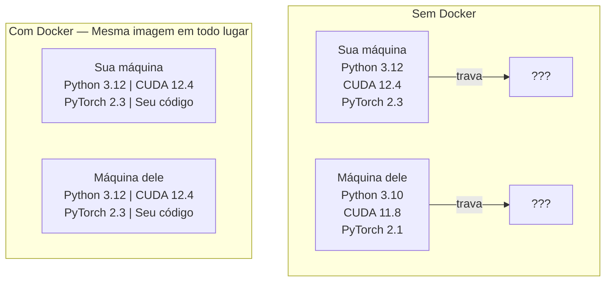

# Docker para IA

> Containers fazem "funciona na minha máquina" uma coisa do passado.

**Tipo:** Build
**Linguagens:** Docker
**Pré-requisitos:** Fase 0, Aulas 01 e 03
**Tempo:** ~60 minutos

## Objetivos de Aprendizado

- Construir uma imagem Docker habilitada para GPU com CUDA, PyTorch e bibliotecas de IA a partir de um Dockerfile
- Montar diretórios do host como volumes para persistir modelos, datasets e código entre rebuilds do container
- Configurar o NVIDIA Container Toolkit para expor GPUs dentro de containers
- Orquestrar aplicações de IA multi-serviço (servidor de inferência + banco de dados vetorial) usando Docker Compose

## O Problema

Você treinou um modelo no seu notebook com PyTorch 2.3, CUDA 12.4 e Python 3.12. Seu colega tem PyTorch 2.1, CUDA 11.8 e Python 3.10. Seu modelo trava na máquina dele. Seu Dockerfile funciona nos dois.

Projetos de IA são pesadelos de dependência. Uma stack típica inclui Python, PyTorch, drivers CUDA, cuDNN, bibliotecas C de nível de sistema e pacotes eespecificaçãoializados como flash-attn que precisam de versões exatas de compiladores. Docker empacota tudo isso em uma imagem única que roda identicamente em qualquer lugar.

## O Conceito

Docker empacota seu código, runtime, bibliotecas e ferramentas de sistema em uma unidade isolada chamada container. Pense nele como uma máquina virtual leve, exceto que ele compartilha o kernel do SO hospedeiro em vez de rodar o seu próprio, então ele inicia em segundos em vez de minutos.



## Construa

### Passo 1: Instale Docker

```bash
# macOS
brew install --cask docker
open /Applications/Docker.app

# Ubuntu
curl -fsSL https://get.docker.com | sh
sudo usermod -aG docker $USER
# Faça logout e login novamente para o grupo ter efeito
```

Verifique:

```bash
docker --version
docker run hello-world
```

### Passo 2: Instale o NVIDIA Container Toolkit (Linux com GPU NVIDIA)

Isso permite que containers Docker acessem sua GPU. Usuários de macOS e Windows (WSL2) podem pular isso.

```bash
distribution=$(. /etc/os-release;echo $ID$VERSION_ID)
curl -fsSL https://nvidia.github.io/libnvidia-container/gpgkey | sudo gpg --dearmor -o /usr/share/keyrings/nvidia-container-toolkit-keyring.gpg
curl -s -L https://nvidia.github.io/libnvidia-container/$distribution/libnvidia-container.list | \
    sed 's#deb https://#deb [signed-by=/usr/share/keyrings/nvidia-container-toolkit-keyring.gpg] https://#g' | \
    sudo tee /etc/apt/sources.list.d/nvidia-container-toolkit.list

sudo apt-get update
sudo apt-get install -y nvidia-container-toolkit
sudo nvidia-ctk runtime configure --runtime=docker
sudo systemctl restart docker
```

### Passo 3: Entenda as imagens base

```
nvidia/cuda:12.4.1-devel-ubuntu22.04
  Toolkit CUDA completo. Compiladores incluídos.
  Usar para: construir pacotes que precisam de nvcc (flash-attn, bitsandbytes)
  Tamanho: ~4 GB

nvidia/cuda:12.4.1-runtime-ubuntu22.04
  Apenas runtime CUDA. Sem compiladores.
  Usar para: rodar código pré-compilado
  Tamanho: ~1.5 GB

pytorch/pytorch:2.3.1-cuda12.4-cudnn9-runtime
  PyTorch pré-instalado sobre CUDA.
  Usar para: pular o passo de instalação do PyTorch
  Tamanho: ~6 GB

python:3.12-slim
  Sem CUDA. Só CPU.
  Usar para: inferência em CPU, ferramentas leves
  Tamanho: ~150 MB
```

### Passo 4: Escreva um Dockerfile para desenvolvimento de IA

Veja o Dockerfile em `code/Dockerfile`.

### Passo 5: Mounts de volume para dados e modelos

```bash
# Monte seu código
-v $(pwd):/workspace

# Monte um diretório compartilhado de modelos
-v ~/models:/models

# Monte datasets
-v ~/datasets:/data
```

### Passo 6: Docker Compose para apps de IA multi-serviço

Veja `code/docker-compose.yml`. Uma aplicação RAG real precisa de um servidor de inferência e um banco de dados vetorial. Docker Compose roda os dois com um comando.

```bash
cd phases/00-setup-and-tooling/07-docker-for-ai/code
docker compose up -d
```

Agora seu container de dev de IA consegue acessar o banco de dados vetorial em `http://qdrant:6333` pelo nome do serviço.

## Exercícios

1. Construa o Dockerfile e rode `python -c "import torch; print(torch.__version__)"` dentro do container
2. Inicie a stack do docker-compose e verifique que o Qdrant está acessível do container de IA em `http://qdrant:6333/collections`
3. Adicione `flask` ao Dockerfile, reconstrua e rode um servidor de API simples na porta 5000
4. Meça o tamanho da imagem com `docker images`. Tente trocar a imagem base de `devel` para `runtime` e compare os tamanhos
