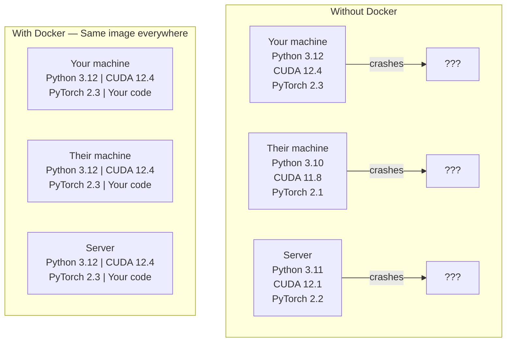

# Yapay Zeka için Docker

> Konteynerler "makinemde çalışma"yı geçmişte bırakıyor.

**Tür:** Yapım
**Diller:** Docker
**Önkoşullar:** Aşama 0, Dersler 01 ve 03
**Süre:** ~60 dakika

## Öğrenme Hedefleri

- Docker dosyasından CUDA, PyTorch ve AI kitaplıklarıyla GPU özellikli bir Docker görüntüsü oluşturun
- Kapsayıcı yeniden oluşturma işlemleri genelinde modelleri, dataset'leri ve kodları kalıcı kılmak için ana bilgisayar dizinlerini birimler halinde bağlayın
- Kapların içindeki GPU'ları açığa çıkarmak için NVIDIA Container Toolkit'i yapılandırın
- Docker Compose'u kullanarak çok hizmetli yapay zeka uygulamalarını (inference sunucu + vector database) düzenleyin

## Sorun

PyTorch 2.3, CUDA 12.4 ve Python 3.12 ile dizüstü bilgisayarınızda bir model eğittiniz. Meslektaşınız PyTorch 2.1, CUDA 11.8 ve Python 3.10'a sahip. Modeliniz makinelerinde çöküyor. Dockerfile'ınız her ikisinde de çalışır.

Yapay zeka projeleri bağımlılık kabuslarıdır. Tipik bir yığın; Python, PyTorch, CUDA sürücüleri, cuDNN, sistem düzeyinde C kitaplıkları ve tam derleyici sürümlerine ihtiyaç duyan flash-attn gibi özel paketleri içerir. Docker tüm bunları her yerde aynı şekilde çalışan tek bir görüntüde paketler.

## Konsept

Docker, kodunuzu, çalışma zamanınızı, kitaplıklarınızı ve sistem araçlarınızı konteyner adı verilen yalıtılmış bir birime sarar. Bunu hafif bir sanal makine olarak düşünün, ancak kendi işletim sistemi çekirdeğini çalıştırmak yerine ana işletim sistemi çekirdeğini paylaşıyor, böylece dakikalar yerine saniyeler içinde başlıyor.



### Yapay zeka projeleri neden çoğu kişiden daha fazla Docker'a ihtiyaç duyuyor?

1. **GPU sürücüleri hassastır.** CUDA 12.4 kodu CUDA 11.8'de çalışmaz. Docker, ana GPU sürücüsünü NVIDIA Container Toolkit aracılığıyla paylaşırken konteynerin içindeki CUDA araç kitini izole eder.

2. **Model ağırlıkları büyüktür.** 7B parametre modeli, fp16'da 14 GB'dir. Her yeniden oluşturduğunuzda yeniden indirmek istemezsiniz. Docker birimleri, ana bilgisayardan bir modeller dizini bağlamanıza olanak tanır.

3. **Çok hizmetli mimariler yaygındır.** Gerçek bir yapay zeka uygulaması yalnızca bir Python betiği değildir. Bu bir inference sunucusu, RAG için bir vector database, belki bir web ön ucudur. Docker Compose bunların hepsini tek bir komutla düzenler.

### Anahtar kelimeler

| Dönem | Ne anlama geliyor |
|------|---------------|
| Resim | Salt okunur bir şablon. Tarifiniz. Bir Dockerfile'dan oluşturuldu. |
| Konteyner | Bir görüntünün çalışan bir örneği. Mutfağınız. |
| Docker dosyası | Bir görüntü oluşturma talimatları. Katman katman. |
| Cilt | Konteyner yeniden başlatıldığında hayatta kalan kalıcı depolama. |
| liman işçisi oluşturma | YAML'de çok kapsayıcılı uygulamaları tanımlamaya yönelik bir araç. |

### Yapay zekadaki yaygın kapsayıcı kalıpları

```
Dev Container
  Full toolkit. Editor support. Jupyter. Debugging tools.
  Used during development and experimentation.

Training Container
  Minimal. Just the training script and dependencies.
  Runs on GPU clusters. No editor, no Jupyter.

Inference Container
  Optimized for serving. Small image. Fast cold start.
  Runs behind a load balancer in production.
```

## İnşa Et

### Adım 1: Docker'ı yükleyin

```bash
# macOS
brew install --cask docker
open /Applications/Docker.app

# Ubuntu
curl -fsSL https://get.docker.com | sh
sudo usermod -aG docker $USER
# Log out and back in for group change to take effect
```

Doğrulamak:

```bash
docker --version
docker run hello-world
```

### Adım 2: NVIDIA Container Toolkit'i yükleyin (NVIDIA GPU'lu Linux)

Bu, Docker konteynerlerinin GPU'nuza erişmesine olanak tanır. macOS ve Windows (WSL2) kullanıcıları bunu atlayabilir; Docker Desktop, bu platformlarda GPU geçişini farklı şekilde işler.

```bash
distribution=$(. /etc/os-release;echo $ID$VERSION_ID)
curl -fsSL https://nvidia.github.io/libnvidia-container/gpgkey | sudo gpg --dearmor -o /usr/share/keyrings/nvidia-container-toolkit-keyring.gpg
curl -s -L https://nvidia.github.io/libnvidia-container/$distribution/libnvidia-container.list | \
    sed 's#deb https://#deb [signed-by=/usr/share/keyrings/nvidia-container-toolkit-keyring.gpg] https://#g' | \
    sudo tee /etc/apt/sources.list.d/nvidia-container-toolkit.list

sudo apt-get update
sudo apt-get install -y nvidia-container-toolkit
sudo nvidia-ctk runtime configure --runtime=docker
sudo systemctl restart docker
```

Bir kapsayıcının içindeki GPU erişimini test edin:

```bash
docker run --rm --gpus all nvidia/cuda:12.4.1-base-ubuntu22.04 nvidia-smi
```

GPU bilgilerinizi görüyorsanız araç seti çalışıyor demektir.

### 3. Adım: Temel görselleri anlayın

Doğru temel görüntüyü seçmek saatlerce süren hata ayıklamadan tasarruf sağlar.

```
nvidia/cuda:12.4.1-devel-ubuntu22.04
  Full CUDA toolkit. Compilers included.
  Use for: building packages that need nvcc (flash-attn, bitsandbytes)
  Size: ~4 GB

nvidia/cuda:12.4.1-runtime-ubuntu22.04
  CUDA runtime only. No compilers.
  Use for: running pre-built code
  Size: ~1.5 GB

pytorch/pytorch:2.6.0-cuda12.4-cudnn9-runtime
  PyTorch pre-installed on top of CUDA.
  Use for: skipping the PyTorch install step
  Size: ~6 GB

python:3.12-slim
  No CUDA. CPU only.
  Use for: inference on CPU, lightweight tools
  Size: ~150 MB
```

### Adım 4: Yapay zeka geliştirme için bir Docker dosyası yazın

İşte `code/Dockerfile` içindeki Docker dosyası. İçinden geçin:

```dockerfile
FROM nvidia/cuda:12.4.1-devel-ubuntu22.04

ENV DEBIAN_FRONTEND=noninteractive
ENV PYTHONUNBUFFERED=1

RUN apt-get update && apt-get install -y --no-install-recommends \
    software-properties-common \
    git \
    curl \
    build-essential \
    && add-apt-repository -y ppa:deadsnakes/ppa \
    && apt-get update && apt-get install -y --no-install-recommends \
    python3.12 \
    python3.12-venv \
    python3.12-dev \
    && rm -rf /var/lib/apt/lists/*

RUN update-alternatives --install /usr/bin/python python /usr/bin/python3.12 1

RUN curl -sSL https://raw.githubusercontent.com/pypa/get-pip/3b73145063be545b649ad9ca83ea8da5fc915a4f/public/get-pip.py -o /tmp/get-pip.py \
    && echo "a341e1a43e38001c551a1508a73ff23636a11970b61d901d9a1cad2a18f57055  /tmp/get-pip.py" | sha256sum -c - \
    && python /tmp/get-pip.py \
    && rm /tmp/get-pip.py \
    && update-alternatives --install /usr/bin/pip pip /usr/local/bin/pip3.12 1

RUN python -m pip install --no-cache-dir --upgrade pip setuptools wheel

RUN python -m pip install --no-cache-dir \
    torch==2.6.0+cu124 \
    torchvision==0.21.0+cu124 \
    torchaudio==2.6.0+cu124 \
    --index-url https://download.pytorch.org/whl/cu124

RUN python -m pip install --no-cache-dir \
    numpy \
    pandas \
    scikit-learn \
    matplotlib \
    jupyter \
    transformers \
    datasets \
    accelerate \
    safetensors

WORKDIR /workspace

VOLUME ["/workspace", "/models"]

EXPOSE 8888

CMD ["python"]
```

İnşa et:

```bash
docker build -t ai-dev -f phases/00-setup-and-tooling/07-docker-for-ai/code/Dockerfile .
```

Bu ilk seferde biraz zaman alır (CUDA temel görüntüsünün indirilmesi + PyTorch). Sonraki derlemeler önbelleğe alınmış katmanları kullanır.

Çalıştır:

```bash
docker run --rm -it --gpus all \
    -v $(pwd):/workspace \
    -v ~/models:/models \
    ai-dev python -c "import torch; print(f'PyTorch {torch.__version__}, CUDA: {torch.cuda.is_available()}')"
```

Jupyter'ı kabın içinde çalıştırın:

```bash
docker run --rm -it --gpus all \
    -v $(pwd):/workspace \
    -v ~/models:/models \
    -p 8888:8888 \
    ai-dev jupyter notebook --ip=0.0.0.0 --port=8888 --no-browser --allow-root
```

### Adım 5: Veriler ve modeller için birim bağlamaları

Birim montajları yapay zeka çalışmaları için kritik öneme sahiptir. Bunlar olmadan, konteyner durduğunda 14 GB'lık model indirmeleriniz kaybolur.

```bash
# Mount your code
-v $(pwd):/workspace

# Mount a shared models directory
-v ~/models:/models

# Mount datasets
-v ~/datasets:/data
```

Eğitim betiğinizin içinde, monte edilen yoldan yükleyin:

```python
from transformers import AutoModel

model = AutoModel.from_pretrained("/models/llama-7b")
```

Model, ana dosya sisteminizde yaşar. Yeniden indirmeye gerek kalmadan kapsayıcıyı istediğiniz sıklıkta yeniden oluşturun.

### Adım 6: Çok hizmetli yapay zeka uygulamaları için Docker Compose

Gerçek bir RAG uygulamasının bir inference sunucusuna ve bir vector database'ye ihtiyacı vardır. Docker Compose her ikisini de tek komutla çalıştırır.

Bkz. `code/docker-compose.yml`:

```yaml
services:
  ai-dev:
    build:
      context: .
      dockerfile: Dockerfile
    deploy:
      resources:
        reservations:
          devices:
            - driver: nvidia
              count: all
              capabilities: [gpu]
    volumes:
      - ../../../:/workspace
      - ~/models:/models
      - ~/datasets:/data
    ports:
      - "8888:8888"
    stdin_open: true
    tty: true
    command: jupyter notebook --ip=0.0.0.0 --port=8888 --no-browser --allow-root

  qdrant:
    image: qdrant/qdrant:v1.12.5
    ports:
      - "6333:6333"
      - "6334:6334"
    volumes:
      - qdrant_data:/qdrant/storage

volumes:
  qdrant_data:
```

Her şeyi başlatın:

```bash
cd phases/00-setup-and-tooling/07-docker-for-ai/code
docker compose up -d
```

Artık AI geliştirici kapsayıcınız hizmet adına göre `http://qdrant:6333` adresindeki vector database'ye ulaşabilir. Docker Compose otomatik olarak paylaşılan bir ağ oluşturur.

Bağlantıyı AI kapsayıcısının içinden test edin:

```python
from qdrant_client import QdrantClient

client = QdrantClient(host="qdrant", port=6333)
print(client.get_collections())
```

Her şeyi durdurun:

```bash
docker compose down
```

Qdrant birimini de silmek için `-v` ekleyin:

```bash
docker compose down -v
```

### Adım 7: Yapay zeka çalışması için faydalı Docker komutları

```bash
# List running containers
docker ps

# List all images and their sizes
docker images

# Remove unused images (reclaim disk space)
docker system prune -a

# Check GPU usage inside a running container
docker exec -it <container_id> nvidia-smi

# Copy a file from container to host
docker cp <container_id>:/workspace/results.csv ./results.csv

# View container logs
docker logs -f <container_id>
```

## Kullan onu

Artık tekrarlanabilir bir yapay zeka geliştirme ortamınız var. Bu kursun geri kalanı için:

- Geliştirme ortamınızı başlatmak için `docker compose up`'yi ve birlikte vector database'yi kullanın
- Yeniden oluşturmalar arasında hiçbir şeyin kaybolmaması için kodunuzu, modellerinizi ve verilerinizi birimler halinde bağlayın
- Bir ders yeni bir Python paketi gerektirdiğinde onu Dockerfile'a ekleyin ve yeniden oluşturun
- Docker dosyanızı ekip arkadaşlarınızla paylaşın. Aynı ortamı elde ediyorlar.

### GPU yok mu?

`--gpus all` bayrağını ve NVIDIA dağıtım bloğunu kaldırın. Kapsayıcı hala CPU tabanlı dersler için çalışıyor. PyTorch, CUDA'nın yokluğunu algılar ve otomatik olarak CPU'ya geri döner.

## Egzersizler

1. Dockerfile'ı oluşturun ve konteynerin içinde `python -c "import torch; print(torch.__version__)"` komutunu çalıştırın
2. Docker-compose yığınını başlatın ve Qdrant'a `http://qdrant:6333/collections` konumundaki AI kapsayıcısından erişilebildiğini doğrulayın.
3. Dockerfile'a `flask` ekleyin, yeniden oluşturun ve 5000 numaralı bağlantı noktasında basit bir API sunucusu çalıştırın. Bağlantı noktasını `-p 5000:5000` ile eşleyin
4. `docker images` ile görüntü boyutunu ölçün. Temel görüntüyü `devel` yerine `runtime` olarak değiştirmeyi deneyin ve boyutları karşılaştırın

## Anahtar Terimler

| Dönem | İnsanlar ne diyor | Aslında ne anlama geliyor |
|------|----------------|----------------------|
| Konteyner | "Hafif VM" | Kendi dosya sistemi ve ağıyla ana bilgisayar çekirdeğini kullanan yalıtılmış bir süreç |
| Görüntü katmanı | "Önbelleğe alınmış adım" | Her Dockerfile talimatı bir katman oluşturur. Değiştirilmemiş katmanlar önbelleğe alınır, bu nedenle yeniden oluşturma işlemleri hızlıdır. |
| NVIDIA Konteyner Araç Takımı | "Docker'da GPU" | Ana GPU'ları `--gpus` bayrağı aracılığıyla kapsayıcılara gösteren bir çalışma zamanı kancası |
| Cilt montajı | "Paylaşılan klasör" | Ana bilgisayardaki kapsayıcıya eşlenen bir dizin. Konteyner durduktan sonra değişiklikler devam eder. |
| Temel resim | "Başlangıç ​​noktası" | Dockerfile'ınızın üzerinde oluşturduğu `FROM` görüntüsü. Neyin önceden yüklendiğini belirler. |
