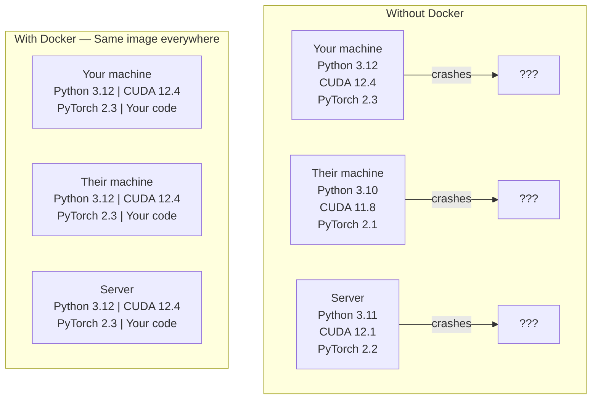

# Docker for AI

> Containers make "works on my machine" a thing of the past.

** 类型：** 构建
** 语言：** Python
** 先决条件：** 第0阶段，课程01和03
** 时间：** ~60分钟

## 学习目标

- 从Dockerfile中使用CUDA、PyTorch和AI库构建支持GPU的Docker镜像
- 将主机目录装载为卷，以便在容器重建中持久化模型、数据集和代码
- 配置英伟达容器工具包以暴露容器内的图形处理器
- 使用Docker Compose构建多服务人工智能应用程序（推理服务器+载体数据库）

## The Problem

您使用PyTorch 2.3、CUDA 12.4和Python 3.12在笔记本电脑上训练了模型。您的同事拥有PyTorch 2.1、CUDA 11.8和Python 3.10。您的模型在他们的机器上崩溃。您的Dockerfile适用于这两种功能。

人工智能项目是依赖性的噩梦。典型的堆栈包括Python、PyTorch、CUDA驱动程序、cuDNN、系统级C库以及需要精确编译器版本的专业包（例如flash-attn）。Docker将所有这些打包到一个在任何地方都相同运行的单个镜像中。

## The Concept

Docker wraps your code, runtime, libraries, and system tools into an isolated unit called a container. Think of it as a lightweight virtual machine, except it shares the host OS kernel instead of running its own, so it starts in seconds instead of minutes.



### 为什么人工智能项目比大多数项目更需要Docker

1. ** 图形处理器驱动程序很脆弱。** CUDA 12.4代码不在CUDA 11.8上运行。Docker在容器内隔离了CUDA工具包，同时通过NVIDIA容器工具包共享主机图形处理器驱动程序。

2. **Model weights are large.** A 7B parameter model is 14 GB in fp16. You do not want to re-download it every time you rebuild. Docker volumes let you mount a models directory from the host.

3. **Multi-service architectures are common.** A real AI application is not just a Python script. It is an inference server, a vector database for RAG, maybe a web frontend. Docker Compose orchestrates all of these with one command.

### Key vocabulary

| Term | 意味着什么 |
|------|---------------|
| 图像 | A read-only template. Your recipe. Built from a Dockerfile. |
| 容器 | 映像的运行实例。你厨房 |
| Dockerfile | Instructions to build an image. Layer by layer. |
| 体积 | 在容器重新启动后幸存的持久存储。 |
| docker-compose | A tool for defining multi-container applications in YAML. |

### 人工智能中常见的容器模式

```
Dev Container
  Full toolkit. Editor support. Jupyter. Debugging tools.
  Used during development and experimentation.

Training Container
  Minimal. Just the training script and dependencies.
  Runs on GPU clusters. No editor, no Jupyter.

Inference Container
  Optimized for serving. Small image. Fast cold start.
  Runs behind a load balancer in production.
```

## 建设党

### 第1步：安装Docker

```bash
# macOS
brew install --cask docker
open /Applications/Docker.app

# Ubuntu
curl -fsSL https://get.docker.com | sh
sudo usermod -aG docker $USER
# Log out and back in for group change to take effect
```

Verify:

```bash
docker --version
docker run hello-world
```

### 第2步：安装NVIDIA容器工具包（带NVIDIA图形处理器的Linux）

这可以让Docker容器访问您的图形处理器。macOS和Windows（WSL 2）用户可以跳过这一点; Docker桌面在这些平台上处理图形处理方式不同。

```bash
distribution=$(. /etc/os-release;echo $ID$VERSION_ID)
curl -fsSL https://nvidia.github.io/libnvidia-container/gpgkey | sudo gpg --dearmor -o /usr/share/keyrings/nvidia-container-toolkit-keyring.gpg
curl -s -L https://nvidia.github.io/libnvidia-container/$distribution/libnvidia-container.list | \
    sed 's#deb https://#deb [signed-by=/usr/share/keyrings/nvidia-container-toolkit-keyring.gpg] https://#g' | \
    sudo tee /etc/apt/sources.list.d/nvidia-container-toolkit.list

sudo apt-get update
sudo apt-get install -y nvidia-container-toolkit
sudo nvidia-ctk runtime configure --runtime=docker
sudo systemctl restart docker
```

测试容器内的GPU访问：

```bash
docker run --rm --gpus all nvidia/cuda:12.4.1-base-ubuntu22.04 nvidia-smi
```

If you see your GPU info, the toolkit is working.

### 第3步：了解基本图像

选择正确的基础映像可以节省数小时的调试时间。

```
nvidia/cuda:12.4.1-devel-ubuntu22.04
  Full CUDA toolkit. Compilers included.
  Use for: building packages that need nvcc (flash-attn, bitsandbytes)
  Size: ~4 GB

nvidia/cuda:12.4.1-runtime-ubuntu22.04
  CUDA runtime only. No compilers.
  Use for: running pre-built code
  Size: ~1.5 GB

pytorch/pytorch:2.3.1-cuda12.4-cudnn9-runtime
  PyTorch pre-installed on top of CUDA.
  Use for: skipping the PyTorch install step
  Size: ~6 GB

python:3.12-slim
  No CUDA. CPU only.
  Use for: inference on CPU, lightweight tools
  Size: ~150 MB
```

### 第4步：编写用于人工智能开发的Docker文件

这是“code/Dockerfile”中的Dockerfile。走过它：

```dockerfile
FROM nvidia/cuda:12.4.1-devel-ubuntu22.04

ENV DEBIAN_FRONTEND=noninteractive
ENV PYTHONUNBUFFERED=1

RUN apt-get update && apt-get install -y --no-install-recommends \
    python3.12 \
    python3.12-venv \
    python3.12-dev \
    python3-pip \
    git \
    curl \
    build-essential \
    && rm -rf /var/lib/apt/lists/*

RUN update-alternatives --install /usr/bin/python python /usr/bin/python3.12 1

RUN python -m pip install --no-cache-dir --upgrade pip setuptools wheel

RUN python -m pip install --no-cache-dir \
    torch==2.3.1 \
    torchvision==0.18.1 \
    torchaudio==2.3.1 \
    --index-url https://download.pytorch.org/whl/cu124

RUN python -m pip install --no-cache-dir \
    numpy \
    pandas \
    scikit-learn \
    matplotlib \
    jupyter \
    transformers \
    datasets \
    accelerate \
    safetensors

WORKDIR /workspace

VOLUME ["/workspace", "/models"]

EXPOSE 8888

CMD ["python"]
```

构建它：

```bash
docker build -t ai-dev -f phases/00-setup-and-tooling/07-docker-for-ai/code/Dockerfile .
```

This takes a while the first time (downloading CUDA base image + PyTorch). Subsequent builds use cached layers.

Run it:

```bash
docker run --rm -it --gpus all \
    -v $(pwd):/workspace \
    -v ~/models:/models \
    ai-dev python -c "import torch; print(f'PyTorch {torch.__version__}, CUDA: {torch.cuda.is_available()}')"
```

Run Jupyter inside the container:

```bash
docker run --rm -it --gpus all \
    -v $(pwd):/workspace \
    -v ~/models:/models \
    -p 8888:8888 \
    ai-dev jupyter notebook --ip=0.0.0.0 --port=8888 --no-browser --allow-root
```

### 第5步：数据和模型的批量装载

批量装载对于人工智能工作至关重要。如果没有它们，当容器停止时，您的14 GB型号下载就会消失。

```bash
# Mount your code
-v $(pwd):/workspace

# Mount a shared models directory
-v ~/models:/models

# Mount datasets
-v ~/datasets:/data
```

在您的培训脚本中，从安装路径加载：

```python
from transformers import AutoModel

model = AutoModel.from_pretrained("/models/llama-7b")
```

该模型位于您的主机文件系统中。根据需要尽可能频繁地重建容器，而无需重新下载。

### 第6步：Docker为多服务人工智能应用程序编写

真正的RAG应用程序需要推理服务器和载体数据库。Docker Compose只需一个命令即可运行这两个命令。

请参阅' code/docker-compose.yml '：

```yaml
services:
  ai-dev:
    build:
      context: .
      dockerfile: Dockerfile
    deploy:
      resources:
        reservations:
          devices:
            - driver: nvidia
              count: all
              capabilities: [gpu]
    volumes:
      - ../../../:/workspace
      - ~/models:/models
      - ~/datasets:/data
    ports:
      - "8888:8888"
    stdin_open: true
    tty: true
    command: jupyter notebook --ip=0.0.0.0 --port=8888 --no-browser --allow-root

  qdrant:
    image: qdrant/qdrant:v1.12.5
    ports:
      - "6333:6333"
      - "6334:6334"
    volumes:
      - qdrant_data:/qdrant/storage

volumes:
  qdrant_data:
```

开始一切：

```bash
cd phases/00-setup-and-tooling/07-docker-for-ai/code
docker compose up -d
```

现在，您的AI开发容器可以通过服务名称访问“http：//qdrant：6333”的载体数据库。Docker Compose自动创建共享网络。

Test the connection from inside the AI container:

```python
from qdrant_client import QdrantClient

client = QdrantClient(host="qdrant", port=6333)
print(client.get_collections())
```

停止一切：

```bash
docker compose down
```

添加'-v '也可以删除qdrant卷：

```bash
docker compose down -v
```

### 第7步：用于人工智能工作的有用Docker命令

```bash
# List running containers
docker ps

# List all images and their sizes
docker images

# Remove unused images (reclaim disk space)
docker system prune -a

# Check GPU usage inside a running container
docker exec -it <container_id> nvidia-smi

# Copy a file from container to host
docker cp <container_id>:/workspace/results.csv ./results.csv

# View container logs
docker logs -f <container_id>
```

## Use It

您现在拥有了一个可复制的人工智能开发环境。对于本课程的其余部分：

- 使用“docker composition up”一起启动开发环境和载体数据库
- 将您的代码、模型和数据装载为卷，以便在重建之间不会丢失任何内容
- When a lesson requires a new Python package, add it to the Dockerfile and rebuild
- Share your Dockerfile with teammates. They get the exact same environment.

### 没有图形处理器？

删除“--gpus all”标志和NVIDIA部署块。该容器仍然适用于基于MCU的课程。PyTorch检测到缺少CUDA并自动回退到中央处理器。

## Exercises

1. Build the Dockerfile and run `python -c "import torch; print(torch.__version__)"` inside the container
2. Start the docker-compose stack and verify Qdrant is accessible from the AI container at `http://qdrant:6333/collections`
3. 将“flocker”添加到Docker文件中，重建并在5000端口上运行一个简单的API服务器。用'-p 5000：5000 '映射端口
4. 使用“docker images”测量图像大小。尝试将基本图像从“Devel”切换到“runtime”并比较大小

## Key Terms

| Term | 别人怎么说 | 它实际上意味着什么 |
|------|----------------|----------------------|
| 容器 | "Lightweight VM" | 使用主机内核的隔离进程，具有自己的文件系统和网络 |
| 图像层 | “缓存步骤” | Each Dockerfile instruction creates a layer. Unchanged layers are cached, so rebuilds are fast. |
| NVIDIA容器工具包 | “Docker中的图形处理器” | 运行时挂钩，通过'--gpus '标志将主机图形处理器暴露给容器 |
| Volume mount | “共享文件夹” | 映射到容器的主机上的目录。容器停止后，更改会持续存在。 |
| 基础图像 | "Starting point" | 您的Docker文件在其上构建的“From”图像。确定预安装的内容。 |
