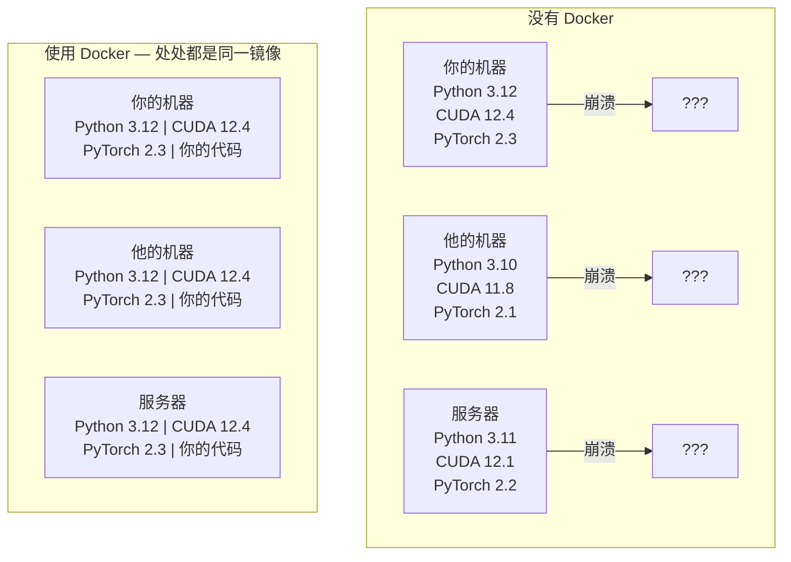

# 给 AI 用的 Docker（Docker for AI）

> 译注：本文译自同目录 [`en.md`](./en.md)。术语遵循仓根 [TRANSLATION_GUIDE.md](../../../../TRANSLATION_GUIDE.md)。

> 容器（container）让「在我电脑上能跑」彻底成为过去式。

**Type:** Build
**Languages:** Docker
**Prerequisites:** Phase 0, Lessons 01 and 03
**Time:** ~60 minutes

## 学习目标（Learning Objectives）

- 从 Dockerfile 构建一个支持 GPU 的 Docker 镜像，里面装好 CUDA、PyTorch 与各种 AI 库
- 把宿主机目录挂载（mount）为 volume，让模型、数据集和代码在容器重建之间持久化
- 配置 NVIDIA Container Toolkit，把 GPU 暴露进容器
- 用 Docker Compose 编排多服务 AI 应用（推理服务器 + 向量数据库）

## 问题（The Problem）

你在自己笔记本上用 PyTorch 2.3、CUDA 12.4 和 Python 3.12 训了个模型。同事的环境是 PyTorch 2.1、CUDA 11.8 和 Python 3.10。模型在他机器上崩了。但你的 Dockerfile 在两边都能跑。

AI 项目就是依赖灾难现场。一个典型的技术栈包含 Python、PyTorch、CUDA 驱动、cuDNN、系统级 C 库，还有像 flash-attn 这种对编译器版本要求极其精确的特殊包。Docker 把这一切打包成一个镜像，到哪儿都跑得一模一样。

## 概念（The Concept）

Docker 把你的代码、运行时、库和系统工具一起包进一个隔离的单元里，这个单元叫容器（container）。可以把它想成一台轻量虚拟机，区别在于它共享宿主机的 OS 内核、不需要自己跑一个，所以启动只要几秒而不是几分钟。



### 为什么 AI 项目比一般项目更需要 Docker（Why AI projects need Docker more than most）

1. **GPU 驱动很脆弱。** CUDA 12.4 的代码跑不动 CUDA 11.8。Docker 把 CUDA toolkit 隔在容器内部，同时通过 NVIDIA Container Toolkit 共享宿主机的 GPU 驱动。

2. **模型权重（weight）很大。** 一个 7B 参数的模型在 fp16 下是 14 GB。你不会想每次重建都重新下载一遍。Docker volume 让你能把宿主机的 models 目录挂进来。

3. **多服务架构很常见。** 真实的 AI 应用不只是一个 Python 脚本。它是一个推理（inference）服务器、一个用于 RAG 的向量数据库，可能还有个 web 前端。Docker Compose 用一条命令把这些全部编排起来。

### 关键词汇（Key vocabulary）

| 术语 | 是什么意思 |
|------|---------------|
| Image（镜像） | 一个只读模板。你的菜谱。从 Dockerfile 构建出来。 |
| Container（容器） | 一个镜像的运行实例。你的厨房。 |
| Dockerfile | 构建镜像的指令集。一层一层叠上去。 |
| Volume（卷） | 持久化存储，容器重启后还在。 |
| docker-compose | 用 YAML 定义多容器应用的工具。 |

### AI 里常见的容器模式（Common container patterns in AI）

```
Dev Container
  Full toolkit. Editor support. Jupyter. Debugging tools.
  Used during development and experimentation.

Training Container
  Minimal. Just the training script and dependencies.
  Runs on GPU clusters. No editor, no Jupyter.

Inference Container
  Optimized for serving. Small image. Fast cold start.
  Runs behind a load balancer in production.
```

## 动手实现（Build It）

### 第 1 步：安装 Docker（Step 1: Install Docker）

```bash
# macOS
brew install --cask docker
open /Applications/Docker.app

# Ubuntu
curl -fsSL https://get.docker.com | sh
sudo usermod -aG docker $USER
# Log out and back in for group change to take effect
```

验证：

```bash
docker --version
docker run hello-world
```

### 第 2 步：安装 NVIDIA Container Toolkit（带 NVIDIA GPU 的 Linux）（Step 2: Install NVIDIA Container Toolkit）

这一步让 Docker 容器能访问你的 GPU。macOS 和 Windows（WSL2）用户可以跳过；Docker Desktop 在那两个平台上以另一种方式处理 GPU 透传。

```bash
distribution=$(. /etc/os-release;echo $ID$VERSION_ID)
curl -fsSL https://nvidia.github.io/libnvidia-container/gpgkey | sudo gpg --dearmor -o /usr/share/keyrings/nvidia-container-toolkit-keyring.gpg
curl -s -L https://nvidia.github.io/libnvidia-container/$distribution/libnvidia-container.list | \
    sed 's#deb https://#deb [signed-by=/usr/share/keyrings/nvidia-container-toolkit-keyring.gpg] https://#g' | \
    sudo tee /etc/apt/sources.list.d/nvidia-container-toolkit.list

sudo apt-get update
sudo apt-get install -y nvidia-container-toolkit
sudo nvidia-ctk runtime configure --runtime=docker
sudo systemctl restart docker
```

测试容器内能否访问 GPU：

```bash
docker run --rm --gpus all nvidia/cuda:12.4.1-base-ubuntu22.04 nvidia-smi
```

如果你看到了自己的 GPU 信息，就说明 toolkit 正常工作了。

### 第 3 步：理解 base image（Step 3: Understand base images）

选对 base image 能省下你好几个小时的 debug 时间。

```
nvidia/cuda:12.4.1-devel-ubuntu22.04
  Full CUDA toolkit. Compilers included.
  Use for: building packages that need nvcc (flash-attn, bitsandbytes)
  Size: ~4 GB

nvidia/cuda:12.4.1-runtime-ubuntu22.04
  CUDA runtime only. No compilers.
  Use for: running pre-built code
  Size: ~1.5 GB

pytorch/pytorch:2.3.1-cuda12.4-cudnn9-runtime
  PyTorch pre-installed on top of CUDA.
  Use for: skipping the PyTorch install step
  Size: ~6 GB

python:3.12-slim
  No CUDA. CPU only.
  Use for: inference on CPU, lightweight tools
  Size: ~150 MB
```

### 第 4 步：为 AI 开发写一个 Dockerfile（Step 4: Write a Dockerfile for AI development）

`code/Dockerfile` 里就是这个 Dockerfile。一起过一遍：

```dockerfile
FROM nvidia/cuda:12.4.1-devel-ubuntu22.04

ENV DEBIAN_FRONTEND=noninteractive
ENV PYTHONUNBUFFERED=1

RUN apt-get update && apt-get install -y --no-install-recommends \
    python3.12 \
    python3.12-venv \
    python3.12-dev \
    python3-pip \
    git \
    curl \
    build-essential \
    && rm -rf /var/lib/apt/lists/*

RUN update-alternatives --install /usr/bin/python python /usr/bin/python3.12 1

RUN python -m pip install --no-cache-dir --upgrade pip setuptools wheel

RUN python -m pip install --no-cache-dir \
    torch==2.3.1 \
    torchvision==0.18.1 \
    torchaudio==2.3.1 \
    --index-url https://download.pytorch.org/whl/cu124

RUN python -m pip install --no-cache-dir \
    numpy \
    pandas \
    scikit-learn \
    matplotlib \
    jupyter \
    transformers \
    datasets \
    accelerate \
    safetensors

WORKDIR /workspace

VOLUME ["/workspace", "/models"]

EXPOSE 8888

CMD ["python"]
```

构建：

```bash
docker build -t ai-dev -f phases/00-setup-and-tooling/07-docker-for-ai/code/Dockerfile .
```

第一次会慢一点（要下载 CUDA base image + PyTorch）。后面的构建会用到缓存层。

运行：

```bash
docker run --rm -it --gpus all \
    -v $(pwd):/workspace \
    -v ~/models:/models \
    ai-dev python -c "import torch; print(f'PyTorch {torch.__version__}, CUDA: {torch.cuda.is_available()}')"
```

在容器内跑 Jupyter：

```bash
docker run --rm -it --gpus all \
    -v $(pwd):/workspace \
    -v ~/models:/models \
    -p 8888:8888 \
    ai-dev jupyter notebook --ip=0.0.0.0 --port=8888 --no-browser --allow-root
```

### 第 5 步：用 volume 挂载数据和模型（Step 5: Volume mounts for data and models）

Volume 挂载对 AI 工作来说至关重要。没有它，你下载下来的 14 GB 模型会在容器一停就消失。

```bash
# Mount your code
-v $(pwd):/workspace

# Mount a shared models directory
-v ~/models:/models

# Mount datasets
-v ~/datasets:/data
```

在你的训练脚本里，从挂载路径加载：

```python
from transformers import AutoModel

model = AutoModel.from_pretrained("/models/llama-7b")
```

模型存在宿主机文件系统上。容器你想重建多少次都可以，不用重新下载。

### 第 6 步：用 Docker Compose 跑多服务 AI 应用（Step 6: Docker Compose for multi-service AI apps）

一个真实的 RAG 应用需要一个推理服务器加一个向量数据库。Docker Compose 一条命令就能把两个一起跑起来。

见 `code/docker-compose.yml`：

```yaml
services:
  ai-dev:
    build:
      context: .
      dockerfile: Dockerfile
    deploy:
      resources:
        reservations:
          devices:
            - driver: nvidia
              count: all
              capabilities: [gpu]
    volumes:
      - ../../../:/workspace
      - ~/models:/models
      - ~/datasets:/data
    ports:
      - "8888:8888"
    stdin_open: true
    tty: true
    command: jupyter notebook --ip=0.0.0.0 --port=8888 --no-browser --allow-root

  qdrant:
    image: qdrant/qdrant:v1.12.5
    ports:
      - "6333:6333"
      - "6334:6334"
    volumes:
      - qdrant_data:/qdrant/storage

volumes:
  qdrant_data:
```

启动整套：

```bash
cd phases/00-setup-and-tooling/07-docker-for-ai/code
docker compose up -d
```

现在你的 AI 开发容器可以通过服务名 `http://qdrant:6333` 直接连到向量数据库。Docker Compose 会自动建一个共享网络。

从 AI 容器内测一下连接：

```python
from qdrant_client import QdrantClient

client = QdrantClient(host="qdrant", port=6333)
print(client.get_collections())
```

全部停掉：

```bash
docker compose down
```

加上 `-v` 还会顺便删掉 qdrant 的 volume：

```bash
docker compose down -v
```

### 第 7 步：AI 工作里好用的 Docker 命令（Step 7: Useful Docker commands for AI work）

```bash
# List running containers
docker ps

# List all images and their sizes
docker images

# Remove unused images (reclaim disk space)
docker system prune -a

# Check GPU usage inside a running container
docker exec -it <container_id> nvidia-smi

# Copy a file from container to host
docker cp <container_id>:/workspace/results.csv ./results.csv

# View container logs
docker logs -f <container_id>
```

## 用起来（Use It）

到这里你已经有了一个可复现的 AI 开发环境。本课程后面会继续用：

- 用 `docker compose up` 把开发环境和向量数据库一起启起来
- 把代码、模型和数据当 volume 挂进去，重建之间什么都不会丢
- 当某节课需要装新的 Python 包时，加到 Dockerfile 里然后重建
- 把你的 Dockerfile 分享给队友，他们就能拿到完全一样的环境。

### 没有 GPU 怎么办？（No GPU?）

去掉 `--gpus all` flag 和 NVIDIA 的 deploy 块。容器在 CPU 课程里照样能用。PyTorch 检测不到 CUDA 时会自动 fallback 到 CPU。

## 练习（Exercises）

1. 构建 Dockerfile 然后在容器内跑 `python -c "import torch; print(torch.__version__)"`
2. 启动 docker-compose 整套，确认能从 AI 容器里通过 `http://qdrant:6333/collections` 访问到 Qdrant
3. 把 `flask` 加到 Dockerfile 里，重建，然后在 5000 端口跑一个简单的 API server。用 `-p 5000:5000` 做端口映射
4. 用 `docker images` 看镜像大小。试着把 base image 从 `devel` 换成 `runtime`，对比一下大小

## 关键术语（Key Terms）

| 术语 | 大家口头怎么说 | 实际含义 |
|------|----------------|----------------------|
| Container（容器） | 「轻量 VM」 | 用宿主机内核的隔离进程，有自己的文件系统和网络 |
| Image layer（镜像层） | 「缓存的一步」 | Dockerfile 里每条指令都会生成一层。没变的层会被缓存，所以重建很快。 |
| NVIDIA Container Toolkit | 「Docker 里的 GPU」 | 一个运行时 hook，通过 `--gpus` flag 把宿主机的 GPU 暴露进容器 |
| Volume mount（卷挂载） | 「共享文件夹」 | 宿主机上的目录被映射进容器。容器停了改动也还在。 |
| Base image（基础镜像） | 「起点」 | Dockerfile 里 `FROM` 后面那个镜像，决定了里面预装了什么。 |
