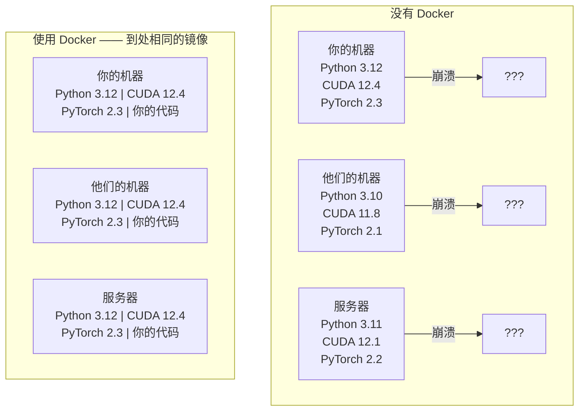

# Docker 用于 AI

> 容器让"在我机器上能跑"成为过去式。

**类型：** 构建
**语言：** Docker
**前置条件：** 第 0 阶段，第 01 课和第 03 课
**预计时间：** ~60 分钟

## 学习目标

- 从 Dockerfile 构建一个启用了 GPU 的 Docker 镜像，包含 CUDA、PyTorch 和 AI 库
- 将主机目录挂载为卷，以便在容器重建之间持久化模型、数据集和代码
- 配置 NVIDIA Container Toolkit，使容器内部能够访问 GPU
- 使用 Docker Compose 编排多服务 AI 应用（推理服务器 + 向量数据库）

## 问题

你在自己的笔记本上用 PyTorch 2.3、CUDA 12.4 和 Python 3.12 训练了一个模型。你的同事用的是 PyTorch 2.1、CUDA 11.8 和 Python 3.10。你的模型在他们的机器上崩溃了。而你的 Dockerfile 可以在两者上运行。

AI 项目是依赖关系的噩梦。一个典型的栈包括 Python、PyTorch、CUDA 驱动、cuDNN、系统级 C 库，以及像 flash-attn 这样需要精确编译器版本的特殊包。Docker 将所有这些打包成一个单一的镜像，在任何地方都能一致运行。

## 概念

Docker 将你的代码、运行时、库和系统工具打包到一个称为容器的隔离单元中。可以把它想象成一个轻量级虚拟机，不同的是它共享主机 OS 内核而不是运行自己的内核，因此它在几秒内启动而不是几分钟。


```mermaid
graph TD
    subgraph without["没有 Docker"]
        A1["你的机器<br/>Python 3.12<br/>CUDA 12.4<br/>PyTorch 2.3"] -->|崩溃| X1["???"]
        A2["他们的机器<br/>Python 3.10<br/>CUDA 11.8<br/>PyTorch 2.1"] -->|崩溃| X2["???"]
        A3["服务器<br/>Python 3.11<br/>CUDA 12.1<br/>PyTorch 2.2"] -->|崩溃| X3["???"]
    end

    subgraph with_docker["使用 Docker —— 到处相同的镜像"]
        B1["你的机器<br/>Python 3.12 | CUDA 12.4<br/>PyTorch 2.3 | 你的代码"]
        B2["他们的机器<br/>Python 3.12 | CUDA 12.4<br/>PyTorch 2.3 | 你的代码"]
        B3["服务器<br/>Python 3.12 | CUDA 12.4<br/>PyTorch 2.3 | 你的代码"]
    end
```

### 为什么 AI 项目比大多数项目更需要 Docker

1. **GPU 驱动很脆弱。** CUDA 12.4 的代码无法在 CUDA 11.8 上运行。Docker 将 CUDA 工具包隔离在容器内部，同时通过 NVIDIA Container Toolkit 共享主机 GPU 驱动。

2. **模型权重很大。** 一个 7B 参数的模型在 fp16 下占用 14 GB。你肯定不想每次重建都重新下载它。Docker 卷允许你从主机挂载一个模型目录。

3. **多服务架构很常见。** 一个真正的 AI 应用不仅仅是一个 Python 脚本。它包括推理服务器、用于 RAG 的向量数据库，可能还有 Web 前端。Docker Compose 用一个命令编排所有这些服务。

### 关键词汇

| 术语 | 含义 |
|------|---------------|
| Image | 只读模板。你的配方。从 Dockerfile 构建。 |
| Container | 镜像的运行实例。你的厨房。 |
| Dockerfile | 构建镜像的指令。一层一层。 |
| Volume | 在容器重启后仍然存在的持久化存储。 |
| docker-compose | 用 YAML 定义多容器应用的工具。 |

### AI 中的常见容器模式

```
开发容器
  完整工具包。编辑器支持。Jupyter。调试工具。
  在开发与实验期间使用。

训练容器
  最小化。仅训练脚本和依赖。
  在 GPU 集群上运行。没有编辑器，没有 Jupyter。

推理容器
  为服务优化。镜像小。冷启动快。
  在生产环境中运行在负载均衡器后面。
```

## 动手实践

### 第 1 步：安装 Docker

```bash
# macOS
brew install --cask docker
open /Applications/Docker.app

# Ubuntu
curl -fsSL https://get.docker.com | sh
sudo usermod -aG docker $USER
# 注销并重新登录以使组更改生效
```

验证：

```bash
docker --version
docker run hello-world
```

### 第 2 步：安装 NVIDIA Container Toolkit（带有 NVIDIA GPU 的 Linux）

这使 Docker 容器能够访问你的 GPU。macOS 和 Windows（WSL2）用户可以跳过此步骤；Docker Desktop 在这些平台上以不同方式处理 GPU 直通。

```bash
distribution=$(. /etc/os-release;echo $ID$VERSION_ID)
curl -fsSL https://nvidia.github.io/libnvidia-container/gpgkey | sudo gpg --dearmor -o /usr/share/keyrings/nvidia-container-toolkit-keyring.gpg
curl -s -L https://nvidia.github.io/libnvidia-container/$distribution/libnvidia-container.list | \
    sed 's#deb https://#deb [signed-by=/usr/share/keyrings/nvidia-container-toolkit-keyring.gpg] https://#g' | \
    sudo tee /etc/apt/sources.list.d/nvidia-container-toolkit.list

sudo apt-get update
sudo apt-get install -y nvidia-container-toolkit
sudo nvidia-ctk runtime configure --runtime=docker
sudo systemctl restart docker
```

测试容器内部的 GPU 访问：

```bash
docker run --rm --gpus all nvidia/cuda:12.4.1-base-ubuntu22.04 nvidia-smi
```

如果你看到 GPU 信息，说明工具包工作正常。

### 第 3 步：理解基础镜像

选择正确的基础镜像可以节省数小时的调试时间。

```
nvidia/cuda:12.4.1-devel-ubuntu22.04
  完整的 CUDA 工具包。包含编译器。
  用途：构建需要 nvcc 的包（flash-attn、bitsandbytes）
  大小：~4 GB

nvidia/cuda:12.4.1-runtime-ubuntu22.04
  仅 CUDA 运行时。无编译器。
  用途：运行预构建的代码
  大小：~1.5 GB

pytorch/pytorch:2.3.1-cuda12.4-cudnn9-runtime
  PyTorch 预装在 CUDA 之上。
  用途：跳过 PyTorch 安装步骤
  大小：~6 GB

python:3.12-slim
  无 CUDA。仅 CPU。
  用途：在 CPU 上推理，轻量工具
  大小：~150 MB
```

### 第 4 步：为 AI 开发编写 Dockerfile

以下是 `code/Dockerfile` 中的 Dockerfile。逐步解析：

```dockerfile
FROM nvidia/cuda:12.4.1-devel-ubuntu22.04

ENV DEBIAN_FRONTEND=noninteractive
ENV PYTHONUNBUFFERED=1

RUN apt-get update && apt-get install -y --no-install-recommends \
    python3.12 \
    python3.12-venv \
    python3.12-dev \
    python3-pip \
    git \
    curl \
    build-essential \
    && rm -rf /var/lib/apt/lists/*

RUN update-alternatives --install /usr/bin/python python /usr/bin/python3.12 1

RUN python -m pip install --no-cache-dir --upgrade pip setuptools wheel

RUN python -m pip install --no-cache-dir \
    torch==2.3.1 \
    torchvision==0.18.1 \
    torchaudio==2.3.1 \
    --index-url https://download.pytorch.org/whl/cu124

RUN python -m pip install --no-cache-dir \
    numpy \
    pandas \
    scikit-learn \
    matplotlib \
    jupyter \
    transformers \
    datasets \
    accelerate \
    safetensors

WORKDIR /workspace

VOLUME ["/workspace", "/models"]

EXPOSE 8888

CMD ["python"]
```

构建它：

```bash
docker build -t ai-dev -f phases/00-setup-and-tooling/07-docker-for-ai/code/Dockerfile .
```

第一次构建需要一些时间（下载 CUDA 基础镜像 + PyTorch）。后续构建会使用缓存的层。

运行它：

```bash
docker run --rm -it --gpus all \
    -v $(pwd):/workspace \
    -v ~/models:/models \
    ai-dev python -c "import torch; print(f'PyTorch {torch.__version__}, CUDA: {torch.cuda.is_available()}')"
```

在容器内部运行 Jupyter：

```bash
docker run --rm -it --gpus all \
    -v $(pwd):/workspace \
    -v ~/models:/models \
    -p 8888:8888 \
    ai-dev jupyter notebook --ip=0.0.0.0 --port=8888 --no-browser --allow-root
```

### 第 5 步：数据和模型的卷挂载

卷挂载对 AI 工作至关重要。没有它们，你 14 GB 的模型下载在容器停止时就会消失。

```bash
# 挂载你的代码
-v $(pwd):/workspace

# 挂载共享模型目录
-v ~/models:/models

# 挂载数据集
-v ~/datasets:/data
```

在你的训练脚本中，从挂载的路径加载：

```python
from transformers import AutoModel

model = AutoModel.from_pretrained("/models/llama-7b")
```

模型存在于你的主机文件系统上。你可以随心所欲地重建容器，而无需重新下载。

### 第 6 步：多服务 AI 应用的 Docker Compose

一个真正的 RAG 应用需要一个推理服务器和一个向量数据库。Docker Compose 用一个命令运行两者。

参见 `code/docker-compose.yml`：

```yaml
services:
  ai-dev:
    build:
      context: .
      dockerfile: Dockerfile
    deploy:
      resources:
        reservations:
          devices:
            - driver: nvidia
              count: all
              capabilities: [gpu]
    volumes:
      - ../../../:/workspace
      - ~/models:/models
      - ~/datasets:/data
    ports:
      - "8888:8888"
    stdin_open: true
    tty: true
    command: jupyter notebook --ip=0.0.0.0 --port=8888 --no-browser --allow-root

  qdrant:
    image: qdrant/qdrant:v1.12.5
    ports:
      - "6333:6333"
      - "6334:6334"
    volumes:
      - qdrant_data:/qdrant/storage

volumes:
  qdrant_data:
```

启动所有服务：

```bash
cd phases/00-setup-and-tooling/07-docker-for-ai/code
docker compose up -d
```

现在你的 AI 开发容器可以通过服务名 `http://qdrant:6333` 访问向量数据库。Docker Compose 会自动创建一个共享网络。

从 AI 容器内部测试连接：

```python
from qdrant_client import QdrantClient

client = QdrantClient(host="qdrant", port=6333)
print(client.get_collections())
```

停止所有服务：

```bash
docker compose down
```

添加 `-v` 参数也会删除 qdrant 卷：

```bash
docker compose down -v
```

### 第 7 步：AI 工作中有用的 Docker 命令

```bash
# 列出运行中的容器
docker ps

# 列出所有镜像及其大小
docker images

# 删除未使用的镜像（回收磁盘空间）
docker system prune -a

# 检查运行容器中的 GPU 使用情况
docker exec -it <container_id> nvidia-smi

# 将文件从容器的复制到主机
docker cp <container_id>:/workspace/results.csv ./results.csv

# 查看容器日志
docker logs -f <container_id>
```

## 使用方式

现在你拥有了一个可重现的 AI 开发环境。在本课程的其余部分：

- 使用 `docker compose up` 同时启动你的开发环境和向量数据库
- 将你的代码、模型和数据挂载为卷，这样在重建之间不会丢失任何内容
- 当某课需要新的 Python 包时，将其添加到 Dockerfile 并重建
- 与队友分享你的 Dockerfile。他们得到完全相同环境。

### 没有 GPU？

移除 `--gpus all` 标志和 NVIDIA deploy 块。容器仍然适用于基于 CPU 的课程。PyTorch 会检测到没有 CUDA 并自动回退到 CPU。

## 练习

1. 构建 Dockerfile 并在容器内部运行 `python -c "import torch; print(torch.__version__)"`
2. 启动 docker-compose 栈，验证可以通过 `http://qdrant:6333/collections` 从 AI 容器访问 Qdrant
3. 将 `flask` 添加到 Dockerfile，重建，在端口 5000 上运行一个简单的 API 服务器。使用 `-p 5000:5000` 映射端口
4. 使用 `docker images` 测量镜像大小。尝试将基础镜像从 `devel` 切换到 `runtime`，比较大小

## 关键术语

| 术语 | 人们怎么说 | 实际含义 |
|------|----------------|----------------------|
| Container | "轻量级虚拟机" | 使用主机内核的隔离进程，拥有自己的文件系统和网络 |
| Image layer | "缓存步骤" | 每个 Dockerfile 指令创建一个层。未更改的层被缓存，因此重建速度很快。 |
| NVIDIA Container Toolkit | "Docker 中的 GPU" | 一个运行时钩子，通过 `--gpus` 标志将主机 GPU 暴露给容器 |
| Volume mount | "共享文件夹" | 主机上映射到容器中的目录。容器停止后更改仍然存在。 |
| Base image | "起点" | Dockerfile 在其之上构建的 `FROM` 镜像。决定哪些已预装。 |
