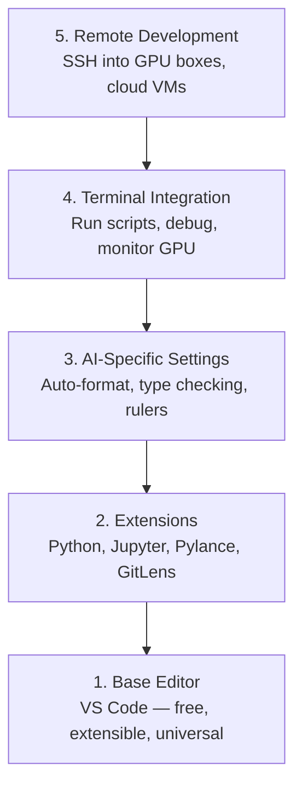

# エディタのセットアップ

> エディタはあなたの副操縦士です。一度だけ設定し、作業の邪魔をせず、きちんと役に立つ状態にします。

**タイプ:** 作ってみる
**言語:** --
**前提条件:** フェーズ0、レッスン01
**時間:** 約20分

## 学習目標

- Python、Jupyter、lint、remote SSHに必要な拡張機能とともにVS Codeをインストールする
- AIワークフロー向けに、保存時format、type checking、notebook output scrollingを設定する
- Remote SSHを設定し、remote GPU machine上のcodeをlocalのように編集・debugする
- Cursor、Windsurf、Neovimなどのエディタ代替案と、AI作業におけるtradeoffを評価する

## 課題

あなたはエディタ内で、Pythonを書き、notebookを実行し、training loopをdebugし、GPU machineへSSHしながら何千時間も過ごします。設定が悪いエディタは、毎回の作業を摩擦だらけにします。autocompleteがない、type hintがない、inline errorがない、formatが手動、terminal workflowがぎこちない。

正しいセットアップは20分で終わります。省略すると、毎日20分を失います。

## 考え方

AIエンジニアリング用のエディタ設定には5つの要素が必要です。



## 作ってみる

### ステップ1: VS Codeをインストールする

推奨エディタはVS Codeです。無料で、すべてのOSで動き、Jupyter notebookを第一級にサポートし、拡張機能のecosystemがAI作業に必要なものを網羅しています。

[code.visualstudio.com](https://code.visualstudio.com/) からダウンロードします。

terminalから確認します。

```bash
code --version
```

macOSで `code` が見つからない場合は、VS Codeを開き、`Cmd+Shift+P` を押し、"Shell Command" と入力して "Install 'code' command in PATH" を選択します。

### ステップ2: 必須拡張機能をインストールする

VS Codeの統合terminal（`Ctrl+`` ` または `` Cmd+` ``）を開き、AI作業に重要な拡張機能をインストールします。

```bash
code --install-extension ms-python.python
code --install-extension ms-python.vscode-pylance
code --install-extension ms-toolsai.jupyter
code --install-extension eamodio.gitlens
code --install-extension ms-vscode-remote.remote-ssh
code --install-extension ms-python.debugpy
code --install-extension ms-python.black-formatter
code --install-extension charliermarsh.ruff
```

それぞれの役割:

| 拡張機能 | 理由 |
|-----------|-----|
| Python | language support、virtual env検出、run/debug |
| Pylance | 高速なtype checking、autocomplete、import解決 |
| Jupyter | VS Code内でnotebookを実行、variable explorer |
| GitLens | 誰が何を変更したか、inline git blameを見る |
| Remote SSH | remote GPU box上のfolderをlocalのように開く |
| Debugpy | Pythonのstep-through debugging |
| Black Formatter | 保存時auto-format、一貫したstyle |
| Ruff | 高速linting、よくある間違いの検出 |

このレッスンの `code/.vscode/extensions.json` には、推奨一覧の完全版が入っています。project folderを開くと、VS Codeがインストールを促します。

### ステップ3: 設定する

このレッスンの `code/.vscode/settings.json` から設定をコピーするか、`Settings > Open Settings (JSON)` で手動適用します。

AI作業に重要な設定:

```jsonc
{
    "python.analysis.typeCheckingMode": "basic",
    "editor.formatOnSave": true,
    "editor.rulers": [88, 120],
    "notebook.output.scrolling": true,
    "files.autoSave": "afterDelay"
}
```

これらが重要な理由:

- **Type checking on basic**: 実行前に間違った引数型を検出します。tensor shape mismatchや誤ったAPI parameterのdebug時間を減らします。
- **Format on save**: formatについて考えなくてよくなります。Blackが処理します。
- **88と120のruler**: Blackは88で折り返します。120のmarkerは、docstringやcommentが長くなりすぎた時の目安です。
- **Notebook output scrolling**: training loopは何千行もprintします。scrollingがないとoutput panelが巨大化します。
- **Auto-save**: 保存し忘れます。training scriptが古いcodeで走ります。auto-saveはそれを防ぎます。

### ステップ4: Terminal統合

VS Codeの統合terminalは、training scriptの実行、GPU監視、環境管理を行う場所です。

適切に設定します。

```jsonc
{
    "terminal.integrated.defaultProfile.osx": "zsh",
    "terminal.integrated.defaultProfile.linux": "bash",
    "terminal.integrated.fontSize": 13,
    "terminal.integrated.scrollback": 10000
}
```

便利なshortcut:

| 操作 | macOS | Linux/Windows |
|--------|-------|---------------|
| terminal切り替え | `` Ctrl+` `` | `` Ctrl+` `` |
| 新しいterminal | `Ctrl+Shift+`` ` | `Ctrl+Shift+`` ` |
| terminal分割 | `Cmd+\` | `Ctrl+\` |

分割terminalは便利です。一方でscriptを実行し、もう一方で `nvidia-smi -l 1` または `watch -n 1 nvidia-smi` によってGPUを監視できます。

### ステップ5: Remote Development（GPU boxへSSH）

これはAI作業で最も重要な拡張機能です。trainingはremote machine（cloud VM、lab server、Lambda、Vast.ai）で実行することになります。Remote SSHを使うと、remote filesystemを開き、fileを編集し、terminalを実行し、すべてlocalのようにdebugできます。

セットアップ:

1. Remote SSH拡張機能をインストールする（ステップ2で完了）。
2. `Ctrl+Shift+P`（または `Cmd+Shift+P`）を押し、"Remote-SSH: Connect to Host" と入力する。
3. `user@your-gpu-box-ip` を入力する。
4. VS Codeがremote machineへserver componentを自動的にインストールする。

passwordless accessにはSSH keyを設定します。

```bash
ssh-keygen -t ed25519 -C "your-email@example.com"
ssh-copy-id user@your-gpu-box-ip
```

便利なようにhostを `~/.ssh/config` に追加します。

```
Host gpu-box
    HostName 203.0.113.50
    User ubuntu
    IdentityFile ~/.ssh/id_ed25519
    ForwardAgent yes
```

これで `Remote-SSH: Connect to Host > gpu-box` からすぐ接続できます。

## 代替案

### Cursor

[cursor.com](https://cursor.com) はAI code generationを内蔵したVS Code forkです。同じ拡張機能ecosystemと設定形式を使います。Cursorを使う場合も、このレッスンの内容はそのまま当てはまります。同じ `settings.json` と `extensions.json` をimportしてください。

### Windsurf

[windsurf.com](https://windsurf.com) は別のAI-firstなVS Code forkです。同じ話です。同じ拡張機能、同じ設定形式、同じRemote SSH supportを使えます。

### Vim/Neovim

すでにVimまたはNeovimを使っていて生産的なら、そのまま使ってください。AI Python作業の最小構成は次の通りです。

- type checking用の **pyright** または **pylsp**（Masonまたは手動install）
- language server連携用の **nvim-lspconfig**
- notebook的な実行用の **jupyter-vim** または **molten-nvim**
- file/symbol search用の **telescope.nvim**
- format/lint用にblackとruffを組み合わせた **none-ls.nvim**

まだVimを使っていないなら、今から始めないでください。学習曲線がAIエンジニアリングの学習と競合します。VS Codeを使います。

## 使ってみる

このセットアップにより、日常のworkflowは次のようになります。

1. VS Codeでproject folderを開く（またはRemote SSHでGPU boxへ接続する）。
2. autocomplete、type hint、inline error付きでPythonを書く。
3. Jupyter拡張でnotebookをinline実行する。
4. training script、`uv pip install`、GPU監視には統合terminalを使う。
5. commit前にGitLensで変更を確認する。

## 演習

1. VS Codeとステップ2に挙げたすべての拡張機能をインストールする
2. このレッスンの `settings.json` をVS Code configへコピーする
3. Python fileを開き、Pylanceがtype hintを表示し、Blackが保存時formatすることを確認する
4. remote machineへアクセスできる場合は、Remote SSHを設定してfolderを開く

## 重要用語

| 用語 | よくある言い方 | 実際の意味 |
|------|----------------|----------------------|
| LSP | 「autocomplete engine」 | Language Server Protocol。editorがlanguage-specific serverからtype info、completion、diagnosticを取得するための標準 |
| Pylance | 「Python plugin」 | type checkingとIntelliSenseにPyrightを使うMicrosoftのPython language server |
| Remote SSH | 「server上で作業する」 | remote machine上で軽量serverを実行し、UIをlocal editorへstreamするVS Code拡張 |
| Format on save | 「auto-prettier」 | 保存するたびにeditorがformatter（Black、Ruff）を実行し、code styleを常に一貫させること |
