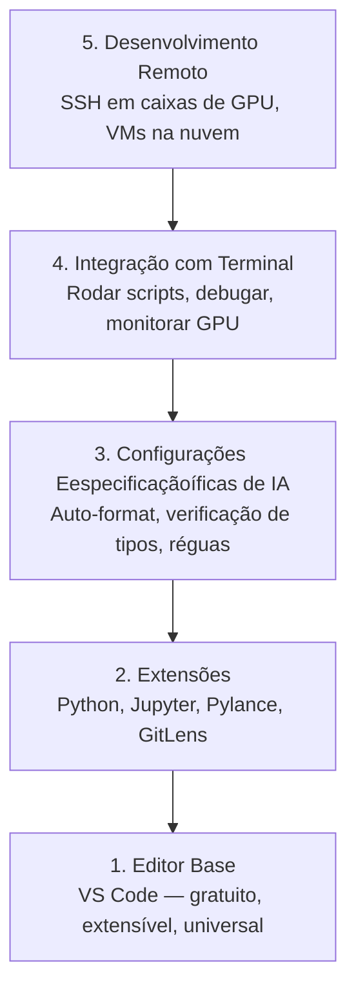

# Configuração do Editor

> Seu editor é seu copiloto. Configure uma vez pra que ele não atrapalhe e comece a carregar seu peso.

**Tipo:** Build
**Linguagens:** --
**Pré-requisitos:** Fase 0, Aula 01
**Tempo:** ~20 minutos

## Objetivos de Aprendizado

- Instalar VS Code com extensões essenciais para Python, Jupyter, linting e SSH remoto
- Configurar formatação ao salvar, verificação de tipos e scroll de output de notebook para fluxos de trabalho de IA
- Configurar Remote SSH para editar e debugar código em máquinas remotas de GPU como se fossem locais
- Avaliar alternativas de editor (Cursor, Windsurf, Neovim) e seus tradeoffs para trabalho de IA

## O Problema

Você vai gastar milhares de horas dentro do seu editor escrevendo Python, rodando notebooks, debugando loops de treino e fazendo SSH em caixas de GPU. Um editor mal configurado transforma cada sessão em atrito: sem autocomplete, sem type hints, sem erros inline, formatação manual e um fluxo de terminal desajeitado.

A configuração certa leva 20 minutos. Pular isso custa 20 minutos todo dia.

## O Conceito

Uma configuração de editor para engenharia de IA precisa de cinco coisas:



## Construa

### Passo 1: Instale o VS Code

O VS Code é o editor recomendado. É gratuito, roda em qualquer SO, tem suporte de primeira classe a Jupyter notebooks e o ecossistema de extensões cobre tudo que você precisa para trabalho de IA.

Baixe em [code.visualstudio.com](https://code.visualstudio.com/).

### Passo 2: Instale as Extensões Essenciais

```bash
code --install-extension ms-python.python
code --install-extension ms-python.vscode-pylance
code --install-extension ms-toolsai.jupyter
code --install-extension eamodio.gitlens
code --install-extension ms-vscode-remote.remote-ssh
code --install-extension ms-python.debugpy
code --install-extension ms-python.black-formatter
code --install-extension charliermarsh.ruff
```

O que cada uma faz:

| Extensão | Por quê |
|-----------|---------|
| Python | Suporte de linguagem, detecção de venv, run/debug |
| Pylance | Verificação de tipos rápida, autocomplete, resolução de imports |
| Jupyter | Rodar notebooks dentro do VS Code, explorador de variáveis |
| GitLens | Ver quem mudou o quê, git blame inline |
| Remote SSH | Abrir uma pasta em uma caixa de GPU remota como se fosse local |
| Debugpy | Step-through debugging para Python |
| Black Formatter | Auto-formatação ao salvar, estilo consistente |
| Ruff | Linting rápido, captura erros comuns |

### Passo 3: Configure as Configurações

```jsonc
{
    "python.analysis.typeCheckingMode": "basic",
    "editor.formatOnSave": true,
    "editor.rulers": [88, 120],
    "notebook.output.scrolling": true,
    "files.autoSave": "afterDelay"
}
```

### Passo 4: Integração com Terminal

```jsonc
{
    "terminal.integrated.defaultProfile.osx": "zsh",
    "terminal.integrated.defaultProfile.linux": "bash",
    "terminal.integrated.fontSize": 13,
    "terminal.integrated.scrollback": 10000
}
```

### Passo 5: Desenvolvimento Remoto (SSH em Caixas de GPU)

Esta é a extensão mais importante para trabalho de IA. Você vai rodar treino em máquinas remotas (VMs na nuvem, servidores de lab, Lambda, Vast.ai). Remote SSH permite abrir o sistema de arquivos remoto, editar arquivos, rodar terminais e debugar como se tudo fosse local.

1. Instale a extensão Remote SSH (feito no Passo 2).
2. Pressione `Ctrl+Shift+P` (ou `Cmd+Shift+P`), digite "Remote-SSH: Connect to Host".
3. Digite `user@your-gpu-box-ip`.
4. O VS Code instala seu componente servidor na máquina remota automaticamente.

Para acesso sem senha, configure chaves SSH:

```bash
ssh-keygen -t ed25519 -C "seu-email@exemplo.com"
ssh-copy-id user@your-gpu-box-ip
```

## Alternativas

### Cursor
[cursor.com](https://cursor.com) é um fork do VS Code com geração de código por IA embutida. Usa o mesmo ecossistema de extensões e formato de configurações.

### Windsurf
[windsurf.com](https://windsurf.com) é outro fork do VS Code focado em IA. Mesma história: mesmas extensões, mesmo formato de configurações, mesmo suporte a Remote SSH.

### Vim/Neovim
Se você já usa Vim ou Neovim e é produtivo nele, continue. Se não usa, não comece agora. A curva de aprendizado vai competir com aprender engenharia de IA. Use VS Code.

## Exercícios

1. Instale o VS Code e todas as extensões listadas no Passo 2
2. Copie o `settings.json` desta aula para sua configuração do VS Code
3. Abra um arquivo Python e verifique que o Pylance mostra type hints e o Black formata ao salvar
4. Se você tiver acesso a uma máquina remota, configure o Remote SSH e abra uma pasta nela
