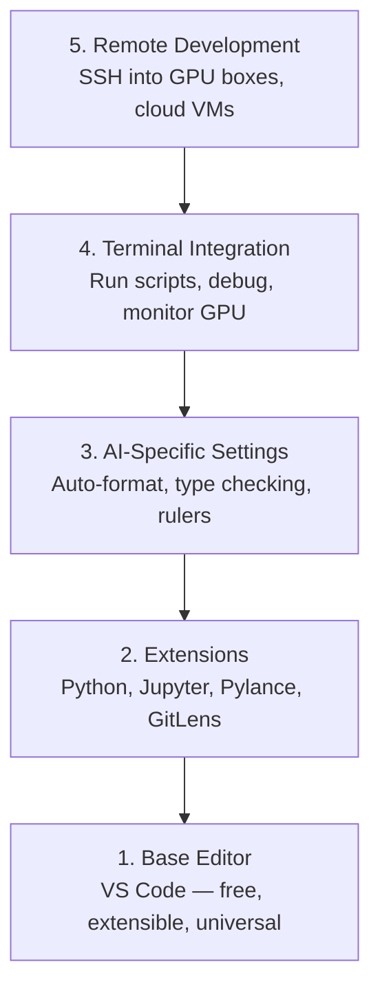

# Editör Kurulumu

> Editörünüz yardımcı pilotunuzdur. Bir kez yapılandırın ki, önünüzden çekilsin ve ağırlığını çekmeye başlasın.

**Tür:** Yapım
**Diller:** --
**Önkoşullar:** Aşama 0, Ders 01
**Süre:** ~20 dakika

## Öğrenme Hedefleri

- Python, Jupyter, linting ve uzak SSH için gerekli uzantılarla VS Code'u yükleyin
- AI iş akışları için kaydetme sırasında formatı, tür kontrolünü ve not defteri çıktısı kaydırmayı yapılandırın
- Uzak GPU makinelerindeki kodu sanki yerelmiş gibi düzenlemek ve hata ayıklamak için Uzak SSH'yi kurun
- Editör alternatiflerini (İmleç, Rüzgar Sörfü, Neovim) ve bunların yapay zeka çalışmaları için tercihlerini değerlendirin

## Sorun

Editörünüzün içinde Python yazarak, not defterlerini çalıştırarak, eğitim döngülerinde hata ayıklayarak ve GPU kutularına SSH uygulayarak binlerce saat harcayacaksınız. Yanlış yapılandırılmış bir düzenleyici, her oturumu sürtünmeye dönüştürür: otomatik tamamlama yok, tür ipuçları yok, satır içi hatalar yok, manuel biçimlendirme ve hantal bir terminal iş akışı.

Doğru kurulum 20 dakika sürer. Bunu atlamak size her gün 20 dakikaya mal olur.

## Konsept

Bir AI engineering düzenleyici kurulumunun beş şeye ihtiyacı vardır:



## İnşa Et

### Adım 1: VS Kodunu Yükleyin

VS Code önerilen düzenleyicidir. Ücretsizdir, her işletim sisteminde çalışır, birinci sınıf Jupyter dizüstü bilgisayar desteğine sahiptir ve uzantı ekosistemi, yapay zeka çalışmaları için ihtiyacınız olan her şeyi kapsar.

[code.visualstudio.com](https://code.visualstudio.com/) adresinden indirin.

Terminalden doğrulayın:

```bash
code --version
```

`code` macOS'ta bulunamazsa, VS Code'u açın, `Cmd+Shift+P` tuşuna basın, "Kabuk Komutu" yazın ve "PATH'e 'kod' komutunu yükle" seçeneğini seçin.

### 2. Adım: Temel Uzantıları Yükleyin

VS Code'daki entegre terminali açın (her platformda `` Ctrl+` ``) ve yapay zeka çalışması için önemli olan uzantıları yükleyin:

```bash
code --install-extension ms-python.python
code --install-extension ms-python.vscode-pylance
code --install-extension ms-toolsai.jupyter
code --install-extension eamodio.gitlens
code --install-extension ms-vscode-remote.remote-ssh
code --install-extension ms-python.debugpy
code --install-extension ms-python.black-formatter
code --install-extension charliermarsh.ruff
```

Her birinin yaptığı şey:

| Uzantı | Neden |
|-----------|-----|
| Python | Dil desteği, sanal ortam algılama, çalıştırma/hata ayıklama |
| Pylance | Hızlı tip kontrolü, otomatik tamamlama, içe aktarma çözünürlüğü |
| Jüpiter | Not defterlerini VS Code, değişken gezgini içinde çalıştırın |
| GitLens | Kimin neyi değiştirdiğini görün, satır içi git suçlaması |
| Uzaktan SSH | Uzak GPU kutusundaki bir klasörü sanki yerelmiş gibi açın |
| Hata ayıklama | Python için adım adım hata ayıklama |
| Siyah Formatlayıcı | Kaydedildiğinde otomatik biçimlendirme, tutarlı stil |
| fırfır | Hızlı tüylenme, yaygın hataları yakalar |

Bu dersteki `code/.vscode/extensions.json` dosyası tam öneriler listesini içerir. Proje klasörünü açtığınızda, VS Code prompt bunları yüklemenizi sağlayacaktır.

### 3. Adım: Ayarları Yapılandırın

Bu dersteki ayarları `code/.vscode/settings.json`'den kopyalayın veya `Settings > Open Settings (JSON)` aracılığıyla manuel olarak uygulayın.

Yapay zekanın çalışması için temel ayarlar:

```jsonc
{
    "python.analysis.typeCheckingMode": "basic",
    "editor.formatOnSave": true,
    "editor.rulers": [88, 120],
    "notebook.output.scrolling": true,
    "files.autoSave": "afterDelay"
}
```

Bunlar neden önemlidir:

- **Temelde tür kontrolü**: Çalıştırmadan önce yanlış argüman türlerini yakalar. Tensör şekli uyuşmazlıklarında ve yanlış API parametrelerinde hata ayıklama süresinden tasarruf sağlar.
- **Kayıt sırasında biçimlendir**: Bir daha asla biçimlendirmeyi düşünmeyin. Siyah hallediyor.
- **88 ve 120'deki cetveller**: Siyah 88'de sarar. 120 işaretçisi, belge dizilerinin ve yorumların ne zaman çok uzadığını gösterir.
- **Dizüstü bilgisayar çıktısını kaydırma**: Eğitim döngüleri binlerce satır yazdırır. Kaydırma yapılmadığında çıkış paneli patlar.
- **Otomatik kaydet**: Kaydetmeyi unutacaksınız. Eğitim betiğiniz eski kodu çalıştıracaktır. Otomatik kaydetme bunu engeller.

### Adım 4: Terminal Entegrasyonu

VS Code'un entegre terminali, eğitim komut dosyalarını çalıştırdığınız, GPU'ları izlediğiniz ve ortamları yönettiğiniz yerdir.

Doğru şekilde ayarlayın:

```jsonc
{
    "terminal.integrated.defaultProfile.osx": "zsh",
    "terminal.integrated.defaultProfile.linux": "bash",
    "terminal.integrated.fontSize": 13,
    "terminal.integrated.scrollback": 10000
}
```

Yararlı kısayollar:

| Eylem | macOS | Linux/Windows |
|--------|-------|---------------|
| Terminali değiştir | `` Ctrl+` `` | `` Ctrl+` `` |
| Yeni terminal | `` Ctrl+Shift+` `` | `` Ctrl+Shift+` `` |
| Bölünmüş terminal | `Cmd+\` | `Ctrl+Shift+5` |

Bölünmüş terminaller kullanışlıdır: biri komut dosyanızı çalıştırmak için, diğeri `nvidia-smi -l 1` veya `watch -n 1 nvidia-smi` ile GPU'yu izlemek için.

### Adım 5: Uzaktan Geliştirme (GPU Kutularına SSH)

Bu yapay zeka çalışmalarının en önemli uzantısıdır. Uzak makinelerde (bulut VM'leri, laboratuvar sunucuları, Lambda, Vast.ai) eğitim yürüteceksiniz. Uzak SSH, sanki her şey yerelmiş gibi uzak dosya sistemini açmanıza, dosyaları düzenlemenize, terminalleri çalıştırmanıza ve hata ayıklamanıza olanak tanır.

Kurulum:

1. Uzak SSH uzantısını yükleyin (2. Adımda gerçekleştirilir).
2. `Ctrl+Shift+P` (veya `Cmd+Shift+P`) tuşuna basın, "Uzaktan SSH: Ana Bilgisayara Bağlan" yazın.
3. `user@your-gpu-box-ip`'yi girin.
4. VS Code, sunucu bileşenini uzak makineye otomatik olarak yükler.

Parolasız erişim için SSH anahtarlarını ayarlayın:

```bash
ssh-keygen -t ed25519 -C "your-email@example.com"
ssh-copy-id user@your-gpu-box-ip
```

Kolaylık sağlamak için ana bilgisayarı `~/.ssh/config`'ye ekleyin:

```
Host gpu-box
    HostName 203.0.113.50
    User ubuntu
    IdentityFile ~/.ssh/id_ed25519
    ForwardAgent yes
```

Artık `Remote-SSH: Connect to Host > gpu-box` anında bağlanıyor.

## Alternatifler

### İmleç

[cursor.com](https://cursor.com), yerleşik AI kod oluşturmaya sahip bir VS Code çatalıdır. Aynı uzantı ekosistemini ve ayarlar biçimini kullanır. İmleç kullanıyorsanız bu dersteki her şey hâlâ geçerlidir. Aynı `settings.json` ve `extensions.json`'yi içe aktarın.

### Rüzgar Sörfü

[windsurf.com](https://windsurf.com), başka bir yapay zeka öncelikli VS Code çatalıdır. Aynı hikaye: aynı uzantılar, aynı ayar formatı, aynı Uzaktan SSH desteği.

### Vim/Neovim

Zaten Vim veya Neovim kullanıyorsanız ve bu konuda üretkenseniz orada kalın. AI Python çalışması için minimum kurulum:

- Tip kontrolü için **pyright** veya **pylsp** (Mason veya manuel kurulum yoluyla)
- Dil sunucusu entegrasyonu için **nvim-lspconfig**
- Not defteri benzeri yürütme için **jupyter-vim** veya **erimiş-nvim**
- Dosya/sembol araması için **telescope.nvim**
- **yok-ls.nvim** biçimlendirme/astarlama için siyah ve fırfırlı

Henüz Vim kullanmıyorsanız hemen başlamayın. Öğrenme eğrisi AI engineering öğrenmeyle rekabet edecek. VS Kodunu kullanın.

## Kullan onu

Bu kurulumla günlük iş akışınız şöyle görünür:

1. Proje klasörünü VS Code'da açın (veya Uzak SSH aracılığıyla bir GPU kutusuna bağlanın).
2. Python'u düzenleyiciye otomatik tamamlama, tür ipuçları ve satır içi hatalarla yazın.
3. Jupyter not defterlerini Jupyter uzantısıyla satır içi çalıştırın.
4. Eğitim komut dosyaları, `uv pip install` ve GPU izleme için entegre terminali kullanın.
5. Kaydetmeden önce değişiklikleri GitLens ile inceleyin.

## Egzersizler

1. VS Code'u ve 2. Adımda listelenen tüm uzantıları yükleyin
2. Bu dersteki `settings.json`'yi VS Code yapılandırmanıza kopyalayın
3. Bir Python dosyası açın ve Pylance'in kayıt sırasında tür ipuçlarını ve Siyah formatları gösterdiğini doğrulayın
4. Uzak bir makineye erişiminiz varsa Uzak SSH'yi kurun ve üzerinde bir klasör açın.

## Anahtar Terimler

| Dönem | İnsanlar ne diyor | Aslında ne anlama geliyor |
|------|----------------|----------------------|
| LSP | "Otomatik tamamlama motoru" | Dil Sunucusu Protokolü: editörlerin dile özgü bir sunucudan tür bilgileri, tamamlamalar ve teşhisler almasına yönelik bir standart |
| Pylance | "Python eklentisi" | Microsoft'un Python dil sunucusu, tür kontrolü için Pyright ve IntelliSense |
| Uzak SSH | "Sunucuda çalışıyor" | Uzak bir makinede hafif bir sunucu çalıştıran ve kullanıcı arayüzünü yerel düzenleyicinize aktaran VS Code uzantısı |
| Kaydedildiğinde biçimlendir | "Otomatik olarak daha güzel" | Düzenleyici, her kaydettiğinizde bir formatlayıcı (Siyah, Kırışık) çalıştırır, böylece kod stili her zaman tutarlı olur |
