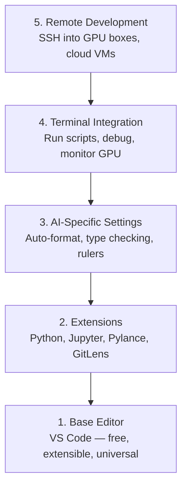

# 编辑器设置

> 您的编辑是您的副驾驶。配置一次，以便它不会妨碍您并开始发挥其重量。

** 类型：** 构建
** 语言：**--
** 先决条件：** 第0阶段，第01课
** 时间：** ~20分钟

## 学习目标

- 安装VS Code，并具有Python、Butyter、linting和远程SSH的基本扩展
- Configure format-on-save, type checking, and notebook output scrolling for AI workflows
- 设置远程SSH以在远程图形处理器上编辑和调试代码，就像它们是本地的一样
- 评估编辑器替代方案（Cursor、Windsurf、Neovim）及其对人工智能工作的权衡

## 问题

You'll spend thousands of hours inside your editor writing Python, running notebooks, debugging training loops, and SSH-ing into GPU boxes. A misconfigured editor turns every session into friction: no autocomplete, no type hints, no inline errors, manual formatting, and a clunky terminal workflow.

正确的设置需要20分钟。跳过它每天要花费20分钟。

## 概念

人工智能工程编辑器设置需要五件事：



## Build It

### Step 1: Install VS Code

VS Code是推荐的编辑器。它是免费的，在每个操作系统上运行，拥有一流的Inbox笔记本电脑支持，扩展生态系统涵盖了人工智能工作所需的一切。

Download it from [code.visualstudio.com](https://code.visualstudio.com/).

从终端验证：

```bash
code --version
```

If `code` is not found on macOS, open VS Code, press `Cmd+Shift+P`, type "Shell Command", and select "Install 'code' command in PATH".

### 第2步：安装基本扩展

在VS Code中打开集成终端（`Ctrl+``或`` Cmd+``），并安装对AI工作重要的扩展：

```bash
code --install-extension ms-python.python
code --install-extension ms-python.vscode-pylance
code --install-extension ms-toolsai.jupyter
code --install-extension eamodio.gitlens
code --install-extension ms-vscode-remote.remote-ssh
code --install-extension ms-python.debugpy
code --install-extension ms-python.black-formatter
code --install-extension charliermarsh.ruff
```

每个人的作用：

| 延伸 | 为什么 |
|-----------|-----|
| Python | Language support, virtual env detection, run/debug |
| Pylance | 快速类型检查、自动完成、导入解析 |
| Jupyter | Run notebooks inside VS Code, variable explorer |
| GitLens | See who changed what, inline git blame |
| 远程SSH | 在远程图形处理器上打开文件夹，就好像它是本地文件夹一样 |
| Debugpy | Step-through debugging for Python |
| 黑色实体 | 保存时自动格式化，样式一致 |
| Ruff | Fast linting, catches common mistakes |

本课中的文件“code/.vscode/extensions.json”包含完整的建议列表。当您打开项目文件夹时，VS Code将提示您安装它们。

### 第3步：配置设置

从本课中的“code/. vscode/sets.json”复制设置，或通过“设置>打开设置（杨森）”手动应用它们。

人工智能工作的关键设置：

```jsonc
{
    "python.analysis.typeCheckingMode": "basic",
    "editor.formatOnSave": true,
    "editor.rulers": [88, 120],
    "notebook.output.scrolling": true,
    "files.autoSave": "afterDelay"
}
```

为什么这些很重要：

- ** 基本上的类型检查 **：在运行之前捕获错误的参数类型。延长张量形状不匹配和API参数错误的调试时间。
- **Format on save**: Never think about formatting again. Black handles it.
- **Rulers at 88 and 120**: Black wraps at 88. The 120 marker shows when docstrings and comments are getting too long.
- ** 笔记本输出滚动 **：训练循环打印数千行。如果不滚动，输出面板就会爆炸。
- ** 自动保存 **：您会忘记保存。您的培训脚本将运行陈旧的代码。自动保存可以防止这种情况发生。

### 第4步：终端集成

VS Code的集成终端是您运行培训脚本、监控图形处理器和管理环境的地方。

正确设置：

```jsonc
{
    "terminal.integrated.defaultProfile.osx": "zsh",
    "terminal.integrated.defaultProfile.linux": "bash",
    "terminal.integrated.fontSize": 13,
    "terminal.integrated.scrollback": 10000
}
```

有用的快捷方式：

| Action | macOS | Linux/Windows |
|--------|-------|---------------|
| 切换终端 | `` Ctrl+` `` | `` Ctrl+` `` |
| 新终端 | '快捷键+'' | `Ctrl+Shift+`` ` |
| Split terminal | ' CMD+' | ' Alt +\' |

拆分终端很有用：一个用于运行脚本，另一个用于使用“nvidia-smi -l 1”或“watch -n 1 nvidia-smi”监控图形处理器。

### 第5步：远程开发（通过SSH进入图形处理器盒）

这是人工智能工作最重要的扩展。您将在远程机器（云虚拟机、实验室服务器、Lambda、Vast.ai）上运行培训。远程SSH允许您打开远程文件系统、编辑文件、运行终端和调试，就好像一切都是本地的一样。

Setup:

1. Install the Remote SSH extension (done in Step 2).
2. Press `Ctrl+Shift+P` (or `Cmd+Shift+P`), type "Remote-SSH: Connect to Host".
3. 输入“user@your-gpu-box-ip”。
4. VS Code自动在远程机器上安装其服务器组件。

对于无密码访问，请设置SSH密钥：

```bash
ssh-keygen -t ed25519 -C "your-email@example.com"
ssh-copy-id user@your-gpu-box-ip
```

Add the host to `~/.ssh/config` for convenience:

```
Host gpu-box
    HostName 203.0.113.50
    User ubuntu
    IdentityFile ~/.ssh/id_ed25519
    ForwardAgent yes
```

现在`Remote-SSH：Connect to Host > gpu-box`立即连接。

## 替代品

### 光标

[cursor.com](https://cursor.com) is a VS Code fork with built-in AI code generation. It uses the same extension ecosystem and settings format. If you use Cursor, everything in this lesson still applies. Import the same `settings.json` and `extensions.json`.

### 风帆冲浪

[windsurf.com](https://windsurf.com) is another AI-first VS Code fork. Same story: same extensions, same settings format, same Remote SSH support.

### Vim/Neovim

如果您已经使用Vim或Neovim并且高效使用，请留在那里。AI Python工作的最低设置：

- **pyright** 或 ** pylp ** 进行类型检查（通过Mason或手动安装）
- ** nvim-lspconnect ** 用于语言服务器集成
- **jupyter-vim** or **molten-nvim** for notebook-like execution
- **telescope.nvim** for file/symbol search
- **none-ls.nvim** 带有黑色和褶边，用于格式化/打底

如果您尚未使用Vim，请立即开始。学习曲线将与学习人工智能工程竞争。使用VS代码。

## Use It

With this setup, your daily workflow looks like:

1. 在VS Code中打开项目文件夹（或通过远程SSH连接到图形处理盒）。
2. 在编辑器中编写Python，并带有自动完成、类型提示和内联错误。
3. 使用Deliveryter扩展内联运行Deliveryter笔记本。
4. 使用集成终端进行训练脚本、“uv pip安装”和图形处理器监控。
5. 在提交之前使用GitLens查看更改。

## 演习

1. Install VS Code and all extensions listed in Step 2
2. 将本课中的“setsing.json”复制到您的VS Code配置中
3. 打开一个Python文件，并验证Pylance在保存时是否显示类型提示和黑色格式
4. 如果您可以访问远程计算机，请设置远程SSH并打开其上的文件夹

## Key Terms

| Term | 别人怎么说 | 它实际上意味着什么 |
|------|----------------|----------------------|
| LSP | “自动完成引擎” | 语言服务器协议：编辑者从特定语言的服务器获取类型信息、完成和诊断的标准 |
| 皮朗斯 | "The Python plugin" | 微软的Python语言服务器使用Pyright进行类型检查和Intelligence Sense |
| 远程SSH | “在服务器上工作” | VS Code扩展，在远程机器上运行轻量级服务器并将UI流式传输到本地编辑器 |
| 保存时的格式 | “自动更漂亮” | 每次保存时，编辑器都会运行一个格式化程序（Black、Ruff），因此代码风格始终一致 |
