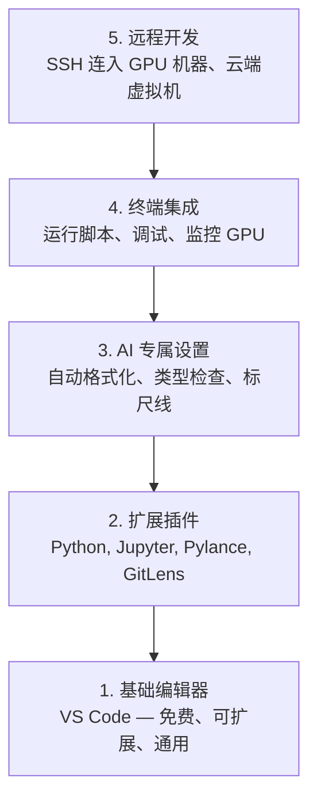

# 编辑器配置（Editor Setup）

> 译注：本文译自同目录 [`en.md`](./en.md)。术语遵循仓根 [TRANSLATION_GUIDE.md](../../../../TRANSLATION_GUIDE.md)。

> 编辑器是你的副驾。配好一次，它就能从此不挡道，开始替你干活。

**Type:** Build
**Languages:** --
**Prerequisites:** Phase 0, Lesson 01
**Time:** ~20 minutes

## 学习目标（Learning Objectives）

- 安装 VS Code 以及 Python、Jupyter、linting 和 Remote SSH 的核心扩展
- 为 AI 工作流配置保存即格式化、类型检查、notebook 输出滚动
- 配置 Remote SSH，让你像在本地一样在远端 GPU 机器上编辑、调试代码
- 评估其它编辑器（Cursor、Windsurf、Neovim）在 AI 工作中的取舍

## 问题（The Problem）

你会在编辑器里花上数千小时——写 Python、跑 notebook、调训练循环、SSH 进 GPU 盒子。一个没配好的编辑器会让每一次工作都磕磕绊绊：没有自动补全、没有类型提示、没有内联报错、要手动格式化、终端体验也很糟。

正确的配置只要 20 分钟。跳过它，你每天都要为此多花 20 分钟。

## 概念（The Concept）

一套面向 AI 工程的编辑器配置需要五样东西：



## 动手实现（Build It）

### Step 1: 安装 VS Code

VS Code 是推荐的编辑器。它免费、跨所有操作系统、对 Jupyter notebook 一等公民支持，而且扩展生态覆盖了 AI 工作所需的一切。

去 [code.visualstudio.com](https://code.visualstudio.com/) 下载。

在终端里验证：

```bash
code --version
```

如果 macOS 上找不到 `code` 命令，打开 VS Code，按 `Cmd+Shift+P`，输入 "Shell Command"，选择 "Install 'code' command in PATH"。

### Step 2: 安装核心扩展

打开 VS Code 自带终端（`` Ctrl+` `` 或 `` Cmd+` ``），安装对 AI 工作有用的扩展：

```bash
code --install-extension ms-python.python
code --install-extension ms-python.vscode-pylance
code --install-extension ms-toolsai.jupyter
code --install-extension eamodio.gitlens
code --install-extension ms-vscode-remote.remote-ssh
code --install-extension ms-python.debugpy
code --install-extension ms-python.black-formatter
code --install-extension charliermarsh.ruff
```

各自的作用：

| Extension | 用途 |
|-----------|-----|
| Python | 语言支持、虚拟环境识别、运行/调试 |
| Pylance | 快速类型检查、自动补全、import 解析 |
| Jupyter | 在 VS Code 里跑 notebook，带变量浏览器 |
| GitLens | 看谁改了什么、内联 git blame |
| Remote SSH | 像本地一样打开远端 GPU 盒子上的目录 |
| Debugpy | Python 单步调试 |
| Black Formatter | 保存即自动格式化，风格统一 |
| Ruff | 快速 linting，抓常见错误 |

本课的 `code/.vscode/extensions.json` 里有完整推荐清单。当你打开项目目录时，VS Code 会主动提示你安装。

### Step 3: 配置 Settings

把本课 `code/.vscode/settings.json` 里的设置复制过去，或者通过 `Settings > Open Settings (JSON)` 手动加进去。

对 AI 工作最关键的几条：

```jsonc
{
    "python.analysis.typeCheckingMode": "basic",
    "editor.formatOnSave": true,
    "editor.rulers": [88, 120],
    "notebook.output.scrolling": true,
    "files.autoSave": "afterDelay"
}
```

为什么这些重要：

- **类型检查设为 basic**：在你运行之前就能抓出参数类型错误。能省下大量调 tensor shape 不匹配、API 参数写错的时间。
- **保存即格式化**：再也不用想格式的事，Black 全包了。
- **88 与 120 两条标尺**：Black 在 88 处折行；120 这条线提示你 docstring 和注释快要太长了。
- **Notebook 输出滚动**：训练循环会打印上千行；不开滚动，输出面板会爆炸。
- **自动保存**：你一定会忘记保存，结果训练脚本跑的是旧代码。自动保存能避免这种事。

### Step 4: 终端集成

VS Code 的集成终端是你跑训练脚本、监控 GPU、管理环境的地方。

好好配置它：

```jsonc
{
    "terminal.integrated.defaultProfile.osx": "zsh",
    "terminal.integrated.defaultProfile.linux": "bash",
    "terminal.integrated.fontSize": 13,
    "terminal.integrated.scrollback": 10000
}
```

实用快捷键：

| 操作 | macOS | Linux/Windows |
|--------|-------|---------------|
| 切换终端 | `` Ctrl+` `` | `` Ctrl+` `` |
| 新终端 | `Ctrl+Shift+`` ` | `Ctrl+Shift+`` ` |
| 分屏终端 | `Cmd+\` | `Ctrl+\` |

分屏终端很好用：一个跑你的脚本，另一个用 `nvidia-smi -l 1` 或 `watch -n 1 nvidia-smi` 监控 GPU。

### Step 5: Remote Development（SSH 进 GPU 盒子）

这是 AI 工作里最重要的扩展。你会在远端机器上跑训练（云 VM、实验室服务器、Lambda、Vast.ai）。Remote SSH 让你打开远端文件系统、改文件、起终端、调试，体验跟本地一样。

配置步骤：

1. 安装 Remote SSH 扩展（Step 2 里已经做过）。
2. 按 `Ctrl+Shift+P`（或 `Cmd+Shift+P`），输入 "Remote-SSH: Connect to Host"。
3. 输入 `user@your-gpu-box-ip`。
4. VS Code 会自动在远端机器上装它的服务端组件。

为了免密登录，配 SSH 密钥：

```bash
ssh-keygen -t ed25519 -C "your-email@example.com"
ssh-copy-id user@your-gpu-box-ip
```

把主机加到 `~/.ssh/config`，方便后续连接：

```
Host gpu-box
    HostName 203.0.113.50
    User ubuntu
    IdentityFile ~/.ssh/id_ed25519
    ForwardAgent yes
```

现在 `Remote-SSH: Connect to Host > gpu-box` 一下就能连上。

## 替代方案（Alternatives）

### Cursor

[cursor.com](https://cursor.com) 是 VS Code 的一个 fork，内置 AI 代码生成。它用同一套扩展生态和设置格式。如果你用 Cursor，本课的一切仍然适用，把同样的 `settings.json` 和 `extensions.json` 导入即可。

### Windsurf

[windsurf.com](https://windsurf.com) 是另一个 AI 优先的 VS Code fork。一样的故事：同样的扩展、同样的设置格式、同样支持 Remote SSH。

### Vim/Neovim

如果你已经在用 Vim 或 Neovim 而且很顺手，那就继续。给 AI Python 工作的最低配置：

- **pyright** 或 **pylsp** 做类型检查（通过 Mason 或手动装）
- **nvim-lspconfig** 接入 language server
- **jupyter-vim** 或 **molten-nvim** 提供类似 notebook 的执行体验
- **telescope.nvim** 做文件 / 符号搜索
- **none-ls.nvim** 配合 black 和 ruff 做格式化 / linting

如果你还没在用 Vim，**别现在开始**。它的学习曲线会和学 AI 工程抢时间。用 VS Code。

## 用起来（Use It）

配好之后，你的日常工作流大概是这样：

1. 在 VS Code 里打开项目目录（或者通过 Remote SSH 连到 GPU 盒子）。
2. 在编辑器里写 Python，享受自动补全、类型提示、内联报错。
3. 借助 Jupyter 扩展直接在编辑器里跑 notebook。
4. 用集成终端跑训练脚本、`uv pip install`、监控 GPU。
5. 提交前用 GitLens 审一下改动。

## 练习（Exercises）

1. 安装 VS Code 和 Step 2 列出的所有扩展
2. 把本课的 `settings.json` 复制到你的 VS Code 配置里
3. 打开一个 Python 文件，验证 Pylance 显示了类型提示，且 Black 在保存时格式化
4. 如果你有远端机器的访问权限，配好 Remote SSH 并在它上面打开一个目录

## 关键术语（Key Terms）

| 术语 | 大家口头怎么叫 | 实际含义 |
|------|----------------|----------------------|
| LSP | "自动补全引擎" | Language Server Protocol：一套标准，让编辑器从特定语言的服务端获取类型信息、补全和诊断 |
| Pylance | "那个 Python 插件" | 微软的 Python language server，底层用 Pyright 做类型检查和 IntelliSense |
| Remote SSH | "在服务器上干活" | VS Code 扩展，在远端机器上跑一个轻量服务端，把 UI 流式传回本地编辑器 |
| Format on save | "自动 prettier" | 每次保存时编辑器都跑一遍格式化器（Black、Ruff），让代码风格永远一致 |
