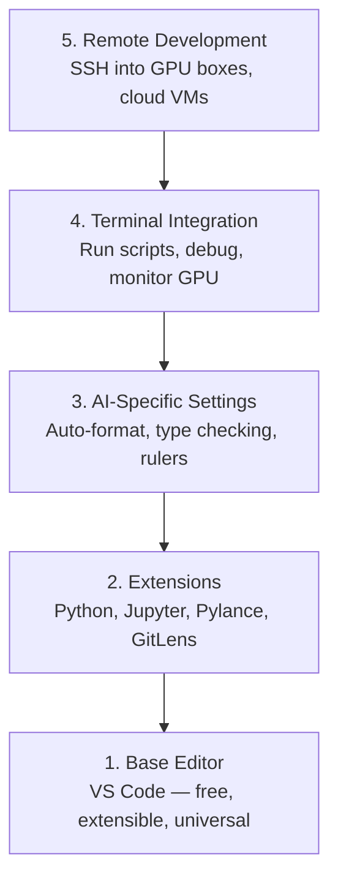

# 08 · 编辑器配置

> 你的编辑器就是你的副驾。一次配置到位，它便不再碍事，并开始为你分担工作。

**类型：** Build
**语言：** --
**前置：** 阶段 0，第 01 课
**时长：** 约 20 分钟

## 学习目标

- 安装 VS Code，并装上面向 Python、Jupyter、代码检查（linting）和远程 SSH 的核心扩展
- 为 AI 工作流配置保存时格式化、类型检查以及笔记本输出滚动
- 配置 Remote SSH，像在本地一样在远程 GPU 机器上编辑和调试代码
- 评估编辑器的替代方案（Cursor、Windsurf、Neovim）以及它们在 AI 工作中的取舍

## 问题所在

你会在编辑器里花上数千小时编写 Python、运行笔记本、调试训练循环、SSH 连入 GPU 机器。一个配置不当的编辑器会让每次会话都充满摩擦：没有自动补全、没有类型提示、没有内联错误、需要手动格式化，加上别扭的终端工作流。

正确的配置只需 20 分钟。跳过它，则每天都要付出 20 分钟的代价。

## 核心概念

一套 AI 工程编辑器配置需要五样东西：



## 动手构建

### 第 1 步：安装 VS Code

VS Code 是推荐的编辑器。它免费、可在每个操作系统上运行、拥有一流的 Jupyter 笔记本支持，而且其扩展生态覆盖了 AI 工作所需的一切。

从 [code.visualstudio.com](https://code.visualstudio.com/) 下载。

在终端中验证：

```bash
code --version
```

如果在 macOS 上找不到 `code` 命令，打开 VS Code，按下 `Cmd+Shift+P`，输入 "Shell Command"，然后选择 "Install 'code' command in PATH"。

### 第 2 步：安装核心扩展

在 VS Code 中打开集成终端（`Ctrl+`` ` 或 `` Cmd+` ``），安装对 AI 工作至关重要的扩展：

```bash
code --install-extension ms-python.python
code --install-extension ms-python.vscode-pylance
code --install-extension ms-toolsai.jupyter
code --install-extension eamodio.gitlens
code --install-extension ms-vscode-remote.remote-ssh
code --install-extension ms-python.debugpy
code --install-extension ms-python.black-formatter
code --install-extension charliermarsh.ruff
```

各扩展的作用：

| 扩展 | 用途 |
|-----------|-----|
| Python | 语言支持、虚拟环境检测、运行/调试 |
| Pylance | 快速类型检查、自动补全、导入解析 |
| Jupyter | 在 VS Code 内运行笔记本、变量浏览器 |
| GitLens | 查看谁改了什么、内联 git blame |
| Remote SSH | 像在本地一样打开远程 GPU 机器上的文件夹 |
| Debugpy | Python 的单步调试 |
| Black Formatter | 保存时自动格式化，风格统一 |
| Ruff | 快速的代码检查，捕获常见错误 |

本课中的 `code/.vscode/extensions.json` 文件包含完整的推荐列表。当你打开项目文件夹时，VS Code 会提示你安装它们。

### 第 3 步：配置设置

从本课的 `code/.vscode/settings.json` 复制设置，或通过 `Settings > Open Settings (JSON)` 手动应用它们。

面向 AI 工作的关键设置：

```jsonc
{
    "python.analysis.typeCheckingMode": "basic",
    "editor.formatOnSave": true,
    "editor.rulers": [88, 120],
    "notebook.output.scrolling": true,
    "files.autoSave": "afterDelay"
}
```

为何这些很重要：

- **类型检查设为 basic**：在运行前就捕获错误的参数类型。为张量形状不匹配和错误的 API 参数省下调试时间。
- **保存时格式化**：再也不用操心格式问题，Black 会搞定一切。
- **88 和 120 处的标尺（ruler）**：Black 在 88 列处换行。120 标记则提示文档字符串和注释何时变得过长。
- **笔记本输出滚动**：训练循环会打印成千上万行。没有滚动，输出面板就会被撑爆。
- **自动保存**：你总会忘记保存。你的训练脚本就会运行过时的代码。自动保存可以防止这种情况。

### 第 4 步：终端集成

VS Code 的集成终端是你运行训练脚本、监控 GPU、管理环境的地方。

把它配置妥当：

```jsonc
{
    "terminal.integrated.defaultProfile.osx": "zsh",
    "terminal.integrated.defaultProfile.linux": "bash",
    "terminal.integrated.fontSize": 13,
    "terminal.integrated.scrollback": 10000
}
```

实用快捷键：

| 操作 | macOS | Linux/Windows |
|--------|-------|---------------|
| 切换终端 | `` Ctrl+` `` | `` Ctrl+` `` |
| 新建终端 | `Ctrl+Shift+`` ` | `Ctrl+Shift+`` ` |
| 拆分终端 | `Cmd+\` | `Ctrl+\` |

拆分终端很有用：一个用来运行脚本，一个用来通过 `nvidia-smi -l 1` 或 `watch -n 1 nvidia-smi` 监控 GPU。

### 第 5 步：远程开发（SSH 连入 GPU 机器）

这是 AI 工作中最重要的扩展。你会在远程机器（云 VM、实验室服务器、Lambda、Vast.ai）上运行训练。Remote SSH 让你能够打开远程文件系统、编辑文件、运行终端、调试，就如同一切都在本地一样。

配置：

1. 安装 Remote SSH 扩展（已在第 2 步完成）。
2. 按下 `Ctrl+Shift+P`（或 `Cmd+Shift+P`），输入 "Remote-SSH: Connect to Host"。
3. 输入 `user@your-gpu-box-ip`。
4. VS Code 会自动在远程机器上安装其服务端组件。

为实现免密访问，配置 SSH 密钥：

```bash
ssh-keygen -t ed25519 -C "your-email@example.com"
ssh-copy-id user@your-gpu-box-ip
```

为方便起见，把主机添加到 `~/.ssh/config`：

```
Host gpu-box
    HostName 203.0.113.50
    User ubuntu
    IdentityFile ~/.ssh/id_ed25519
    ForwardAgent yes
```

现在 `Remote-SSH: Connect to Host > gpu-box` 就能即刻连接。

## 替代方案

### Cursor

[cursor.com](https://cursor.com) 是一个内置 AI 代码生成的 VS Code 分支（fork）。它使用相同的扩展生态和设置格式。如果你使用 Cursor，本课的一切依然适用。导入相同的 `settings.json` 和 `extensions.json` 即可。

### Windsurf

[windsurf.com](https://windsurf.com) 是另一个以 AI 为先的 VS Code 分支。情况相同：相同的扩展、相同的设置格式、相同的 Remote SSH 支持。

### Vim/Neovim

如果你已经在用 Vim 或 Neovim 并且用得很顺手，那就继续用。面向 AI Python 工作的最小配置：

- **pyright** 或 **pylsp** 用于类型检查（通过 Mason 或手动安装）
- **nvim-lspconfig** 用于语言服务器集成
- **jupyter-vim** 或 **molten-nvim** 用于类似笔记本的执行
- **telescope.nvim** 用于文件/符号搜索
- **none-ls.nvim** 配合 black 和 ruff 用于格式化/代码检查

如果你还没用过 Vim，现在不要开始。它的学习曲线会与学习 AI 工程相互争抢精力。用 VS Code 吧。

## 实际运用

有了这套配置，你的日常工作流是这样的：

1. 在 VS Code 中打开项目文件夹（或通过 Remote SSH 连接到 GPU 机器）。
2. 在编辑器中编写 Python，配有自动补全、类型提示和内联错误。
3. 用 Jupyter 扩展在内联中运行 Jupyter 笔记本。
4. 用集成终端运行训练脚本、执行 `uv pip install` 以及监控 GPU。
5. 提交前用 GitLens 审查改动。

## 练习

1. 安装 VS Code 以及第 2 步中列出的所有扩展
2. 把本课的 `settings.json` 复制到你的 VS Code 配置中
3. 打开一个 Python 文件，验证 Pylance 显示类型提示，并且 Black 在保存时格式化
4. 如果你能访问远程机器，配置 Remote SSH 并在其上打开一个文件夹

## 关键术语

| 术语 | 人们怎么说 | 实际含义 |
|------|----------------|----------------------|
| LSP | "自动补全引擎" | 语言服务器协议（Language Server Protocol）：一套标准，让编辑器能从特定语言的服务器获取类型信息、补全和诊断 |
| Pylance | "那个 Python 插件" | 微软的 Python 语言服务器，使用 Pyright 进行类型检查和 IntelliSense |
| Remote SSH | "在服务器上工作" | 一个 VS Code 扩展，在远程机器上运行一个轻量级服务器，并把界面流式传输到你的本地编辑器 |
| Format on save（保存时格式化） | "自动美化代码" | 编辑器在你每次保存时运行格式化工具（Black、Ruff），让代码风格始终保持一致 |
